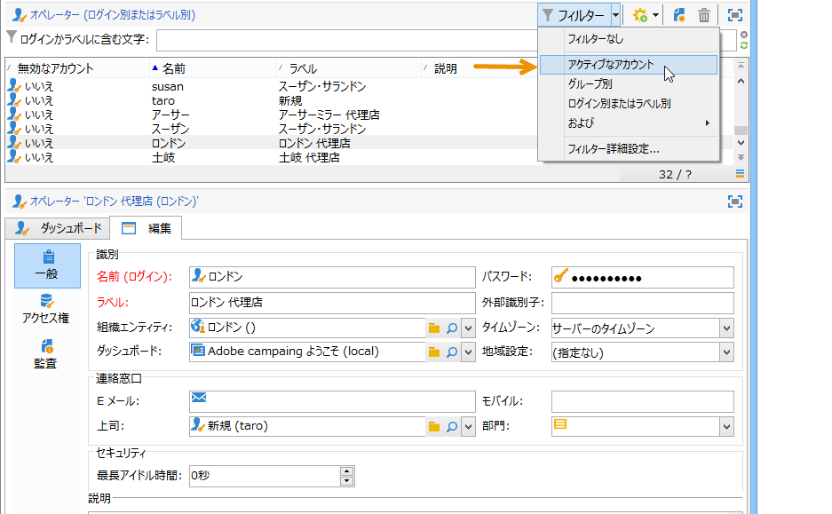
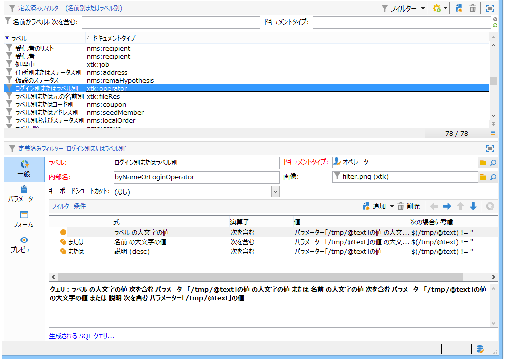
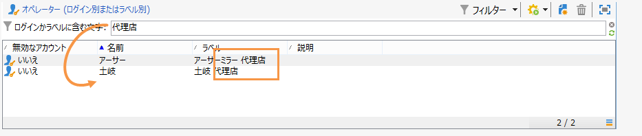
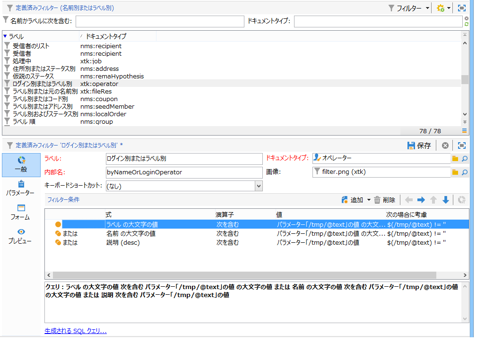
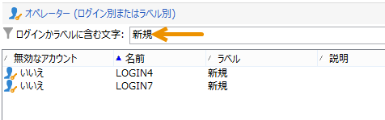

# フィルターの作成 {#creating-a-filter}

Adobe Campaign で使用可能なフィルターは、クエリと同じ操作モードで作成されるフィルター条件を使用して定義します。

>[!NOTE]
>
>フィルターの作成について詳しくは、[この節](../../platform/using/filtering-options.md)を参照してください。

ノード **[!UICONTROL Administration > Configuration > Predefined filters]** には、リストおよびオーバービューで使用されるすべてのフィルターが含まれます。

For example, the list of operators can be filtered by **[!UICONTROL Active accounts]**:

The matching filter contains the query on the **[!UICONTROL Account disabled]** value of the **[!UICONTROL Operators]** schema:

For the same list, the **[!UICONTROL By login or label]** filter lets you filter the data on the list based on the value entered in the filter field:

このフィルターは次のように設計されています。

フィルター条件に一致するには、オペレーターアカウントは次のいずれかの条件を満たしている必要があります。

* ラベルに、入力フィールドに入力された文字が含まれている
* オペレーター名に、入力フィールドに入力された文字が含まれている
* 説明領域の内容に、入力フィールドに入力された文字が含まれている

>[!NOTE]
>
>**[!UICONTROL Upper]** 関数を使用すると、大文字と小文字を区別する機能を無効にすることができます。

この列 **[!UICONTROL Taken into account if]** では、これらのフィルター条件の適用条件を定義できます。 ここでは、文字 **$(/tmp/@text)** は、フィルターにリンクされた入力フィールドの内容を表します。

ここでは、**$(/tmp/@text)=&#39;代理店&#39;** となっています。

**$(/tmp/@text)!=&#39;&#39;** 式は、入力フィールドが空でない場合に各条件を適用します。
