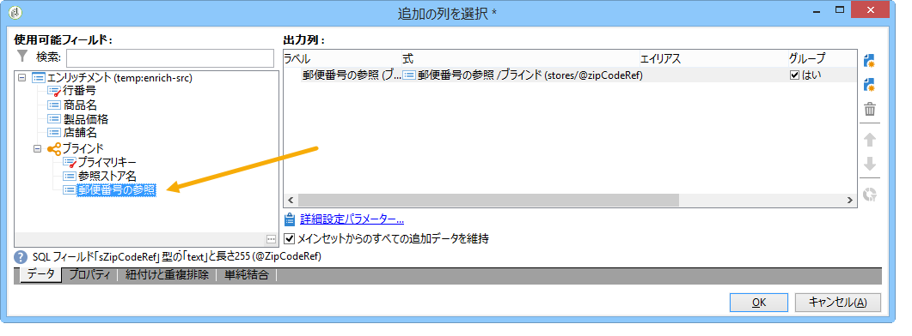

# サマリーリストの作成{#creating-a-summary-list}

この使用例では、ファイルや以下に示すいくつかのエンリッチメントの収集後にサマリーリストを作成できるワークフローについて、作成の手順を詳しく説明します。この例では、店舗で購入をおこなった顧客の連絡先のリストをベースにします。


次のデータ構造が使用されます。


目的は次のとおりです。

* 「エンリッチメント」アクティビティの様々なオプションを使用する
* 紐付けの後にデータベースのデータを更新する
* エンリッチメントされたデータのグローバル「表示」をおこなう

概要リストを作成するには、次の手順に従う必要があります。

1. 「購入品」ファイルを収集して、ワークフローの作業用テーブルに読み込む
1. 参照テーブルへのリンクを作成して、インポート済みのデータをエンリッチメントする
1. エンリッチメントしたデータで、「購入品」テーブルを更新する
1. 「購入品」テーブルから集計したデータを使用して、「連絡先」データをエンリッチメントする
1. サマリーリストの作成

## 手順 1：ファイルの読み込みとインポートしたデータの調整 {#step-1--loading-the-file-and-reconciling-the-imported-data}

読み込むデータは、「購入品」に関係する、以下の形式のデータです。

```
Product Name;Product price;Store
Computer;2000;London 3
Tablet;600;Cambridge
Computer;2000;London 5
Comptuer;2000;London 8
Tablet;600;Cambridge
Phone;500;London 5
```

このデータは、「Purchases.txt」ファイルに含まれています。

1. 「**ファイルコレクター**」アクティビティと「**データの読み込み（ファイル）**」アクティビティをワークフローに追加します。

   「**ファイルコレクター**」アクティビティを使用することで、Adobe Campaign サーバーの間で、ファイルの収集、送信をおこなうことができます。

   一方、「**データの読み込み（ファイル）**」アクティビティでは、収集したデータでワークフローの作業用テーブルをエンリッチメントすることが可能です。

   このアクティビティについて詳しくは、[ファイルからのデータの読み込み](../../workflow/using/importing-data.md#loading-data-from-a-file)を参照してください。

1. 「**ファイルコレクター**」アクティビティを設定し、任意のディレクトリからテキスト（*.txt）タイプのファイルを収集します。

   

   「**ファイルコレクター**」アクティビティを使用すると、ソースディレクトリにファイルの不足がないかを管理することができます。これをおこなうには、「**[!UICONTROL プロセスファイルなし]**」オプションのチェックボックスをオンにします。このワークフローでは、収集の際にデータがディレクトリから失われている場合に別のファイルを収集するよう、「**待機**」アクティビティを追加しています。

1. インポートするデータと同じ形式のサンプルファイルを利用して、「**データの読み込み（ファイル）**」アクティビティを設定します。

   

   「**[!UICONTROL ファイルフォーマットを変更するには、ここをクリック...]**」リンクをクリックし、「購入品」テーブルの内部名とラベルを使用して、列の名前を変更します。

   

データがインポートされたら、「店舗」のスキーマと一致する参照テーブルへのリンクを作成して、エンリッチメントをおこないます。

「エンリッチメント」アクティビティを追加し、次のように設定します。

1. 「**データの読み込み（ファイル）**」アクティビティのデータから構成されるメインセットを選択します。

   

1. 「**[!UICONTROL データを追加]**」をクリックし、「**[!UICONTROL リンク]**」オプションを選択します。

   

1. 「**[!UICONTROL コレクションを定義]**」オプションを選択します。
1. ターゲットとして「店舗」スキーマを選択します。

   

各種リンクについて詳しくは、[データのエンリッチメントと変更](../../workflow/using/targeting-data.md#enriching-and-modifying-data)を参照してください。

以下のウィンドウで、（メインセットにある）ソースフィールドと、ターゲットフィールド（「店舗」スキーマに属する）を選択して結合条件を作成し、データの紐付けを設定する必要があります。


リンクが作成できたら、「店舗」スキーマのワークフローの作業用テーブルに「郵便番号の参照」フィールドの列を追加します。

1. 「エンリッチメント」アクティビティを開きます。
1. 「**[!UICONTROL 追加データを編集]**」をクリックします。
1. 「郵便番号の参照」フィールドを&#x200B;**[!UICONTROL 出力列]**&#x200B;に追加します。



このエンリッチメントが完了すると、ワークフローの作業用テーブルのデータは次のようになります。


## 手順 2：「購入品」テーブルへのエンリッチメントされたデータの書き込み {#step-2--writing-enriched-data-to-the--purchases--table}

このステップでは、インポートされエンリッチメントされたデータを「購入品」テーブルに書き込む方法を詳しく説明します。これをおこなうには、「**データを更新**」アクティビティを使用する必要があります。

「**購入品**」テーブルのデータを更新する前に、ワークフローの作業用テーブルのデータと、「**購入品**」のターゲティングディメンションとの間で紐付けをおこなう必要があります。

1. 「エンリッチメント」アクティビティの「**[!UICONTROL 紐付け]**」タブをクリックします。
1. ターゲティングディメンション、この場合は「購入品」のスキーマを選択します。
1. ワークフローテーブルのデータについて、「ソース式」を選択します。このケースでは、「storeName」フィールドを選択します。
1. 「購入品」テーブルのデータについて、「宛先の式」を選択します。このケースでは、「storename」フィールドを選択します。
1. 「**[!UICONTROL 作業用テーブルからの紐付けられていないデータを保存]**」オプションのチェックボックスをオンにします。


「**データを更新**」アクティビティで、以下の設定作業をおこなう必要があります。

1. 「**[!UICONTROL 操作タイプ]**」フィールドで「**[!UICONTROL 挿入または更新]**」オプションを選択し、ファイルを収集するたびに新しいレコードが作成されないようにします。
1. 「**[!UICONTROL レコード識別]**」オプションで「**[!UICONTROL ターゲティングディメンションを直接使用]**」を選択します。
1. **[!UICONTROL ドキュメントタイプ]**&#x200B;として、「購入品」スキーマを選択します。
1. 更新するフィールドのリストを指定します。「**[!UICONTROL 宛先]**」列では、「購入品」スキーマのフィールドを定義できます。「**[!UICONTROL 式]**」列では、作業用テーブルのフィールドを選択してマッピングをおこなうことができます。
1. 「**[!UICONTROL アウトバウンドトランジションを生成]**」オプションをクリックします。


## 手順 3：「連絡先」データのエンリッチメント {#step-3--enriching--contact--data-}

「連絡先」スキーマは「購入品」スキーマと物理的にリンクします。これは、フィルタリングディメンションにリンクしたデータを追加するという、「エンリッチメント」オプションの別のオプションが利用できることを意味します。

この 2 つ目のエンリッチメントの目的は、「購入品」スキーマの集計をおこない、特定した個々の連絡先について、購入品の総数を計算することにあります。

1. 保存されているすべての&#x200B;**連絡先**&#x200B;を復元する「**クエリ**」タイプアクティビティを追加します。
1. 「**エンリッチメント**」アクティビティを追加し、前のクエリから生成されたメインセットを選択します。
1. 「**[!UICONTROL データを追加]**」をクリックします。
1. 「**[!UICONTROL ターゲティングディメンションにリンクされたデータ]**」オプションをクリックします。
1. **[!UICONTROL 追加するフィールドを選択]**&#x200B;ウィンドウで、「**[!UICONTROL フィルタリングディメンションにリンクされたデータ]**」オプションをクリックします。
1. 「**[!UICONTROL 購入]**」ノードを選択し、「**[!UICONTROL 次へ]**」をクリックします。

   

1. 「**[!UICONTROL 集計]**」オプションを選択して、「**[!UICONTROL 収集されたデータ]**」フィールドを変更します。

   

1. 「**[!UICONTROL 次へ]**」をクリックします。
1. 「Sum(@prodprice)」の式を追加して、各連絡先ごとの購入品の総数を計算します。

   

サマリーリストを準備するには、「購入品」フィールドのフィールドと、1 番目のエンリッチメントのフィールドである「郵便番号の参照」フィールドを追加する必要があります。

1. 「エンリッチメント」アクティビティの「**[!UICONTROL 追加データを編集...]**」リンクをクリックします。
1. 「店舗名」、「購入品／郵便番号の参照」フィールドを追加します。

   

1. 「**[!UICONTROL プロパティ]**」タブをクリックします。
1. 1 つの行だけを作成するよう、2 つ目のリンクを変更します。

   

## 手順 4：サマリーリストの作成とリストへのデータの追加 {#step-4--creating-and-adding-to-a-summary-list}

最後のステップでは、エンリッチメントしたデータをすべてリストに書き込みます。

1. 「**リスト更新**」アクティビティをワークフローに追加します。このアクティビティは、2 つ目の「エンリッチメント」アクティビティのアウトバウンドトランジションとリンクさせる必要があります。
1. 「**[!UICONTROL 必要な場合はリストを作成する（計算済みの名前）]**」オプションを選択します。
1. 計算済みの名前の値を選択します。リストに選択されたラベルは現在の日付です。&lt;%= formatDate(new Date(), &quot;%2D/%2M/%2Y&quot;) %>

ワークフローを実行すると、リストには次の情報が含まれるようになります。

* 連絡先のリスト
* 購入品の総数の列
* 「店舗名」の列
* 店舗参照スキーマに含まれるすべての店舗について入力する「郵便番号の参照」列


