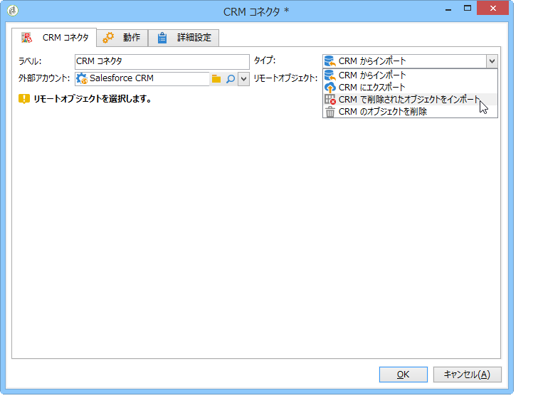
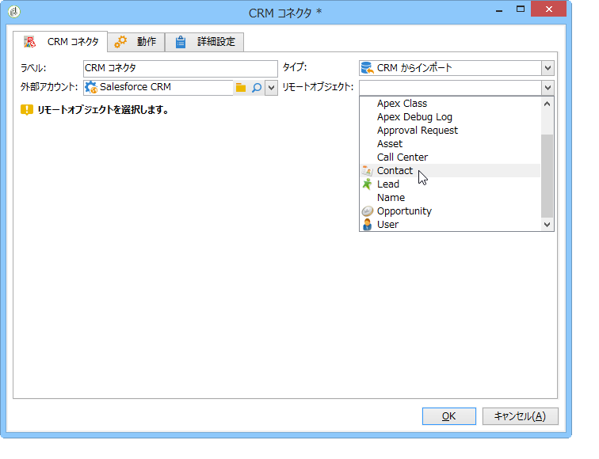

# CRM コネクタ{#crm-connector}

**CRM コネクタ**&#x200B;アクティビティを使用すると、Adobe Campaign と CRM システムの間のデータ同期を設定できます。

Adobe Campaign の CRM コネクタについて詳しくは、[こちらの節](../../platform/using/crm-connectors.md)を参照してください。

このアクティビティを使用すると、次のことができます。

* CRM からのインポート
* CRM へのエクスポート
* CRM で削除されたオブジェクトのインポート
* CRM 内のオブジェクトの削除

同期対象とする CRM に対応する外部アカウントを選択し、同期するオブジェクト（アカウント、オポチュニティ、連絡先など）を選択します。

このアクティビティの設定は、実行するプロセスによって異なります。 各種設定について詳しくは、[こちらのページ](../../platform/using/crm-data-sync.md)を参照してください。
