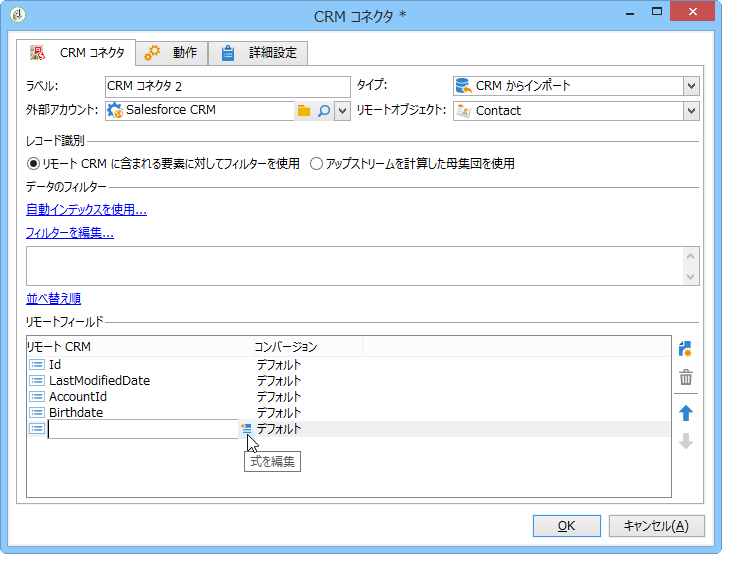

# CRM コネクタ{#crm-connector}

**CRM コネクタ**：Adobe Campaign と CRM との間のデータの同期を設定します。

Adobe Campaign の CRM コネクタについて詳しくは、この[節](../../platform/using/crm-connectors.md)を参照してください。

変更できる設定内容は次のとおりです。

* CRM からインポート（[CRM からのインポート](#importing-from-the-crm)を参照）。
* CRM にエクスポート（[CRM へのエクスポート](#exporting-to-the-crm)を参照）。
* CRM で削除されたオブジェクトをインポート（[CRM で削除されたオブジェクトのインポート](#importing-objects-deleted-in-the-crm)を参照）。
* CRM のオブジェクトを削除（[CRM でのオブジェクトの削除](#deleting-objects-in-the-crm)を参照）。


同期対象とする CRM に対応する外部アカウントを選択し、同期するオブジェクト（アカウント、オポチュニティ、連絡先など）を選択します。


このアクティビティの設定は、実行するプロセスによって異なります。次に、様々な設定について詳しく説明します。

## CRM からのインポート {#importing-from-the-crm}

データを CRM 経由で Adobe Campaign にインポートするには、次のタイプのワークフローを作成する必要があります。


インポートアクティビティの場合、「**CRM コネクタ**」アクティビティの設定手順は次のとおりです。

1. 「**[!UICONTROL CRM からインポート]**」操作を選択します。
1. **[!UICONTROL リモートオブジェクト]**&#x200B;ドロップダウンリストに移動し、プロセスの対象となるオブジェクトを選択します。このオブジェクトは、コネクタの設定時に Adobe Campaign で作成されたテーブルのいずれかと一致します。
1. 「**[!UICONTROL リモートフィールド]**」セクションに移動し、インポートするフィールドを入力します。

   フィールドを追加するには、ツールバーの&#x200B;**[!UICONTROL 追加]**&#x200B;ボタンをクリックし、**[!UICONTROL 式を編集]**&#x200B;アイコンをクリックします。

   

   必要に応じて、「**[!UICONTROL コンバージョン]**」列のドロップダウンリストでデータフォーマットを変更します。使用可能なコンバージョンタイプについて詳しくは、この[ページ](../../platform/using/crm-connectors.md#data-format)を参照してください。

   >[!CAUTION]
   >
   >CRM と Adobe Campaign のオブジェクトをリンクするには、CRM でのレコードの識別子が必須です。これは、アクティビティが承認されると自動的に追加されます。
   > 
   >増分データインポートの場合は、CRM 側での最終変更日も必須です。

1. 必要に応じて、インポートするデータをフィルターすることもできます。そのためには、「**[!UICONTROL フィルターを編集...]**」リンクをクリックします。

   次の例では、2012 年 7 月 31 日以降にアクティビティが記録された連絡先のみが Adobe Campaign によってインポートされます。

   

   データのフィルターモードに関連する制限について詳しくは、[データのフィルター](#filter-on-data)の節を参照してください。

1. 「**[!UICONTROL 自動インデックスを使用]**」オプションを使用すると、CRM と Adobe Campaign の間の増分オブジェクト同期を日付と最終変更に応じて自動的に管理できます。

   詳しくは、[変数管理](#variable-management)を参照してください。

## 変数管理 {#variable-management}

「**[!UICONTROL 自動インデックス]**」オプションを使用すると、最後のインポート以降に変更されたオブジェクトのみを収集できます。


最後の同期の日付が、設定ウィンドウで指定したオプションに保存されます。デフォルトでは、

```
LASTIMPORT_<%=instance.internalName%>_<%=activityName%>
```

最新の変更を識別するために考慮するリモート CRM フィールドを指定できます。

デフォルトでは、次のフィールドが（指定した順序で）使用されます。

* Microsoft Dynamics の場合：**modifiedon**。
* Oracle On Demand の場合：**LastUpdated**、**ModifiedDate**、**LastLoggedIn**。
* Salesforce.com の場合：**LastModifiedDate**、**SystemModstamp**。

「**[!UICONTROL 自動インデックス]**」オプションをオンにすると、「**[!UICONTROL JavaScript コード]**」タイプのアクティビティによって、同期ワークフローで使用できる 3 つの変数が生成されます。これらのアクティビティは、次のとおりです。

* **varscrmOptionName**：最後のインポート日を含むオプションの名前を表します。
* **vars.crmStartImport**：最後のデータ収集の開始日（この日を含む）を表します。
* **vars.crmEndDate**：最後のデータ収集の終了日（この日を含まない）を表します。

   これらの日付は、**yyyy/MM/dd hh:mm:ss** というフォーマットで表示されます。

## データのフィルター {#filter-on-data}

様々な CRM で効率的に操作をおこなうために、次のルールを使用してフィルターを作成する必要があります。

* 各フィルターレベルでは、1 つのタイプの論理演算子のみを使用できます。
* EXCEPT (AND NOT) 演算子はサポートされていません。
* 比較は、null 値（「空である」／「空でない」タイプ）または数値にのみ関係します。つまり、**[!UICONTROL 値]**（右側の列）が評価された場合、この評価の結果は数値である必要があります。
* 「**[!UICONTROL 値]**」列のデータは、JavaScript で評価されます。
* JOIN 比較はサポートされていません。
* 左側の列の式は、フィールドである必要があります。複数の式の組み合わせ、数値などは使用できません。

例えば、以下の図で説明するフィルター条件は、CRM インポートでは有効になりません。理由は次のとおりです。

* OR 演算子が AND 演算子と同じレベルに配置されている。
* 比較の実行対象がテキスト文字列である。


## 並べ替え順 {#order-by}

Microsoft Dynamics および Salesforce.com では、インポートされるリモートフィールドを昇順または降順で並べ替えることができます。

そのためには、「**[!UICONTROL 並べ替え順]**」リンクをクリックし、列をリストに追加します。

リストでの列の順序が、並べ替え順です。


## レコード識別 {#record-identification}

CRM に含まれる（フィルターされた可能性がある）要素をインポートするのではなく、ワークフローで事前に計算された母集団を使用できます。

そのためには、「**[!UICONTROL アップストリームを計算した母集団を使用]**」オプションを選択し、リモート識別子を含むフィールドを指定します。

次に、インポートするインバウンドの母集団のフィールドを次に示すように選択します。


## CRM へのエクスポート {#exporting-to-the-crm}

Adobe Campaign データを CRM にエクスポートすると、コンテンツ全体を CRM データベースにコピーできます。

データを CRM にエクスポートするには、次のタイプのワークフローを作成する必要があります。


エクスポートの場合、次の設定を「**CRM コネクタ**」アクティビティに適用します。

1. 「**[!UICONTROL CRM にエクスポート]**」操作を選択します。
1. **[!UICONTROL リモートオブジェクト]**&#x200B;ドロップダウンリストに移動し、プロセスの対象となるオブジェクトを選択します。このオブジェクトは、コネクタの設定時に Adobe Campaign で作成されたテーブルのいずれかと一致します。

   >[!CAUTION]
   >
   >「**CRM コネクタ**」アクティビティのエクスポート機能では、CRM 側のフィールドを挿入または更新できます。CRM でのフィールド更新を有効にするには、リモートテーブルのプライマリキーを指定する必要があります。キーがない場合、データは（更新ではなく）挿入されます。

1. 「**[!UICONTROL マッピング]**」セクションで、エクスポートされるフィールドと CRM でのそれらのマッピングを指定します。

   

   フィールドを追加するには、ツールバーの&#x200B;**[!UICONTROL 追加]**&#x200B;ボタンをクリックし、**[!UICONTROL 式を編集]**&#x200B;アイコンをクリックします。

   特定のフィールドについて、CRM 側で対応が定義されていない場合は、値を更新できません。値は CRM に直接挿入されます。

   必要に応じて、「**[!UICONTROL コンバージョン]**」列のドロップダウンリストでデータフォーマットを変更します。使用可能なコンバージョンタイプについて詳しくは、この[節](../../platform/using/crm-connectors.md#data-format)を参照してください。

   エクスポートされるレコードのリストとエクスポートの結果は、ワークフローが終了または再開されるまでアクセス可能な一時ファイルに保存されます。これにより、同じレコードを複数回エクスポートしたりデータを失ったりすることなく、エラーが発生した場合にプロセスを再度開始できます。

## データフォーマットとエラー処理 {#data-format-and-error-processing}

CRM へのインポートまたは CRM からのインポート中にデータフォーマットを変換できます。

そのためには、適用する変換を対応する列で選択します。


「**[!UICONTROL デフォルト]**」モードでは、自動データ変換が適用されます。ほとんどの場合、これはデータのコピー／貼り付けと同じです。ただし、タイムゾーン管理が適用されます。

その他の使用可能な変換は、次のとおりです。

* **[!UICONTROL 日付のみ]**：このモードでは、日付 + 時刻タイプのフィールドは削除されます。
* **[!UICONTROL 時間オフセットなし]**：このモードでは、デフォルトモードで適用されるタイムゾーン管理がキャンセルされます。
* **[!UICONTROL コピー／貼り付け]**：このモードでは、文字列などの生データが使用されます（変換なし）。


データのインポートまたはエクスポートのフレームワーク内で、エラーおよび却下に対して特定のプロセスを適用できます。そのためには、「**[!UICONTROL 行動]**」タブで「**[!UICONTROL 却下を処理]**」および「**[!UICONTROL エラーを処理]**」オプションを選択します。

これらのオプションを使用すると、対応するアウトバウンドトランジションが配置されます。


次に、適用するプロセスに関連するアクティビティを配置します。

例えば、エラーを処理するために、待機アクティビティを追加してワークフローの再試行をスケジュールできます。

却下は、エラーコードおよび関連メッセージとともに収集されます。つまり、却下のトラッキングを設定して同期プロセスを最適化できます。

「**[!UICONTROL 却下を処理]**」オプションがオフの場合でも、却下された列ごとに警告がエラーコードおよびメッセージとともに生成されます。

「**[!UICONTROL 却下]**」アウトバウンドトランジションでは、エラーメッセージおよびコードに関連する特定の列を含む出力スキーマにアクセスできます。これらの列は、次のとおりです。

* Oracle On Demand の場合：**errorLogFilename**（Oracle 側でのログファイルの名前）、**errorCode**（エラーコード）、**errorSymbol**（エラーコードとは別のエラー記号）、**errorMessage**（エラーコンテキストの説明）。
* Salesforce.com の場合：**errorSymbol**（エラーコードとは別のエラー記号）、**errorMessage**（エラーコンテキストの説明）。

## CRM で削除されたオブジェクトのインポート {#importing-objects-deleted-in-the-crm}

広範なデータ同期プロセスの設定を可能にするために、CRM で削除されたオブジェクトを Adobe Campaign にインポートできます。

それには、次の手順に従います。

1. 「**[!UICONTROL CRM で削除されたオブジェクトをインポート]**」操作を選択します。
1. **[!UICONTROL リモートオブジェクト]**&#x200B;ドロップダウンリストに移動し、プロセスの対象となるオブジェクトを選択します。このオブジェクトは、コネクタの設定時に Adobe Campaign で作成されたテーブルのいずれかと一致します。
1. 考慮する削除期間を「**[!UICONTROL 開始日]**」および「**[!UICONTROL 終了日]**」フィールドで指定します。これらの日付も期間に含まれます。

   

   >[!CAUTION]
   >
   >要素の削除期間は、CRM に固有の制限と一致している必要があります。したがって、例えば Salesforce.com の場合、削除されてから 30 日を経過した要素は収集することができません。

## CRM でのオブジェクトの削除 {#deleting-objects-in-the-crm}

CRM 側でオブジェクトを削除するには、削除するリモート要素のプライマリキーを指定する必要があります。


「**[!UICONTROL 行動]**」タブで、却下の処理を有効にすることができます。このオプションを使用すると、「**[!UICONTROL CRM コネクタ]**」アクティビティの 2 つ目の出力トランジションが生成されます。詳しくは、[この節](../../platform/using/crm-connectors.md#error-processing)を参照してください。

「**[!UICONTROL 却下を処理]**」オプションがオフの場合でも、却下された列ごとに警告が生成されます。

## 連絡先インポートの設定例 {#example-of-how-to-configure-a-contact-import}

次の例では、アクティビティは連絡先を Oracle On Demand CRM からインポートするように設定されます。インポートされる前、CRM フィールドは、Adobe Campaign データベース内の既存のフィールドと紐付けできるような方法で選択されます。


