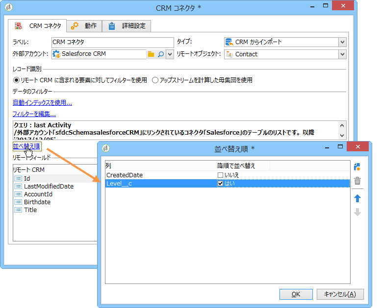

# CRM コネクタ{#crm-connector}

**CRM コネクタ**：Adobe Campaign と CRM との間のデータの同期を設定します。

Adobe Campaign の CRM コネクタについて詳しくは、この[節](../../platform/using/crm-connectors.md)を参照してください。

変更できる設定内容は次のとおりです。

* CRMからのインポート(CRMから [のインポートを参照](#importing-from-the-crm))、
* CRMへのエクスポート(CRM [へのエクスポート](#exporting-to-the-crm)を参照)、
* CRMで削除されたオブジェクトのインポート(CRMで削 [除されたオブジェクトのインポート](#importing-objects-deleted-in-the-crm))、
* CRM内のオブジェクトを削除します(CRM内の [オブジェクトの削除を参照](#deleting-objects-in-the-crm))。


同期対象とする CRM に対応する外部アカウントを選択し、同期するオブジェクト（アカウント、オポチュニティ、連絡先など）を選択します。


このアクティビティの設定は、実行するプロセスによって異なります。次に、様々な設定について詳しく説明します。

## CRM からのインポート {#importing-from-the-crm}

データを CRM 経由で Adobe Campaign にインポートするには、次のタイプのワークフローを作成する必要があります。


インポートアクティビティの場合、「**CRM コネクタ**」アクティビティの設定手順は次のとおりです。

1. 操作を選択 **[!UICONTROL Import from the CRM]** します。
1. Go to the **[!UICONTROL Remote object]** drop-down list and select the object concerned by the process. このオブジェクトは、コネクタの設定時に Adobe Campaign で作成されたテーブルのいずれかと一致します。
1. Go to the **[!UICONTROL Remote fields]** section and enter the fields to be imported.

   To add a field, click the **[!UICONTROL Add]** button in the toolbar, then click the **[!UICONTROL Edit expression]** icon.

   

   If necessary, alter the data format via the drop-down list of the **[!UICONTROL Conversion]** columns. 使用可能なコンバージョンタイプについて詳しくは、この[ページ](../../platform/using/crm-connectors.md#data-format)を参照してください。

   >[!CAUTION]
   >
   >CRM と Adobe Campaign のオブジェクトをリンクするには、CRM でのレコードの識別子が必須です。これは、アクティビティが承認されると自動的に追加されます。
   > 
   >増分データインポートの場合は、CRM 側での最終変更日も必須です。

1. 必要に応じて、インポートするデータをフィルターすることもできます。これを行うには、リンクをクリック **[!UICONTROL Edit the filter...]** します。

   次の例では、2012 年 7 月 31 日以降にアクティビティが記録された連絡先のみが Adobe Campaign によってインポートされます。

   

   The limitations linked to data filtering modes are detailed in [Filter on data](#filter-on-data) section.

1. The **[!UICONTROL Use automatic index]** option enables you to automatically manage incremental object synchronization between the CRM and Adobe Campaign, depending on the date and their last modification.

   For more on this, refer to [Variable management](#variable-management).

## 変数管理 {#variable-management}

Enabling the **[!UICONTROL Automatic index]** option lets you collect only objects modified since the last import.


最後の同期の日付が、設定ウィンドウで指定したオプションに保存されます。デフォルトでは、

```
LASTIMPORT_<%=instance.internalName%>_<%=activityName%>
```

最新の変更を識別するために考慮するリモート CRM フィールドを指定できます。

デフォルトでは、次のフィールドが（指定した順序で）使用されます。

* Microsoft Dynamicsの場合： **modifiedon**、
* Oracle On Demandの場合： **LastUpdate**、 **ModifiedDate**、 **LastLoggedIn**、
* Salesforce.comの場合： **LastModifiedDate**、SystemModstamp ****。

Activating the **[!UICONTROL Automatic index]** option generates three variables that can be used in the synchronization workflow via a **[!UICONTROL JavaScript code]** type activity. これらのアクティビティは、次のとおりです。

* **varscrmOptionName**：最後のインポート日を含むオプションの名前を表します。
* **vars.crmStartImport**：最後のデータ収集の開始日（この日を含む）を表します。
* **vars.crmEndDate**：最後のデータ収集の終了日（この日を含まない）を表します。

   これらの日付は、次の形式で表示されます。 **yyyy/MM/dd hh:mm:ss**.

## データのフィルター {#filter-on-data}

様々な CRM で効率的に操作をおこなうために、次のルールを使用してフィルターを作成する必要があります。

* 各フィルターレベルでは、1 つのタイプの論理演算子のみを使用できます。
* EXCEPT (AND NOT) 演算子はサポートされていません。
* 比較は、null 値（「空である」／「空でない」タイプ）または数値にのみ関係します。This means that once the **[!UICONTROL Value]** column (right-hand column) is assessed, the result of this assessment must be a number.
* The data in the **[!UICONTROL Value]** column is assessed in JavaScript.
* JOIN 比較はサポートされていません。
* 左側の列の式は、フィールドである必要があります。複数の式の組み合わせ、数値などは使用できません。

例えば、以下の図で説明するフィルター条件は、CRM インポートでは有効になりません。理由は次のとおりです。

* OR 演算子が AND 演算子と同じレベルに配置されている。
* 比較の実行対象がテキスト文字列である。


## 並べ替え順 {#order-by}

Microsoft Dynamics および Salesforce.com では、インポートされるリモートフィールドを昇順または降順で並べ替えることができます。

To do this, click the **[!UICONTROL Order by]** link and add the columns to the list.

リストでの列の順序が、並べ替え順です。



## レコード識別 {#record-identification}

CRM に含まれる（フィルターされた可能性がある）要素をインポートするのではなく、ワークフローで事前に計算された母集団を使用できます。

これを行うには、オプションを選択 **[!UICONTROL Use the population calculated upstream]** し、リモート識別子を含むフィールドを指定します。

次に、インポートするインバウンドの母集団のフィールドを次に示すように選択します。


## CRM へのエクスポート {#exporting-to-the-crm}

Adobe Campaign データを CRM にエクスポートすると、コンテンツ全体を CRM データベースにコピーできます。

データを CRM にエクスポートするには、次のタイプのワークフローを作成する必要があります。


エクスポートの場合、次の設定を「**CRM コネクタ**」アクティビティに適用します。

1. 操作を選択 **[!UICONTROL Export to CRM]** します。
1. Go to the **[!UICONTROL Remote object]** drop-down list and select the object concerned by the process. このオブジェクトは、コネクタの設定時に Adobe Campaign で作成されたテーブルのいずれかと一致します。

   >[!CAUTION]
   >
   >「**CRM コネクタ**」アクティビティのエクスポート機能では、CRM 側のフィールドを挿入または更新できます。CRM でのフィールド更新を有効にするには、リモートテーブルのプライマリキーを指定する必要があります。キーがない場合、データは（更新ではなく）挿入されます。

1. In the **[!UICONTROL Mapping]** section, specify the fields to be exported and their mapping in the CRM.

   

   To add a field, click the **[!UICONTROL Add]** button in the toolbar, then click the **[!UICONTROL Edit expression]** icon.

   特定のフィールドについて、CRM 側で対応が定義されていない場合は、値を更新できません。値は CRM に直接挿入されます。

   If necessary, alter the data format via the drop-down list of the **[!UICONTROL Conversion]** columns. 使用可能なコンバージョンタイプについて詳しくは、この[節](../../platform/using/crm-connectors.md#data-format)を参照してください。

   エクスポートされるレコードのリストとエクスポートの結果は、ワークフローが終了または再開されるまでアクセス可能な一時ファイルに保存されます。これにより、同じレコードを複数回エクスポートしたりデータを失ったりすることなく、エラーが発生した場合にプロセスを再度開始できます。

## データフォーマットとエラー処理 {#data-format-and-error-processing}

CRM へのインポートまたは CRM からのインポート中にデータフォーマットを変換できます。

そのためには、適用する変換を対応する列で選択します。


The **[!UICONTROL Default]** mode applies automatic data conversion, which in most cases equals a copy/paste of the data. ただし、タイムゾーン管理が適用されます。

その他の使用可能な変換は、次のとおりです。

* **[!UICONTROL Date only]**:このモードでは、日付+時間タイプのフィールドが削除されます。
* **[!UICONTROL Without time offset]**:このモードは、デフォルトモードで適用されたタイムゾーン管理をキャンセルします。
* **[!UICONTROL Copy/Paste]**:このモードでは、文字列などの生データを使用します（変換なし）。


データのインポートまたはエクスポートのフレームワーク内で、エラーおよび却下に対して特定のプロセスを適用できます。これを行うには、タブのと **[!UICONTROL Process rejects]** オプション **[!UICONTROL Process errors]** を選択し **[!UICONTROL Behavior]** ます。

これらのオプションを使用すると、対応するアウトバウンドトランジションが配置されます。


次に、適用するプロセスに関連するアクティビティを配置します。

例えば、エラーを処理するために、待機アクティビティを追加してワークフローの再試行をスケジュールできます。

却下は、エラーコードおよび関連メッセージとともに収集されます。つまり、却下のトラッキングを設定して同期プロセスを最適化できます。

Even when the **[!UICONTROL Process rejects]** option isn&#39;t enabled, a warning is generated for each rejected column with an error code and message.

The **[!UICONTROL Reject]** outbound transition lets you access the output schema that contains the specific columns relevant to error messages and codes. これらの列は、次のとおりです。

* For Oracle On Demand: **errorLogFilename** (name of the log file on the Oracle side), **errorCode** (error code), **errorSymbol** (error symbol, different from the error code), **errorMessage** (description of the error context).
* For Salesforce.com: **errorSymbol** (error symbol, different from the error code), **errorMessage** (description of the error context).

## CRM で削除されたオブジェクトのインポート {#importing-objects-deleted-in-the-crm}

広範なデータ同期プロセスの設定を可能にするために、CRM で削除されたオブジェクトを Adobe Campaign にインポートできます。

それには、次の手順に従います。

1. 操作を選択 **[!UICONTROL Import objects deleted in the CRM]** します。
1. Go to the **[!UICONTROL Remote object]** drop-down list and select the object concerned by the process. このオブジェクトは、コネクタの設定時に Adobe Campaign で作成されたテーブルのいずれかと一致します。
1. Specify the deletion period to be taken into account in the **[!UICONTROL Start date]** and the **[!UICONTROL End date]** fields. これらの日付も期間に含まれます。

   

   >[!CAUTION]
   >
   >要素の削除期間は、CRM に固有の制限と一致している必要があります。したがって、例えば Salesforce.com の場合、削除されてから 30 日を経過した要素は収集することができません。

## CRM でのオブジェクトの削除 {#deleting-objects-in-the-crm}

CRM 側でオブジェクトを削除するには、削除するリモート要素のプライマリキーを指定する必要があります。


The **[!UICONTROL Behavior]** tab lets you enable the processing of rejects. This option generates a second output transition for the **[!UICONTROL CRM connector]** activity. 詳しくは、[この節](../../platform/using/crm-connectors.md#error-processing)を参照してください。

Even when the **[!UICONTROL Process rejects]** option is disabled, a warning is generated for each rejected column.

## 連絡先インポートの設定例 {#example-of-how-to-configure-a-contact-import}

次の例では、アクティビティは連絡先を Oracle On Demand CRM からインポートするように設定されます。インポートされる前、CRM フィールドは、Adobe Campaign データベース内の既存のフィールドと紐付けできるような方法で選択されます。


