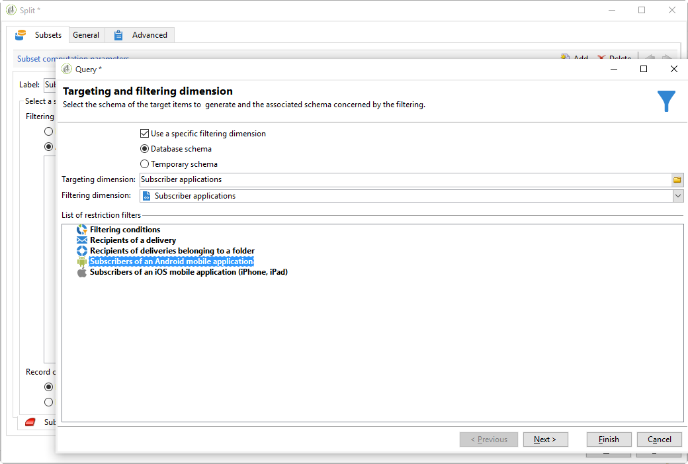

# クロスチャネル配信{#cross-channel-deliveries}

クロスチャネル配信は、キャンペーンワークフローアクティビティの「**[!UICONTROL 配信]**」タブから使用可能です。

クロスチャネル配信を使用して、特定のチャネルに固有の配信を作成できます。従来の配信ウィザードと同じ方法で、配信およびコンテンツのベースとなるテンプレートを指定できます。

次に、使用可能な様々なチャネルを示します。

* [E メール](../../delivery/using/about-email-channel.md)
* [ダイレクトメール](../../delivery/using/about-direct-mail-channel.md)
* [モバイル](../../delivery/using/sms-channel.md)
* [Twitter](../../social/using/publishing-on-twitter.md)
* [Facebook](../../social/using/publishing-on-facebook.md)
* [iOS](../../delivery/using/creating-notifications.md#sending-notifications-on-ios)
* [Android](../../delivery/using/creating-notifications.md#sending-notifications-on-android)

各種ターゲティングアクティビティを使用して、ワークフローの配信アップストリームのターゲットを指定できます。

例えば、ここでは、プッシュ通知購読者に E メールまたは SMS を送信し、1 週間後にプッシュ通知を通知するワークフローを作成します。手順は次のとおりです。

1. キャンペーンを作成します。
1. キャンペーンの「**[!UICONTROL ターゲティングとワークフロー]**」タブで、ワークフローに&#x200B;**[!UICONTROL クエリ]**&#x200B;を追加します。
1. クエリを設定します。例えば、ここでは、ターゲットディメンションとしてプッシュ通知を購読している受信者を選択します。

   >[!NOTE]
   >
   >プッシュ通知の場合、必ず&#x200B;**購読者のアプリケーション**&#x200B;ターゲットディメンションを使用するようにします。

   

1. クエリにフィルター条件を追加します。この場合、モバイル番号または E メールアドレスを持つ受信者を選択します。

   

1. ワークフローに&#x200B;**[!UICONTROL 分割]**&#x200B;アクティビティを追加して、モバイル番号を持つ受信者と E メールアドレスを持つ受信者を分割します。
1. 「**[!UICONTROL 配信]**」タブで、各ターゲットに対する配信を選択します。

   ワークフローの配信アクティビティをダブルクリックして、従来の配信ウィザードと同じ方法で配信を作成します。詳しくは、この[ページ](../../delivery/using/about-email-channel.md)を参照してください。

   

1. 受信者が一度に多くの配信を受信しないように、**[!UICONTROL 待機]**&#x200B;アクティビティを追加および設定します。
1. **[!UICONTROL 分割]**&#x200B;アクティビティを追加して、iOS または Android モバイルアプリケーションの購読者を分割します。

   各オペレーティングシステム用のサービスを選択します。サービスの作成について詳しくは、この[ページ](../../delivery/using/configuring-the-mobile-application.md)を参照してください。

   

1. 各オペレーティングシステム用のモバイルアプリケーション配信を選択および設定します。

   
