# クロスチャネル配信ワークフロー{#cross-channel-delivery-workflow}

この使用例では、クロスチャネル配信ワークフローに関する例を示します。クロスチャネル配信の一般的な概念については、[この節](../../workflow/using/cross-channel-deliveries.md)で説明しています。

ここでは、1 つのグループに E メールを送信し、もう 1 つのグループに SMS メッセージを送信することを目的に、データベースの受信者からオーディエンスを別々のグループにセグメント化します。

この使用例の主な実装手順は次のとおりです。

1. Creating a **[!UICONTROL Query]** activity to target your audience.
1. Creating an **[!UICONTROL Email delivery]** activity containing a link to an offer.
1. Using a **[!UICONTROL Split]** activity to:

   * 最初の E メールを開封しなかった受信者に別の E メールを送信する。
   * E メールを開封したが、オファーへのリンクをクリックしなかった受信者に SMS を送信する。
   * E メールを開封し、オファーへのリンクをクリックした受信者をデータベースに追加する。

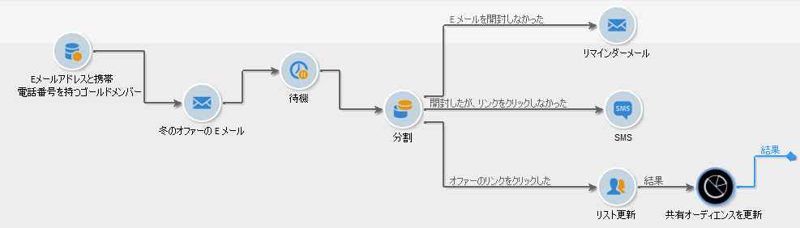

## 手順1:オーディエンスのターゲット設定 {#step-1--targeting-the-audience}

ターゲットを定義するために、受信者を特定するクエリを作成します。

1. キャンペーンを作成します。詳しくは、[この節](../../campaign/using/setting-up-marketing-campaigns.md#creating-a-campaign)を参照してください。
1. In the **[!UICONTROL Targeting and workflows]** tab of your campaign, add a **Query** activity to your workflow. このアクティビティの使用について詳しくは、[この節](../../workflow/using/query.md)を参照してください。
1. 配信を受信する受信者を定義します。例えば、ターゲットディメンションとして「ゴールド」メンバーを選択します。
1. クエリにフィルター条件を追加します。この例では、E メールアドレスと携帯電話番号を持つ受信者を選択します。

   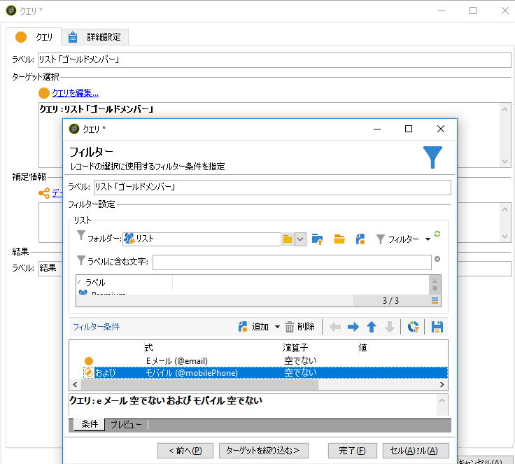

1. 変更を保存します。

## Step 2: Creating an email including an offer {#step-2--creating-an-email-including-an-offer}

1. Create an **[!UICONTROL Email delivery]** activity and double-click it in your workflow to edit it. E メールの作成について詳しくは、[この節](../../delivery/using/about-email-channel.md)を参照してください。
1. メッセージをデザインし、オファーを含むリンクをコンテンツに挿入します。

   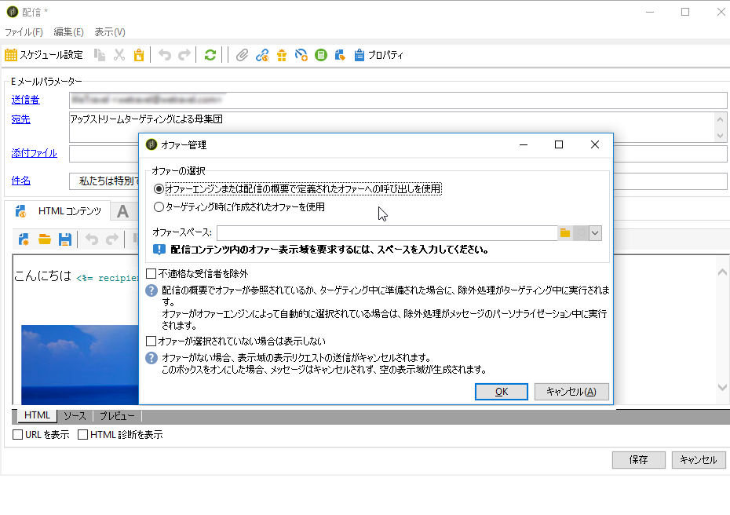

   メッセージ本文へのオファーの組み込みについて詳しくは、[この節](../../interaction/using/integrating-an-offer-via-the-wizard.md#delivering-with-a-call-to-the-offer-engine)を参照してください。

1. 変更を保存します。
1. アクティビティを右クリ **[!UICONTROL Email delivery]** ックして開きます。
1. 母集団とトラッ **[!UICONTROL Generate an outbound transition]** キングログを回復するには、このオプションを選択します。

   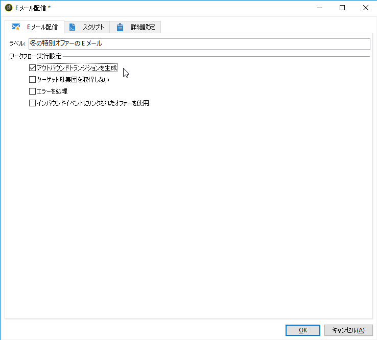

   この情報を使用して、最初の E メールを受信したときの受信者の行動に基づいて別の配信を送信することができます。

1. Add a **[!UICONTROL Wait]** activity to let a few days for the recipients to open the email.

   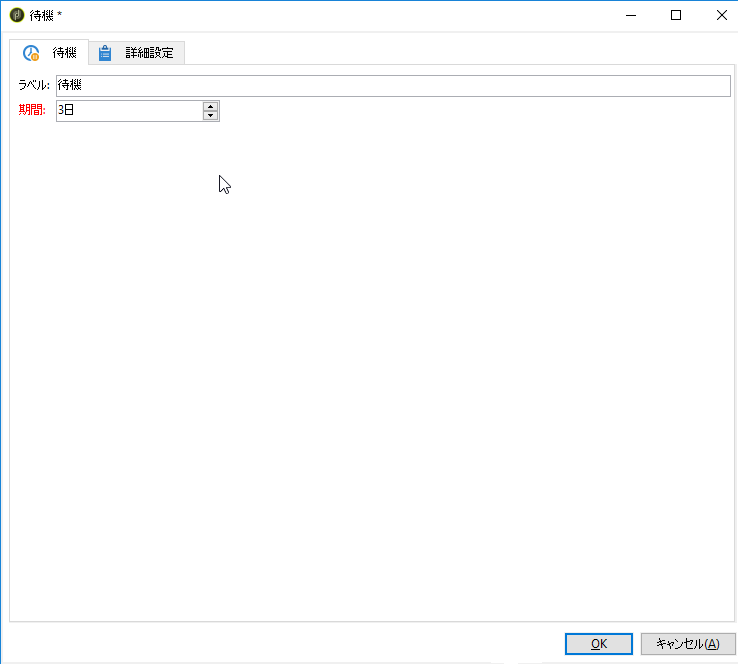

## Step 3: Segmenting the resulting audience {#step-3--segmenting-the-resulting-audience}

ターゲットを特定し、最初の配信を作成した後は、フィルター条件を使用してターゲットを別々の母集団にセグメント化する必要があります。

1. **分割**&#x200B;アクティビティをワークフローに追加し、開きます。このアクティビティの使用について詳しくは、[この節](../../workflow/using/split.md)を参照してください。
1. クエリでアップストリームを計算した母集団から 3 つのセグメントを作成します。

   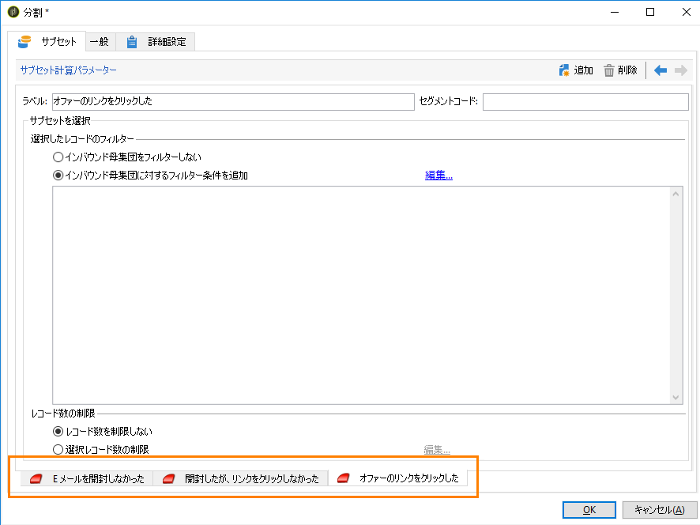

1. 最初のサブセットに対して、オプションを選択 **[!UICONTROL Add a filtering condition on the inbound population]** し、をクリックしま **[!UICONTROL Edit]**&#x200B;す。

   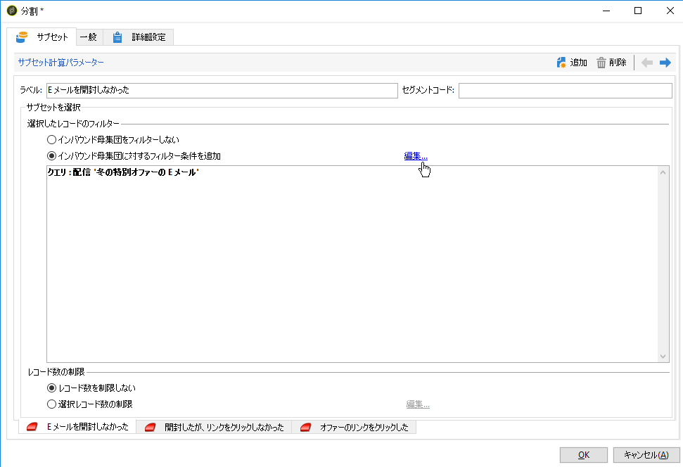

1. 制限フィ **[!UICONTROL Recipients of a delivery]** ルターとして選択し、をクリックしま **[!UICONTROL Next]**&#x200B;す。

   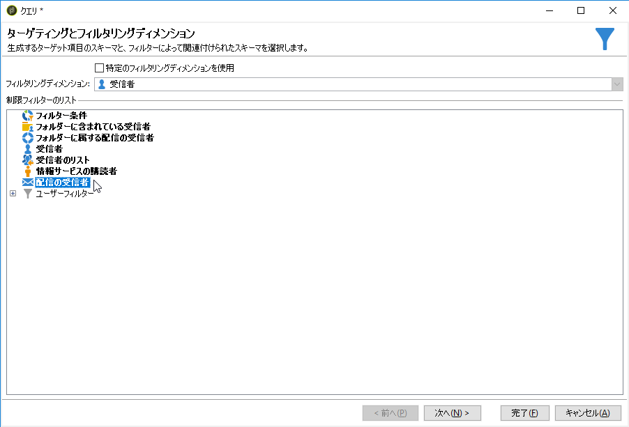

1. フィルター設定で、ドロッ **[!UICONTROL Recipients who have not opened or clicked (email)]** プダウンリスト **[!UICONTROL Behavior]** から選択し、配信リストから送信するオファーを含む電子メールを選択します。 クリック **[!UICONTROL Finish]**.

   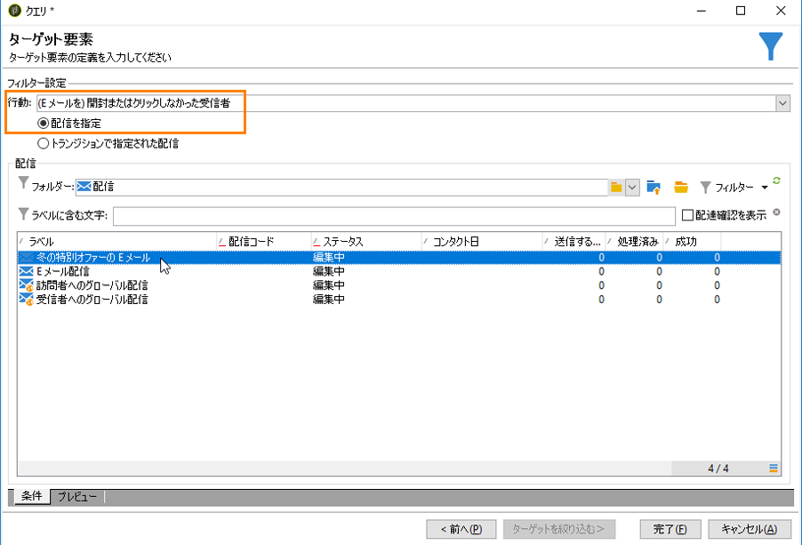

1. 2つ目のサブセットに対しても同様に進み、ドロ **[!UICONTROL Recipients who have not clicked (email)]** ップダウン **[!UICONTROL Behavior]** リストから選択します。

   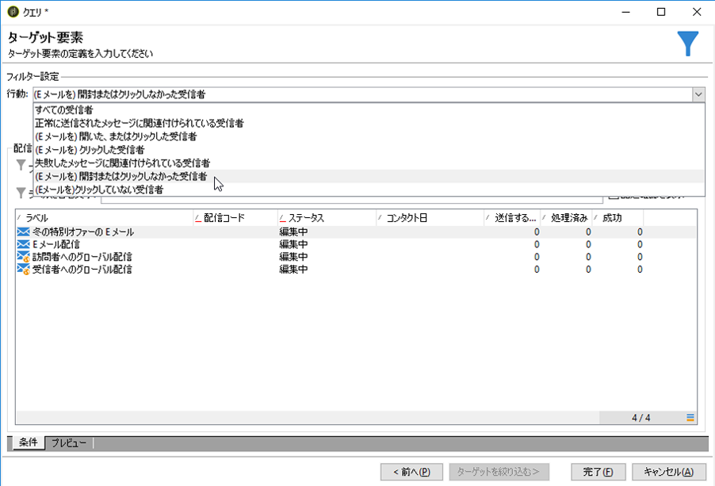

1. 3番目のサブセットに対して、を選択してをクリ **[!UICONTROL Add a filtering condition on the inbound population]** ックし、オ **[!UICONTROL Edit]**&#x200B;プションを選択 **[!UICONTROL Use a specific filtering dimension]** します。
1. ドロッ **[!UICONTROL Recipient tracking log]** プダウンリ **[!UICONTROL Filtering dimension]** ストからを選択し、からハイラ **[!UICONTROL Filtering conditions]** イト表示を **[!UICONTROL List of restriction filters]** 選択しま **[!UICONTROL Next]**&#x200B;す。

   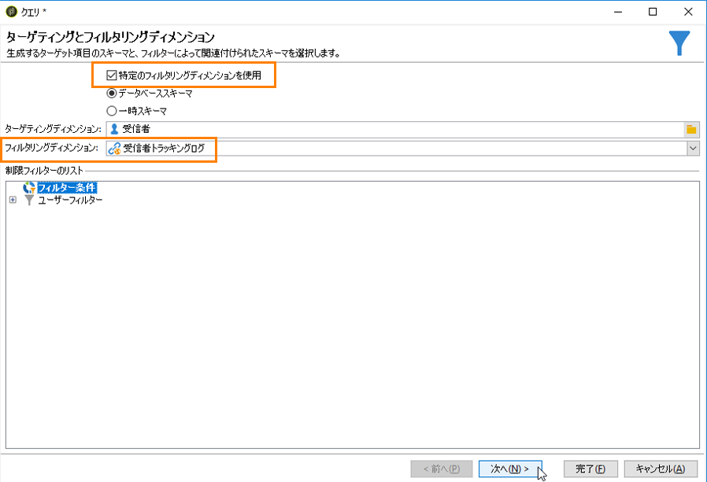

1. 次のようにフィルター条件を選択します。

   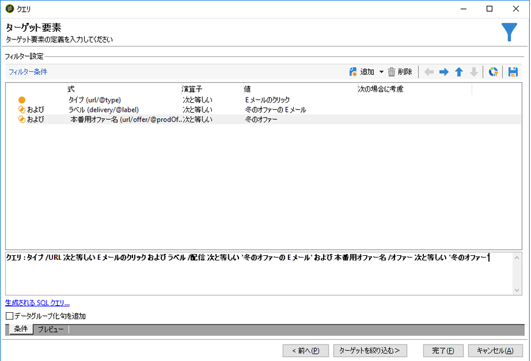

1. Click **[!UICONTROL Finish]** to save your changes.

## 手順4:ワークフローの最終処理 {#step-4--finalizing-the-workflow}

1. Add the relevant activities to your workflow after the three subsets resulting from the **[!UICONTROL Split]** activity:

   * Add an **[!UICONTROL Email delivery]** activity to send a reminder email to the first subset.
   * Add a **[!UICONTROL Mobile delivery]** activity to send an SMS message to the second subset.
   * Add a **[!UICONTROL List update]** activity to add the corresponding recipients to the database.

1. ワークフローの配信アクティビティをダブルクリックして編集します。E メールおよび SMS の作成について詳しくは、[E メールチャネル](../../delivery/using/about-email-channel.md)および [SMS チャネル](../../delivery/using/sms-channel.md)を参照してください。
1. アクティビティをダブルク **[!UICONTROL List update]** リックし、オプションを選択 **[!UICONTROL Generate an outbound transition]** します。

   これで、得られた受信者を Adobe Campaign から Adobe Experience Cloud にエクスポートすることができます。For example, you can use the audience in Adobe Target by adding an **[!UICONTROL Update shared audience]** activity to the workflow. 詳しくは、[オーディエンスのエクスポート](../../integrations/using/importing-and-exporting-audiences.md#exporting-an-audience)を参照してください。

1. アクションバーの「**開始**」ボタンをクリックして、ワークフローを実行します。

**クエリ**&#x200B;アクティビティでターゲティングされた母集団はセグメント化され、受信者の行動に基づいて、E メール配信か SMS 配信を受信します。The remaining population will be added to the database using the **[!UICONTROL List update]** activity.
