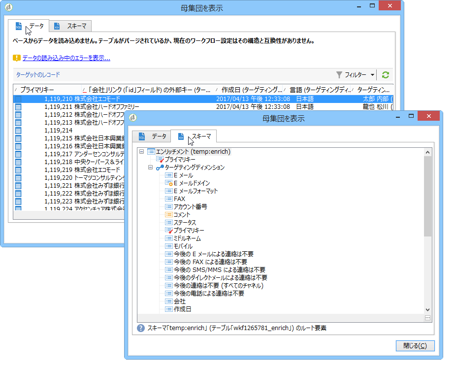
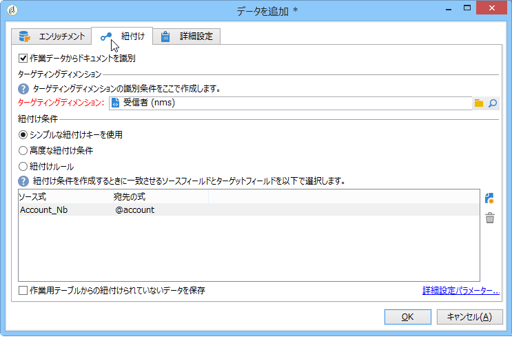
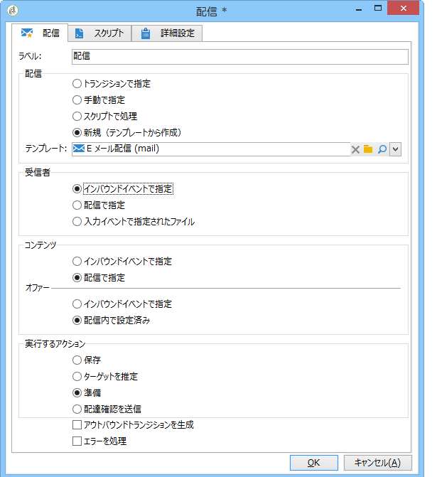

# データのライフサイクル {#data-life-cycle}

## 作業用テーブル {#work-table}

ワークフローでは、1 つのアクティビティから別のアクティビティへ移されたデータは、一時的な作業用テーブルに保存されます。

このデータは、適切なトランジションを右クリックすることで、表示して分析することができます。


これを実行するには、該当するメニューを選択します。

* ターゲットを表示

   このメニューは、ターゲット母集団に対して使用可能なデータと、作業用テーブルの構造を表示します（「**[!UICONTROL スキーマ]**」タブ）。

   

   詳しくは、[作業用テーブルとワークフローのスキーマ](../../workflow/using/monitoring-workflow-execution.md#worktables-and-workflow-schema)を参照してください。

* ターゲットを分析

   このメニューは、トランジションのデータの統計とレポートを作成できる記述的分析ウィザードを表示します。

   詳しくは、[この節](../../reporting/using/using-the-descriptive-analysis-wizard.md)を参照してください。

ワークフローが実行されると、ターゲットデータはパージされます。最後の作業用テーブルだけにアクセスできます。ワークフローを設定し、すべての作業用テーブルをアクセス可能なまま維持することもできます。それには、「**[!UICONTROL 2 つの実行間の中間母集団の結果を保存]**」オプションを選択します。

ただし、データが大量にある場合、このオプションを有効化しないことをお勧めします。


## ターゲットデータ {#target-data}

ワークフローの作業用テーブルに保存されたデータは、パーソナライゼーションフィールドからアクセスできます。

このようにすることで、リストを経由して収集したデータ、または調査に対する回答に基づくデータを使用できます。それには、次の構文を使用します。

```
%= targetData.FIELD %
```

「**[!UICONTROL ターゲット式]**」（targetData）タイプのパーソナライゼーション要素は、ターゲティングワークフローには使用できません。配信ターゲットは、ワークフロー内に作成され、配信のインバウンドトランジション内に指定される必要があります。

配信の配達確認を作成するには、パーソナライゼーションデータが入力できるように、配達確認のターゲットが&#x200B;**[!UICONTROL アドレス置換]**&#x200B;モードに基づいて作成される必要があります。詳しくは、[この節](../../delivery/using/steps-defining-the-target-population.md#using-address-substitution-in-proof)を参照してください。

次の例では、パーソナライズしたメールで使用するために、顧客に関する情報のリストを収集しようとしています。

次の手順に従います。

1. 情報を収集するワークフローを作成し、既にデータベース内にあるデータと紐付けをおこなってから、配信を開始します。

   

   この例では、ファイルの内容は次のようになります。

   ```
   Music,First name,Last name,Account,CD/DVD,Card
   Pop,David,BLAIR,4323,CD,0
   Rock,Daniel,ARCARI,3222,DVD,1
   Disco,Uma,ALTON,0488,DVD,0
   Jazz,Paul,BOLES,6475,CD,1
   Jazz,David,BOUKHARI,0841,DVD,1
   [...]
   ```

   ファイルを読み込むには、次の手順を適用します。

   

1. 「**[!UICONTROL エンリッチメント]**」タイプアクティビティを設定し、収集したデータを、既に Adobe Campaign データベース内にあるデータと紐付けします。

   ここでは、紐付けキーがアカウント番号です。

   

1. 次に、テンプレートに基づいて作成され、インバウンドトランジションによって受信者が指定された「**[!UICONTROL 配信]**」を設定します。

   

   >[!CAUTION]
   >
   >トランジションに含まれているデータのみが、配信のパーソナライズに使用されます。「**targetData**」タイプのパーソナライゼーションフィールドは、「**[!UICONTROL 配信]**」アクティビティのインバウンドの母集団用にのみ使用可能です。

1. 配信テンプレートで、ワークフローで収集したフィールドを使用します。

   それには、「**[!UICONTROL ターゲット式]**」タイプのパーソナライゼーションフィールドを挿入します。

   

   ここでは、ワークフローで収集されたファイル内に記述された顧客の好きな音楽ジャンルとメディアタイプ（CD または DVD）を挿入します。

   さらに、ロイヤリティのあるカード所有者（例えば Card の値が 1 と等しい受信者）にクーポンを追加します。

   

   「**[!UICONTROL ターゲット式]**」（targetData）タイプのデータが、すべてのパーソナライゼーションフィールドと同じ特性を使用して、配信に挿入されます。これらのデータは、本文、リンクラベル、またはリンク自体に使用されます。

   収集された受信者宛てのメッセージには、次のデータが含まれます。

   
