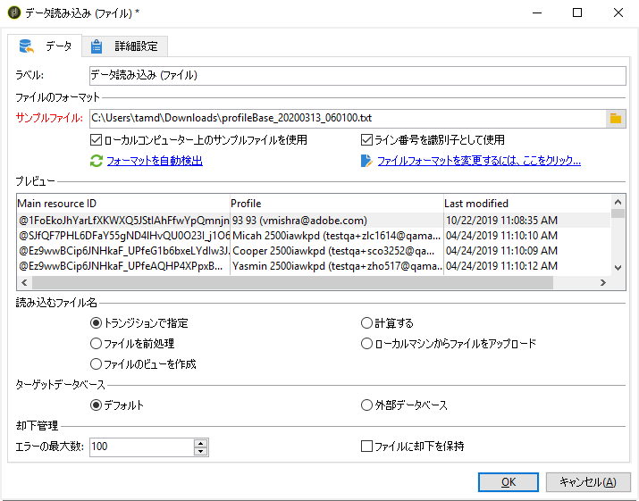
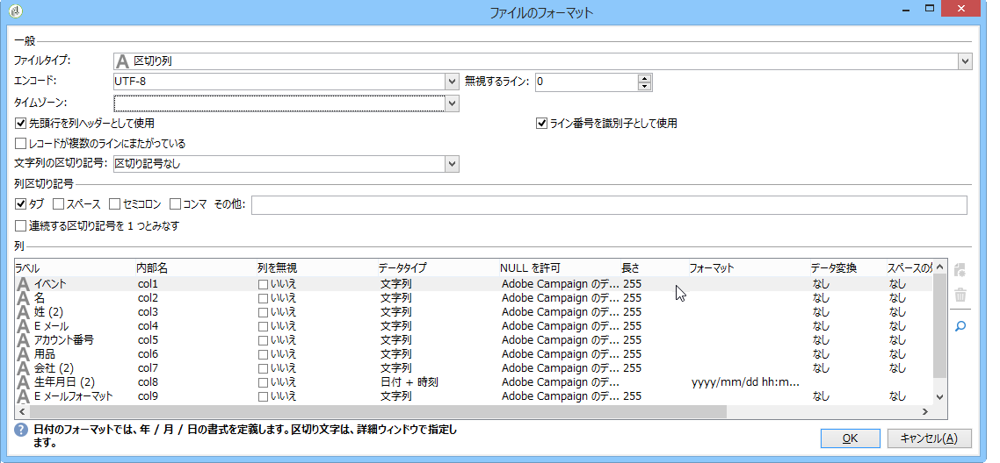
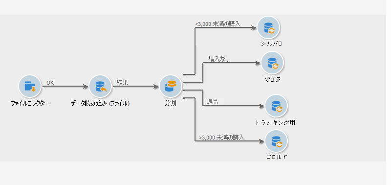
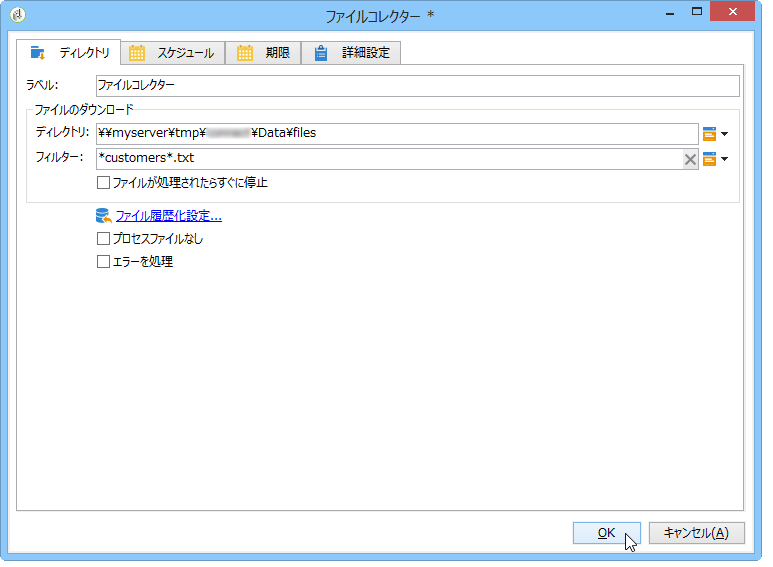
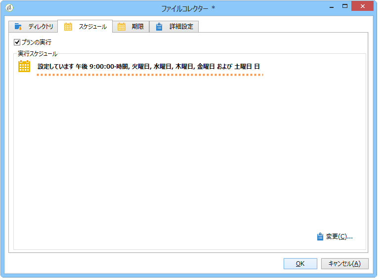
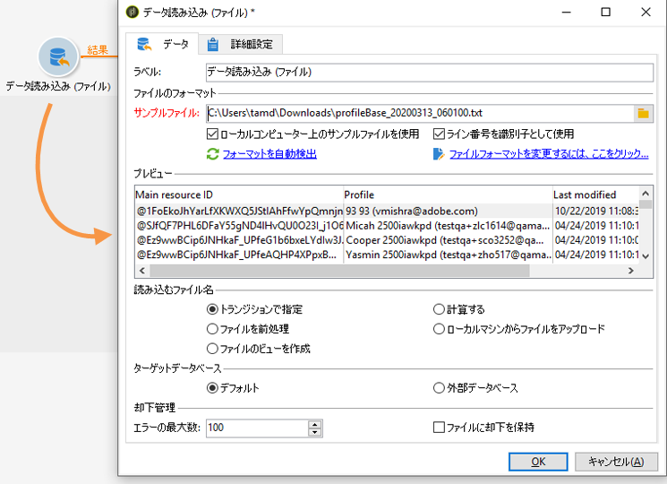
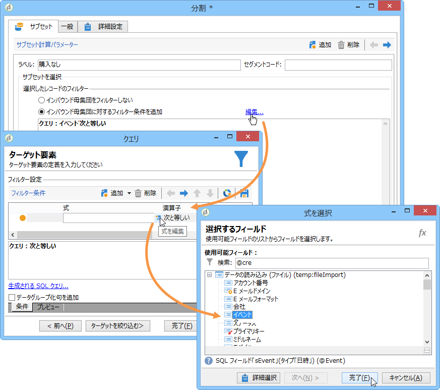
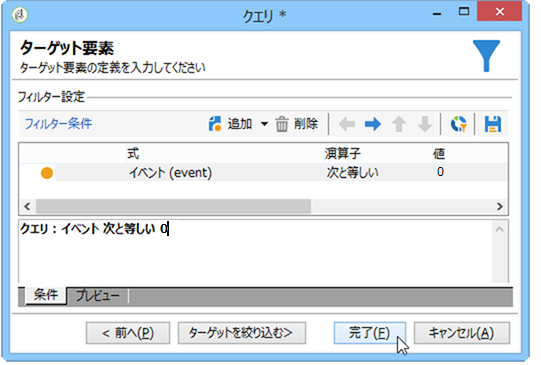
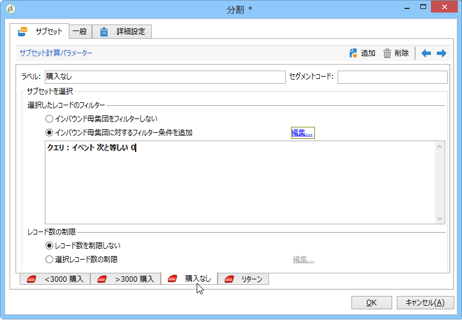

# データの読み込み（ファイル）{#data-loading-file}

## 用途 {#use}

The **[!UICONTROL Load (File)]** activity lets you directly access a source of external data and use it in Adobe Campaign. 実際、ターゲティングオペレーションに必要なデータがすべて Adobe Campaign データベースにあるとは限りません。その場合には、外部のファイルを利用できます。

読み込むファイルはトランジションで指定できますが、このアクティビティの実行によって自動生成することもできます。例えば、クライアントのお気に入りの 10 個の製品リストがあり、それらの購入が外部のデータベースで管理されていたとします。

このアクティビティの設定ウィンドウの上部で、ファイルのフォーマットを定義できます。そのためには、インポートするファイルと同じフォーマットのサンプルファイルを使用します。このファイルは、ローカルマシンまたはサーバーのどちらにも保存できます。

>[!CAUTION]
>
>サポートされるファイルは、「フラット」な構造のファイル（CSV、TXT など）のみです。XML フォーマットのファイルは推奨されません。

ファイルのインポート中にプリプロセスを実行するように設定できます。例えば、サーバー上でファイルを解凍せずに（これによりファイルの解凍スペースが節約される）、ファイル処理にファイルの解凍を含めることができます。このオプション **[!UICONTROL Pre-process the file]** を選択し、次の3つのオプションのいずれかを選択します。 **[!UICONTROL None]**、 **[!UICONTROL Decompression]** (zcat)、 **[!UICONTROL Decrypt]** (gpg)のいずれかです。

## ファイルフォーマットの定義 {#defining-the-file-format}

ファイルを読み込む際に、列のフォーマットが各データタイプのデフォルトのパラメーターに照らして自動的に検出されます。このデフォルトのパラメーターを編集して（特に誤りや空の値がある場合）、特定の処理を指定してデータに適用することができます。

これを行うには、アクティビティ **[!UICONTROL Click here to change the file format...]** のメインウィンドウでを選択 **[!UICONTROL Data loading (file)]** します。 フォーマット詳細ウィンドウが表示されます。

ファイルの全般的なフォーマットと各列のフォーマットを編集できます。

ファイルの全般的なフォーマットでは、列を認識する方法（エンコーディング、使用する区切り文字など）を定義できます。

列のフォーマットでは、以下の設定で各列の値の処理方法を定義できます。

* **[!UICONTROL Ignore column]**:は、データの読み込み中にこの列を処理しません。
* **[!UICONTROL Data type]**:は、各列に必要なデータのタイプを指定します。
* **[!UICONTROL Allow NULLs]**:空の値の管理方法を指定します。

   * **[!UICONTROL Adobe Campaign default]**:数値フィールドに対してのみエラーを生成し、それ以外の場合はNULL値を挿入します。
   * **[!UICONTROL Empty value allowed]**:は空の値を許可します。 したがって、null 値が挿入されます。
   * **[!UICONTROL Always populated]**:値が空の場合にエラーを生成します。

* **[!UICONTROL Length]**:stringデータ型の最大文字数を指 **定します** 。
* **[!UICONTROL Format]**:時刻と日付の形式を定義します。
* **[!UICONTROL Data transformation]**:文字列に文字ケースプロセスを適用する必要があるかどうかを定義 **します**。

   * **[!UICONTROL None]**:読み込まれた文字列は変更されません。
   * **[!UICONTROL First letter in upper case]**:文字列の各単語の最初の文字は、大文字で始まります。
   * **[!UICONTROL Upper case]**:文字列内のすべての文字は大文字です。
   * **[!UICONTROL Lower case]**:文字列内のすべての文字は小文字です。

* **[!UICONTROL White space management]**:特定のスペースを文字列内で無視する必要があるかどうかを指定します。 The **[!UICONTROL Ignore spaces]** value only allows spaces at the beginning and at the end of a string to be ignored.
* **[!UICONTROL Error processings]**:エラーが発生した場合の動作を定義します。

   * **[!UICONTROL Ignore the value]**:値は無視されます。 ワークフローの実行ログに警告が生成されます。
   * **[!UICONTROL Reject line]**:行全体が処理されません。
   * **[!UICONTROL Use a default value in case of error]**:エラーの原因となる値を、フィールドに定義されたデフォルト値に置き換え **[!UICONTROL Default value]** ます。
   * **[!UICONTROL Reject the line when there is no remapping value]**:マッピングが誤った値に対して定義されていない限り、行全体は処理され **[!UICONTROL Mapping]** ません（下記のオプション）。
   * **[!UICONTROL Use a default value in case the value is not remapped]**:エラーの原因となる値を、エラーのある値に対してマッピングが定義されていない限り、フィールドで定義されたデフォルト値に置き換えます( **[!UICONTROL Default value]** 以下のオプション **[!UICONTROL Mapping]** を参照)。

* **[!UICONTROL Default value]**:は、選択したエラー処理に従ってデフォルト値を指定します。
* **[!UICONTROL Mapping]**:このフィールドは、列の詳細設定（ダブルクリックまたは列リストの右側のオプションからアクセス）でのみ使用できます。 これにより、特定の値を読み込んだときに、その値を変換します。例えば、「three」を「3」に変換できます。

## Example: Collecting data and loading it in the database {#example--collecting-data-and-loading-it-in-the-database}

以下の例では、サーバー上のファイルを毎日取得し、コンテンツを読み込み、そのコンテンツの情報に基づいてデータベース内のデータを更新することができます。取得するファイルには、購入をおこなった顧客（3,000 ユーロ以上または未満）、購入の返金をおこなった顧客、または店舗を訪れただけで何も購入しなかった顧客に関する情報が含まれています。この情報に基づいて、様々な処理がデータベースの顧客プロファイルに適用されます。

1. ファイルコレクターを使用すれば、ディレクトリに格納されていたファイルを、所定の日時に定期的に取得できます。

   The **[!UICONTROL Directory]** tab contains information on the file(s) to be recovered. この例では、サーバーの tmp/Adobe/Data/files ディレクトリに格納されている、「customers」という単語をファイル名含むテキストファイルが取得されます。

   の使用方法につい **[!UICONTROL File collector]** ては、「ファイル」コレク [ターの節](../../workflow/using/file-collector.md) を参照してください。

   

   The **[!UICONTROL Schedule]** tab lets you schedule the execution of the collector, i.e. to specify the frequency with which the presence of these files will be checked.

   ここでは、各営業日の午後 9 時にコレクターが実行されるようにします。

   

   To do this, click the **[!UICONTROL Change...]** button located in the lower right-hand section of the editing tool and configure the schedule.

   For more on this, refer to [Scheduler](../../workflow/using/scheduler.md).

1. 次に、「データの読み込み（ファイル）」アクティビティを設定して、取得したファイルを読み込む方法を指定できます。それには、読み込むファイルと同じ構造を持つサンプルファイルを選択します。

   

   ここでは、ファイルに 5 つの列があります。

   * 1 番目の列には、購入（3,000 ユーロ以上または未満）、未購入または 1 つ以上の購入アイテムの返金というイベントと紐付けするコードが含まれています。
   * 2 番目から 4 番目の列はそれぞれ、クライアントの姓、名前、E メールおよびアカウント番号が含まれます。
   世も混まれるファイルのフォーマット設定は、Adobe Campaign へのデータインポート時に定義されたフォーマット設定と紐付けされます。詳しくは、[この節](../../platform/using/importing-data.md#step-2---source-file-selection)を参照してください。

1. 分割アクティビティで、「**イベント**」列の値に従って、作成するサブセットを指定します。

   分割アクティビティについて詳しくは、この節で説明しています。

   

   各サブセットについて、「**イベント**」列にいずれかの値を指定します。

   

   The **[!UICONTROL Split]** activity will therefore contain the following information:

   

1. 次に、母集団の各タイプについて、実行されるプロセスを指定します。In our example, we are going to **[!UICONTROL Update the data]** in the database. To do this, place an **[!UICONTROL Update data]** activity at the end of each outbound transition from the split activity.

   アクティビテ **[!UICONTROL Update data]** ィの詳細は、「データを更新」セク [ションに記載され](../../workflow/using/update-data.md) ます。

