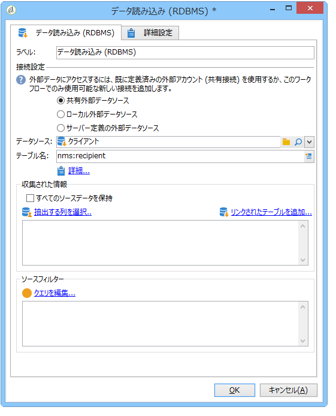
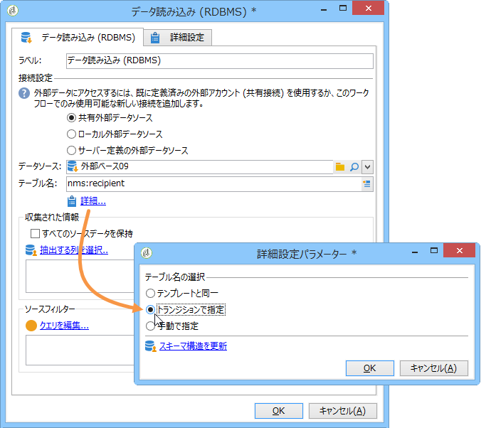
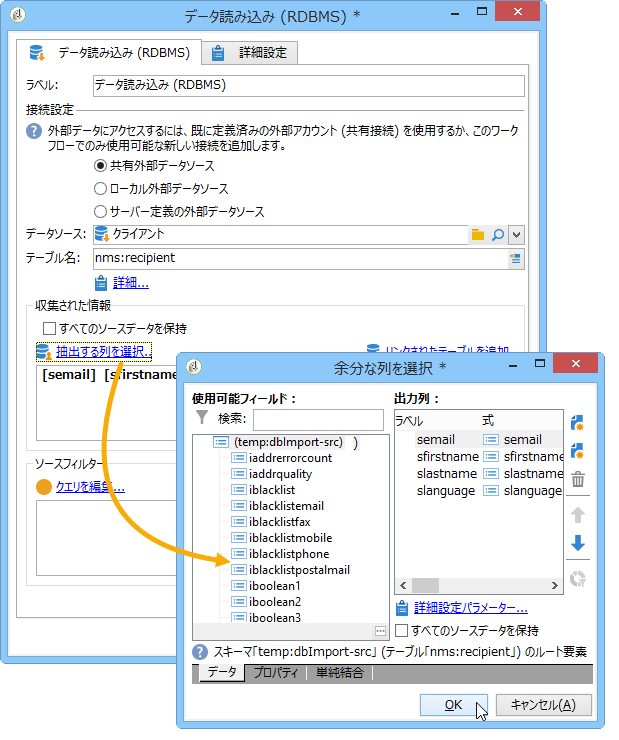

# データの読み込み（RDBMS）{#data-loading-rdbms}

The **[!UICONTROL Data loading (RDBMS)]** activity lets you access this external database directly and to collect only the data required for targeting.

パフォーマンスを向上させるには、外部データベースのデータを使用できるクエリアクティビティの使用をお勧めします。For more on this, refer to [Accessing an external database (FDA)](../../workflow/using/accessing-an-external-database--fda-.md).

手順は以下のようになります。

1. リストからデータソースを選択し、抽出するデータが含まれるテーブル名を入力します。

   

   対応するフィールドに入力したテーブル名は、外部テンプレート内のデータを収集するテンプレートとして使用されます。ワークフローによって処理されるテーブル名は、データの読み取りアクティビティのインバウンドトランジションによって自動生成または伝達されます。使用するテーブルを選択するには、をクリックしま **[!UICONTROL Advanced..]**&#x200B;す。 」リンクをクリックし、またはオプ **[!UICONTROL Specified in the transition]** ションを選 **[!UICONTROL Explicit]** 択します。

   

1. リンクをク **[!UICONTROL Select the columns to extract...]** リックして、データベースで収集するデータを選択します。

   

1. このデータに対してフィルターを定義できます。これを行うには、リンクをクリック **[!UICONTROL Edit query....]** します。

   このように収集されたデータは、ワークフローのライフサイクルを通じて使用できます。

