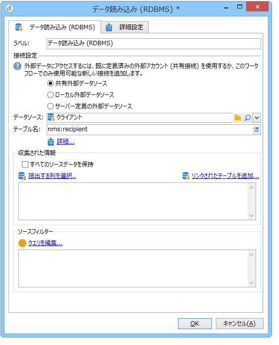
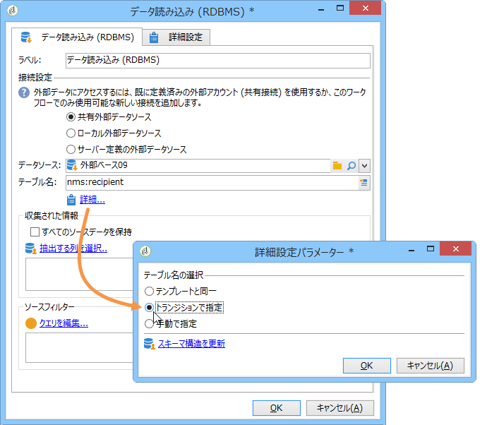
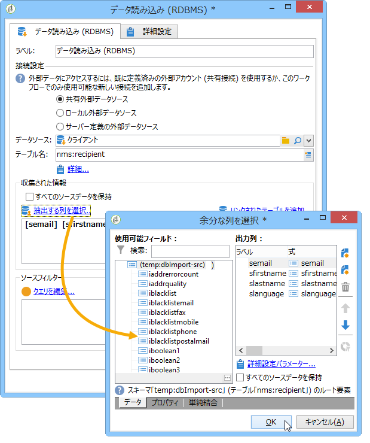

# データの読み込み（RDBMS）{#data-loading-rdbms}

「**[!UICONTROL データの読み込み（RDBMS）]**」アクティビティでは、外部データベースに直接アクセスし、ターゲティングに必要なデータを収集できます。

パフォーマンスを向上させるには、外部データベースのデータを使用できるクエリアクティビティの使用をお勧めします。 詳しくは、[外部データベースへのアクセス（FDA）](accessing-an-external-database-fda.md)を参照してください。

手順は以下のようになります。

1. リストからデータソースを選択し、抽出するデータが含まれるテーブル名を入力します。

   

   対応するフィールドに入力したテーブル名は、外部テンプレート内のデータを収集するテンプレートとして使用されます。 ワークフローによって処理されるテーブル名は、データの読み取りアクティビティのインバウンドトランジションによって自動生成または伝達されます。 使用するテーブルを選択するには、**[!UICONTROL 詳細…]**. リンクをクリックし、**[!UICONTROL 移行]**&#x200B;または&#x200B;**[!UICONTROL 明示的]** オプションで「指定」を選択します。

   

1. 「**[!UICONTROL 抽出する列を選択...]**」リンクをクリックして、収集するデータをデータベース内で選択します。

   

1. このデータに対してフィルターを定義できます。 これを行うには、**[!UICONTROL クエリを編集…]** リンクをクリックします。

   このように収集されたデータは、ワークフローのライフサイクルを通じて使用できます。
