# 重複排除{#deduplication}

重複排除は、インバウンドアクティビティの結果から重複を削除します。重複排除は、メールアドレス、電話番号やその他のフィールドに対して実行されます。

## ベストプラクティス{#best-practices}

重複排除の実行中、インバウンドフローは個別に処理されます。例えば、受信者 A がクエリ 1 とクエリ 2 の結果に見つかった場合、それらは重複排除されません。

この問題は、次のように対処されます。

* 各インバウンドフローを統合する「**和集合**」アクティビティを作成します。
* 「**和集合**」アクティビティの後に、「**重複排除**」アクティビティを作成します。

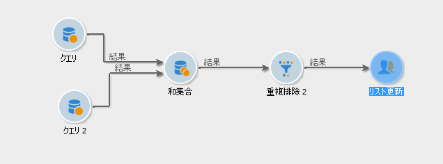

## 設定 {#configuration}

重複排除を設定するには、ラベル、メソッド、重複排除条件、および結果に関するオプションを入力します。

Click the **[!UICONTROL Edit configuration...]** link to define the deduplication mode.

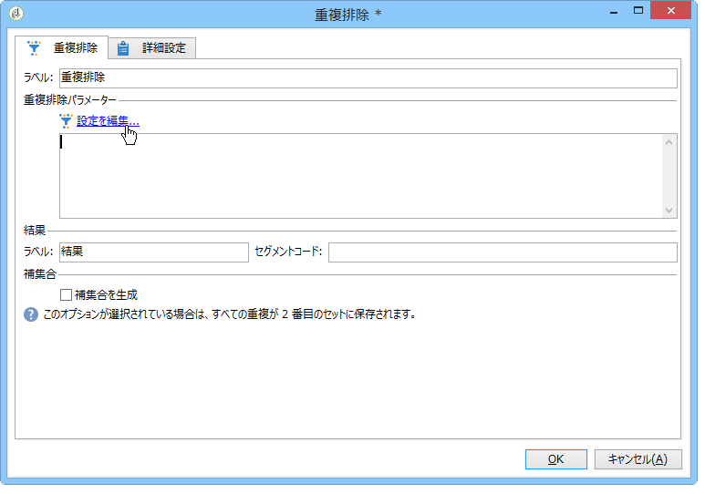

1. ターゲット選択

   このアクティビティのターゲットのタイプ（デフォルトでは、重複排除は受信者を対象とする）と、使用する基準を選択します。例えば、E メールアドレスや携帯または固定電話番号、FAX 番号、個人メールアドレスの中から、同一の値を持つ場合に重複と判断するためのフィールドを選択します。

   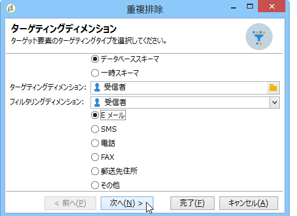

   In the next step, the **[!UICONTROL Other]** option lets you select the criterion or criteria to be used:

   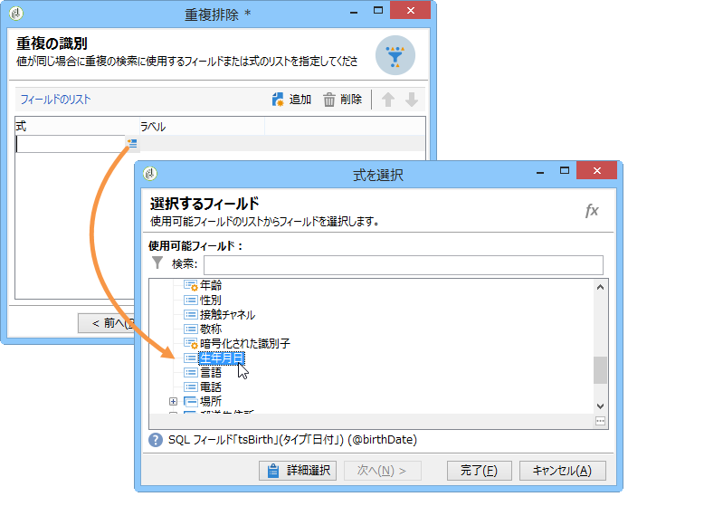

1. 重複排除のメソッド

   ドロップダウンリストから、使用する重複排除メソッドを選択し、保持する重複の数を入力します。

   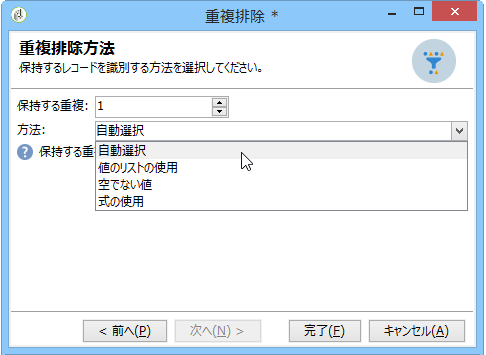

   次のメソッドを使用できます。

   * **[!UICONTROL Choose for me]**:重複を除外するレコードをランダムに選択します。
   * **[!UICONTROL Following a list of values]**:1つ以上のフィールドの値の優先順位を定義できます。 優先度の値を定義するには、フィールドを選択するか式を作成し、適切なフィールドに値を追加します。To define a new field, click the **[!UICONTROL Add]** button located above the list of values.

      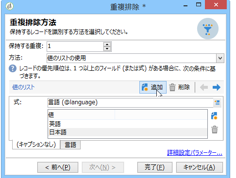

   * **[!UICONTROL Non-empty value]**:これにより、選択した式の値が空でないレコードを優先度として保持できます。

      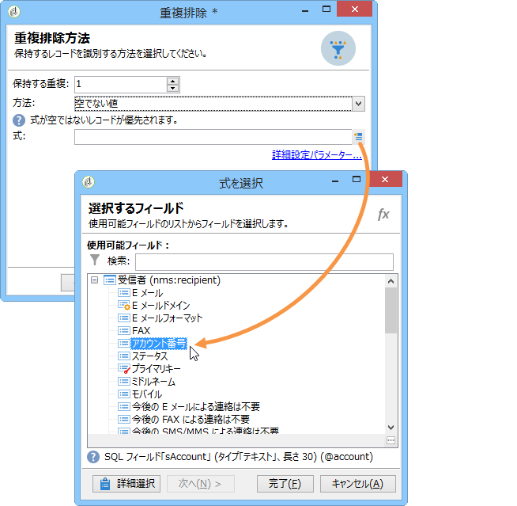

   * **[!UICONTROL Using an expression]**:指定した式の最も低い（または最も高い）値を持つレコードを保持できます。

      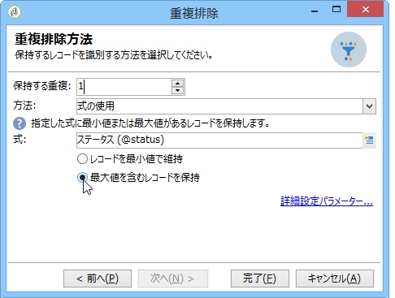
   Click **[!UICONTROL Finish]** to approve the selected deduplication method.

   ウィンドウの中央部に定義した設定の概要が表示されます。

   アクティビティエディターの下側で、グラフィカルオブジェクトのアウトバウンドトラジションのラベルを変更し、アクティビティの結果に関連するセグメントコードを入力できます。このコードは後の手順で、ターゲット条件として使用できます。

   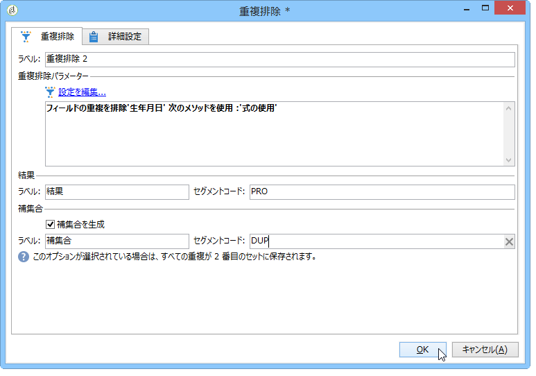

   Check the **[!UICONTROL Generate complement]** option if you wish to exploit the remaining population. 補集合はすべての重複から構成されます。その後、次の図のように、追加のトランジションがアクティビティに追加されます。

   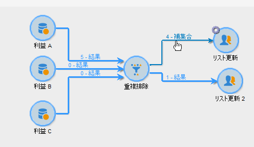

## Example: Identify the duplicates before a delivery {#example--identify-the-duplicates-before-a-delivery}

次の例では、重複排除は 3 つのクエリの重複排除を処理します。

ワークフローの目的は、同じ受信者に何度も配信が送信されないように、重複を除外した配信ターゲットを定義することです。

さらに、特定された重複は、必要に応じて再利用できるように、専用の重複リストにまとめられます。

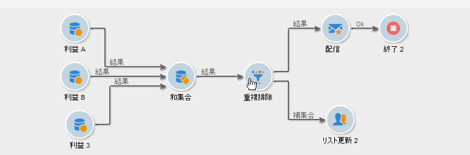

1. 上の図に示すように、ワークフローの操作に必要な各種アクティビティを追加してリンクします。

   ここで使用される和集合アクティビティは、3 つのクエリを 1 つのトランジションに統合します。このため、重複排除は各クエリに個別に作用するのではなく、クエリ全体に対して作用します。For more on this subject, refer to [Best practices](#best-practices).

1. Open the deduplication activity then click the **[!UICONTROL Edit configuration...]** link to define the deduplication mode.
1. 新しいウィンドウで、を選択しま **[!UICONTROL Database schema]**&#x200B;す。
1. 「**受信者**」をターゲティングとフィルタリングディメンションを選択します。
1. Select the ID field for the **[!UICONTROL Email]** duplicates, to send the delivery only once to every email address, then click **[!UICONTROL Next]**.

   If you wish to base the duplicate IDs on a specific field, select **[!UICONTROL Other]** to access the list of available fields.

1. 複数の受信者に対して同じメールアドレスが検出された場合、1 つのエントリのみを保持するように選択します。
1. Select the **[!UICONTROL Choose for me]** deduplication mode so that the records saved in case of identified duplicates are randomly chosen, then click **[!UICONTROL Finish]**.

ワークフローを実行した場合、重複が検出されたすべての受信者は結果から除外され（結果的に配信からも除外される）、重複リストに追加されます。このリストを再利用することで、重複を再度検出しなくてもすみます。

## 入力パラメーター {#input-parameters}

* tableName
* schema

各インバウンドイベントは、これらのパラメーターによって定義されるターゲットを指定する必要があります。

## 出力パラメーター {#output-parameters}

* tableName
* schema
* recCount

この 3 つの値セットは、重複排除によって生成されたターゲットを識別します。**[!UICONTROL tableName]** はターゲットの識別子を保存するテーブル名、**[!UICONTROL schema]** は母集団のスキーマ（通常は nms:recipient）、**[!UICONTROL recCount]** はテーブル内の要素の数です。

補集合に関連付けられたトランジションは、同じパラメーターを持ちます。
