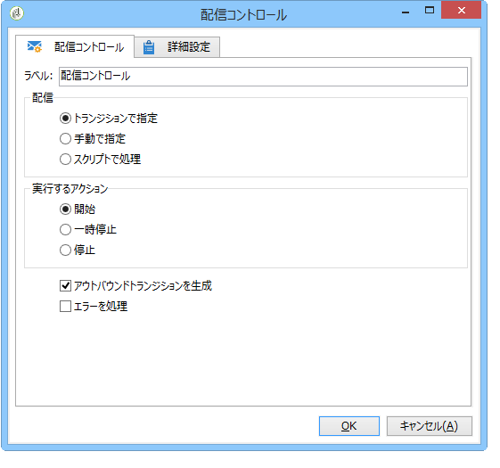

# 配信コントロール{#delivery-control}

「**配信コントロール**」タイプアクションでは、配信を開始、一時停止、または中止できます。

これは、トランジション内で指定された配信、明示的に選択された配信、またはスクリプトで自動生成された配信です。詳しくは、[配信](../../workflow/using/delivery.md)を参照してください。

If you select **[!UICONTROL Start]**, the activity will perform all the steps required to start the delivery (target calculation, content preparation, delivery). これらの手順の一部が、先行のワークフローアクティビティによって実行されている場合、再度実行されることはありません。For instance, if the target estimation was already performed by a **[!UICONTROL Delivery]** type activity (refer to [Delivery](../../workflow/using/delivery.md)), the **[!UICONTROL Act on the delivery]** activity will launch the remaining steps (content preparation and delivery).

次のオプションを使用できます。

* **[!UICONTROL Generate an outbound transition]**

   実行の終了時に有効化される出力トランジションを生成します。アウトバウンド配信のターゲットを取得するかどうかを選択できます。

* **[!UICONTROL Processing errors]**

   詳しくは、処理エ [ラーを参照してくださ](../../workflow/using/monitoring-workflow-execution.md#processing-errors)い。

## 入力パラメーター {#input-parameters}

* deliveryId

配信識別子(選択したアクションが **[!UICONTROL Specified in the transition]**。
