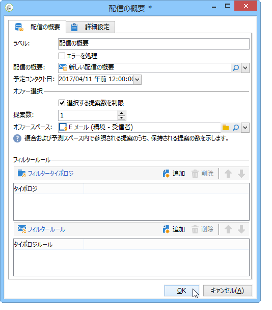

# 配信の概要{#delivery-outline}

配信の概要では、キャンペーンワークフローに概要を使用できます。概要は、あらかじめキャンペーン内に作成しておく必要があります。

Adobe Campaign の配信の概要について詳しくは、この[節](../../campaign/using/marketing-campaign-deliveries.md#associating-and-structuring-resources-linked-via-a-delivery-outline)を参照してください。

アクティビティを設定するには、概要と計画された連絡日を任意に選択するだけです。フィルタリングルールを追加するには、タイポロジまたはタイポロジルールを追加します。

## Example: Inserting an offer via a delivery outline {#example--inserting-an-offer-via-a-delivery-outline}

キャンペーンワークフローで使用可能な配信の概要アクティビティでは、現在進行中のキャンペーンの配信の概要で参照されているオファーを提示できます。

>[!NOTE]
>
>**インタラクション**&#x200B;パッケージをインストールする必要があります。

1. ワークフローで、配信アクティビティを追加する前に、配信の概要アクティビティを追加します。
1. 配信の概要アクティビティで、使用する概要を指定します。

   配信の概要の指定について詳しくは、この[節](../../campaign/using/marketing-campaign-deliveries.md#associating-and-structuring-resources-linked-via-a-delivery-outline)を参照してください。

1. 配信に従って、使用可能なフィールドに入力します。
1. 次の 2 つの場合が考えられます。

   * オファーエンジンを呼び出す場合は、ボックスをオンにし **[!UICONTROL Restrict the number of propositions selected]** ます。 オファースペースを指定し、配信で提示される提案の数を設定します。

      オファーエンジンによって、オファーの重み付けと実施要件ルールが考慮されます。

   * このボックスをオフにすると、オファーエンジンを呼び出すことなく、配信の概要のすべてのオファーが提示されます。
   プレビューでは、配信で指定されたオファーの数が考慮されます。ワークフローを実行する際に考慮されるのは、配信の概要で指定されたオファーの数です。

   

