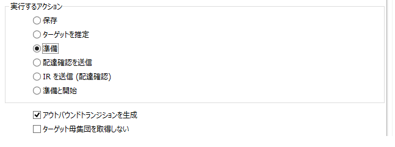
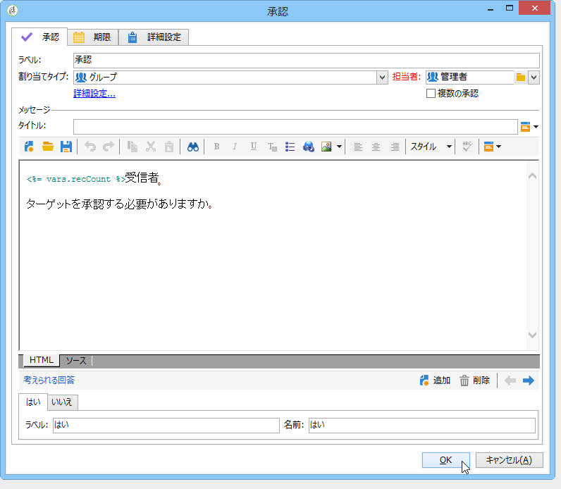

# 配信{#delivery}

「**配信**」タイプのアクティビティで配信アクションを作成できます。入力要素を使用して構築できます。

設定するには、アクティビティを編集して、配信オプションを入力します。


1. **配信**

   次の操作をおこなうことができます。

   * インバウンドトランジションで指定された配信に対して実行します。To do this, select the first option of the **[!UICONTROL Delivery]** section of the window.

      このオプションは、先行するワークフローアクティビティが既に配信を作成または指定済みの場合に使用できます。これは、以下に示すように、アウトバウンドトランジションを生成していた同じタイプのアクティビティによって、完了している場合があります。

      次の例では、初回の配信が作成されます。母集団とコンテンツは、後から定義されます。次に、これらの 3 つの要素の情報は、インバウンドトランジションを使用する新しい配信アクティビティに再入力され、送信できるようになります。

      

   * 対象の配信を直接選択します。To do this, select the **[!UICONTROL Explicit]** option and select the delivery from the drop-down list of the **[!UICONTROL Delivery]** field.

      このリストには、デフォルトで、「**配信**」フォルダー内にある終了していない配信が表示されます。To access other campaigns, click the **[!UICONTROL Select link]** icon.

      

      Select the campaign from the drop-down list of the **[!UICONTROL Folder]** field, or click **[!UICONTROL Display sub-levels]** to display all of the deliveries contained in sub-folders:

      

      After selecting the delivery action, you can display the content by clicking the **[!UICONTROL Edit link]** icon.

   * 配信を自動生成するスクリプトを作成します。これを行うには、オプションを選択し **[!UICONTROL Calculated by a script]** てスクリプトを入力します。 You can open an input window by clicking the **[!UICONTROL Edit...]** option. 次の例では、配信の ID を収集します。

      

   * 新しい配信を作成します。To do this, select the **[!UICONTROL New, created from a template]** option and select the delivery template which the delivery will be based on.

      

      Click the **[!UICONTROL Select link]** icon to browse the folders, and click the **[!UICONTROL Edit link]** icon if you wish to view the content of the selected template.

1. **受信者**

   受信者は、ファイルインポート後のイベントや、配信アクションで指定されたイベントなど、インバウンドイベントによって指定できます。また、受信者は、1 つまたは複数のファイルに保存できます。

   

1. **コンテンツ**

   メッセージのコンテンツは、配信内またはインバウンドイベント内に定義できます。

   

1. **実行するアクション**

   配信を作成して、準備して開始し、ターゲットを推定したり、配達確認を送信することができます。

   

   実行するアクションのタイプを選択します。

   * **[!UICONTROL Save]**:このオプションを使用すると、配信を作成して保存できます。 配信の分析や配信はおこないません。
   * **[!UICONTROL Estimate the target]**:このオプションを使用すると、配信ターゲットを計算して、その潜在能力（最初の分析段階）を評価できます。 This action is the equivalent of selecting the **[!UICONTROL Estimate the population to be targeted]** option and clicking **[!UICONTROL Analyze]** when sending a delivery to the main target via **Delivery**.
   * **[!UICONTROL Prepare]**:このオプションを使用すると、完全な分析プロセス（ターゲットの計算とコンテンツの準備）を実行できます。 配信は送信されません。This action is the equivalent of selecting the **[!UICONTROL Deliver as soon as possible]** option and clicking **[!UICONTROL Analyze]** when sending a delivery to the main target with **Delivery**.
   * **[!UICONTROL Send a proof]**:このオプションを使用すると、配信の証明を送信できます。 This action is the equivalent of clicking the **[!UICONTROL Send a proof]** button in the toolbar of a delivery with **Delivery**
   * **[!UICONTROL Prepare and start]**:このオプションは、完全な分析プロセス（ターゲットの計算とコンテンツの準備）を起動し、配信を送信します。 このアクションは、配信をメインターゲ **[!UICONTROL Deliver as soon as possible]**&#x200B;ットに **[!UICONTROL Analyze]**&#x200B;送信する **[!UICONTROL Confirm delivery]** 際にクリック、オプション、オプションと同 **じです**。
   The **[!UICONTROL Act on a delivery]** activity used further on in the workflow lets you launch all remaining steps required for starting the delivery (target calculation, content preparation, delivery). For more on this, refer to [Delivery control](../../workflow/using/delivery-control.md).

   さらに、次のオプションを使用できます。

   * **[!UICONTROL Generate an outbound transition]**

      実行の終了時に有効化される出力トランジションを生成します。アウトバウンド配信のターゲットを取得するかどうかを選択できます。

   * **[!UICONTROL Do not recover target]**

      外部への配信アクションのターゲットを取得しません。

   * **[!UICONTROL Processing errors]**

      Refer to [Delivery control](../../workflow/using/delivery-control.md).
   「**スクリプト**」タブで、配信パラメーターを編集できます。

   

## 例：配信ワークフロー {#example--delivery-workflow}

新しいワークフローを作成し、次の図に示すようにアクティビティを追加します。


「**配信**」アクティビティを開き、次の手順でプロパティを定義します。

* セクション **[!UICONTROL Delivery]** で、配信テンプ **[!UICONTROL New, created from a template]** レートを選択します。
* セクション **[!UICONTROL Recipients]** で、を選択しま **[!UICONTROL Specified in the delivery]**&#x200B;す。
* セクションで、 **[!UICONTROL Action to execute]** このオプションはそのままに **[!UICONTROL Prepare]** します。


「**[!UICONTROL OK]**」をクリックしてプロパティウィンドウを閉じます。以上で、新しい配信の作成と準備から成るアクティビティが設定されました。新しい配信は、配信ターゲットが指定される配信テンプレートに基づきます。

「**承認**」アクティビティを開き、次の手順でプロパティを定義します。

1. In the **[!UICONTROL Assignment type]** field, select a group in which you are registered. admin アカウントを使用して接続している場合、管理者グループを選択します。
1. 次に、タイトルを入力して、メッセージの本文に次のテキストを挿入します。

   ```
   Do you wish to approve delivery (<%= vars.recCount %> recipient(s))?
   ```

   次に、JavaScriptで記述された式を含むメッセージを示します。前の **[!UICONTROL vars.recCount]** タスクの配信のターゲットとなる受信者の数を表します。 JavaScript式について詳しくは、 [JavaScriptスクリプトとテンプレートを参照してください](../../workflow/using/javascript-scripts-and-templates.md)。

   

   The Approval task is detailed in [Approval](../../workflow/using/approval.md).

## 入力パラメーター {#input-parameters}

配信識別子(セクションでこ **[!UICONTROL Specified in the transition]** のオプションが選択されてい **[!UICONTROL Delivery]** る場合)。

* deliveryId
* tableName
* schema

各インバウンドイベントは、これらのパラメーターによって定義されるターゲットを指定する必要があります。

>[!NOTE]
>
>このパラメーターは、セクションでこのオ **[!UICONTROL Specified by inbound event(s)]** プションが選択されている場合にのみ表示 **[!UICONTROL Recipients]** されます。

* filename

   セクションでこのオプションを選択した場合に生 **[!UICONTROL File(s) specified by inbound event(s)]** 成されるファイルのフルネ **[!UICONTROL Recipients]** ーム。

* contentId

   セクションでこのオプション **[!UICONTROL Specified by inbound events]** が選択されている場合は、コンテンツ識 **[!UICONTROL Content]** 別子。

## 出力パラメーター {#output-parameters}

* tableName
* schema
* recCount

この 3 つの値セットは、配信によって生成されたターゲットを識別します。**[!UICONTROL tableName]** はターゲットの識別子を記憶するテーブル名、**[!UICONTROL schema]** は母集団のスキーマ（通常は nms:recipient）、**[!UICONTROL recCount]** はテーブル内の要素の数です。

補集合に関連付けられたトランジションは、同じパラメーターを持ちます。

>[!NOTE]
>
>このオプションを選択した場合、出力パラメー **[!UICONTROL Do not recover target]** ターはありません。

