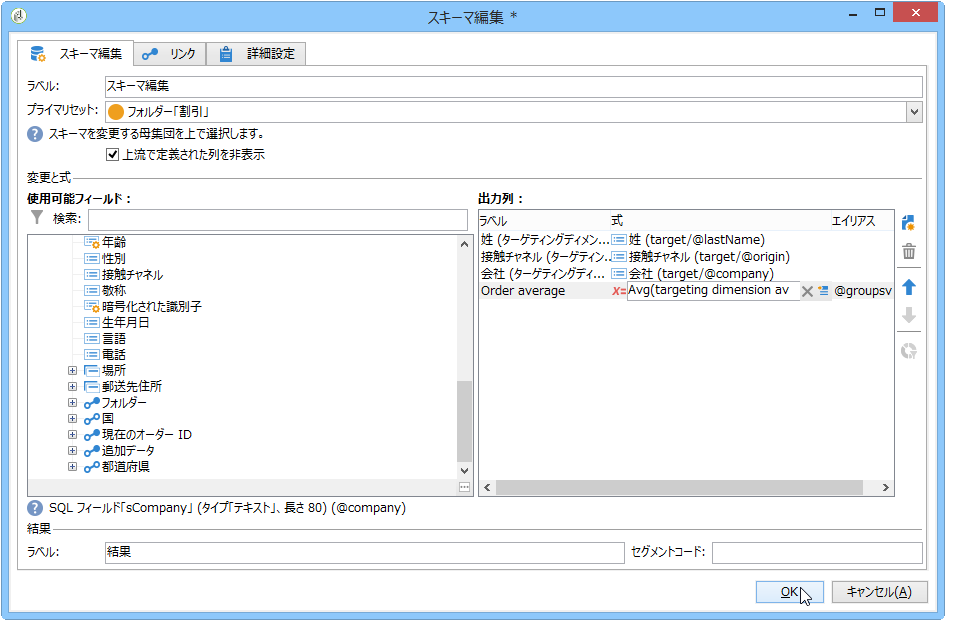
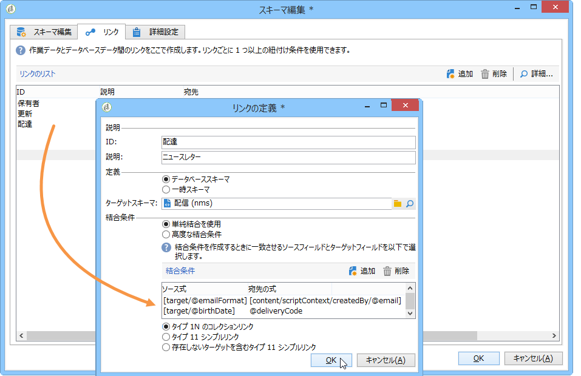

# スキーマを編集{#edit-schema}

Data can be transformed, normalized and, if necessary, enriched in the workflow using the **[!UICONTROL Edit schema]** activity. このアクティビティは通常はデータ構造の正規化に使用されます。例えば、フィールドまたは集計の平均値を算出することで、出力列の名前を変更するか、出力列のコンテンツを変更できます。

このアクティビティは作業用テーブルのデータを変更せずに、スキーマのみ（データの論理ビューなど）を変更します。

You can also create joins with other worktables, via the **[!UICONTROL Links]** tab.

下部のセクションでは、2 つのテーブルからのデータを紐付けするのに使用する条件など、結合条件のリストを設定できます。
