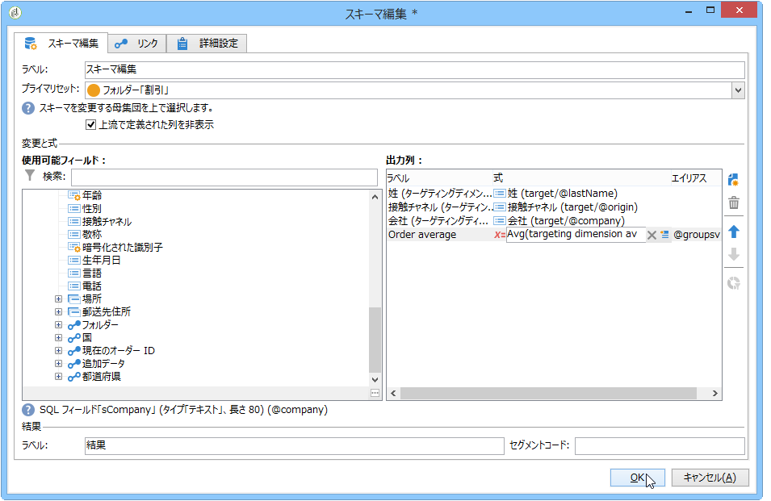
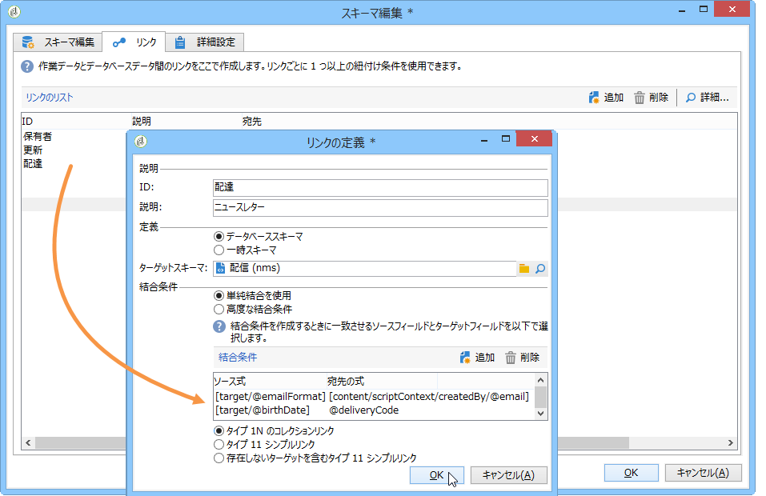

# スキーマの編集{#edit-schema}

「**[!UICONTROL スキーマを編集]**」アクティビティを使用して、データをワークフロー内で変換、正規化および必要に応じてエンリッチメントできます。 このアクティビティは通常はデータ構造の正規化に使用されます。例えば、フィールドまたは集計の平均値を算出することで、出力列の名前を変更するか、出力列のコンテンツを変更できます。

このアクティビティはワークテーブルのデータを変更せずに、スキーマのみ（データの論理ビューなど）を変更します。

また、「**[!UICONTROL リンク]**」タブを使用して、他のワークテーブルとの結合を作成できます。

下部のセクションでは、2 つのテーブルからのデータを紐付けするのに使用する条件など、結合条件のリストを設定できます。
