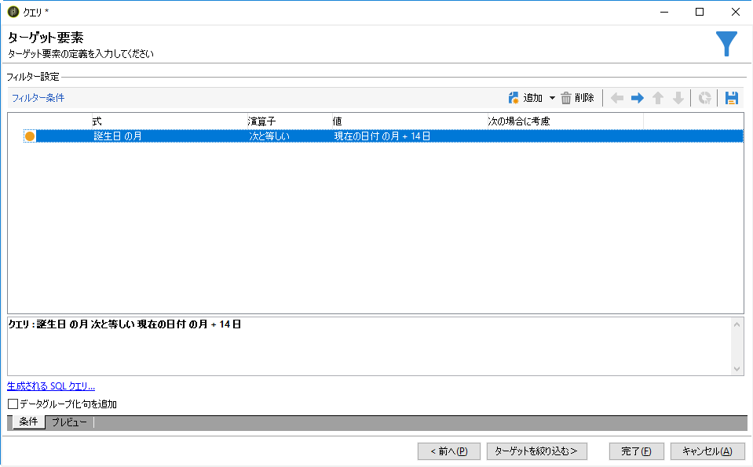

# カスタム日付フィールドを使用した E メールエンリッチメント{#email-enrichment-with-custom-date-fields}

この例では、今月の誕生日を祝う受信者にカスタム日付フィールドを含む E メールを送信します。E メールには、誕生日の前後 1 週間有効なクーポンが含まれます。

We need to target recipients from a list who will celebrate their birthdays this month with a **[!UICONTROL Split]** activity. Then, using the **[!UICONTROL Enrichment]** activity, the custom data field will act as validity dates in the email for the customer&#39;s special offer.


この例を作成するには、次の手順に従います。

1. In the **[!UICONTROL Targeting and workflows]** tab of your campaign, drag and drop a **[!UICONTROL Read list]** activity to target your list of recipients.
1. 処理されるリストは、選択したオプションおよびここで定義したパラメーターに応じて、明示的に指定されるか、スクリプトで処理されるか、動的にローカライズされます。

   

1. Add a **[!UICONTROL Split]** activity to differentiate recipients who will celebrate their birthdays this month from other recipients.
1. リストを分割するには、カテゴリ **[!UICONTROL Filtering of selected records]** でを選択しま **[!UICONTROL Add a filtering condition on the inbound population]**&#x200B;す。 次に、をクリックしま **[!UICONTROL Edit]**&#x200B;す。

   

1. Select **[!UICONTROL Filtering conditions]** then click the **[!UICONTROL Edit expression]** button to filter the month of the recipient&#39;s birthday.

   

1. 「>」を **[!UICONTROL Advanced Selection]** クリック **[!UICONTROL Edit the formula using an expression]** し、次の式を追加します。Month(@birthDate).
1. 列で、 **[!UICONTROL Operator]** を選択します **[!UICONTROL equal to]**。
1. Further filter your condition, by adding the **[!UICONTROL Value]** month of the current date: Month(GetDate()).

   これは、誕生日の月が今月に対応する受信者をクエリします。

   

1. クリック **[!UICONTROL Finish]**. 次に、アクティビティ **[!UICONTROL General]** のタブで、カ **[!UICONTROL Split]** テゴリのをクリ **[!UICONTROL Generate complement]** ックし **[!UICONTROL Results]** ます。

   With the **[!UICONTROL Complement]** result, you can add a delivery activity or update a list. Here, we just added an **[!UICONTROL End]** activity.

   

You now need to configure your **[!UICONTROL Enrichment]** activity:

1. Add an **[!UICONTROL Enrichment]** activity after your subset to add your custom date fields.

   

1. アクティビティを **[!UICONTROL Enrichment]** 開きます。 カテゴリで、 **[!UICONTROL Complementary information]** をクリックしま **[!UICONTROL Add data]**&#x200B;す。

   

1. 次に、を **[!UICONTROL Data linked to the filtering dimension]** 選択しま **[!UICONTROL Data of the filtering dimension]**&#x200B;す。
1. ボタンをクリッ **[!UICONTROL Add]** クします。

   

1. を追加しま **[!UICONTROL Label]**&#x200B;す。 次に、列のをク **[!UICONTROL Expression]** リックします **[!UICONTROL Edit expression]**。

   

1. First, we need to target the week before the birthdate as the **Validity start date** with the following **[!UICONTROL Expression]**: `SubDays([target/@birthDate], 7)`.

   

1. Then, to create the custom date field **Validity end date** which will target the week after the birthdate, you need to add the **[!UICONTROL Expression]**: `AddDays([target/@birthDate], 7)`.

   式にラベルを追加できます。

   

1. クリック **[!UICONTROL Ok]**. エンリッチメントの準備ができました。

After your **[!UICONTROL Enrichment]** activity, you can add a delivery. ここでは、今月の誕生日を祝う顧客への有効期限付きの特別オファーを受信者に送信する E メール配信を追加しました。

1. アクティビティの後にアクティビティ **[!UICONTROL Email delivery]** をドラッグ&amp;ドロッ **[!UICONTROL Enrichment]** プします。

   

1. Double-click your **[!UICONTROL Email delivery]** activity to start personalizing your delivery.
1. Add a **[!UICONTROL Label]** to your delivery and click **[!UICONTROL Continue]**.
1. Click **[!UICONTROL Save]** to create your email delivery.
1. チェック対象の電 **[!UICONTROL Approval]** 子メール配信のタブを **[!UICONTROL Properties]** チェックイ **[!UICONTROL Confirm delivery before sending option]** ンします。

   次に、ワークフローを開始して、アウトバウンドトランジションをターゲット情報でエンリッチメントします。

   

You can now start designing your email delivery with the custom date fields created in the **[!UICONTROL Enrichment]** activity.

1. アクティビティをダブルクリ **[!UICONTROL Email delivery]** ックします。
1. ターゲット式を E メールに追加します。有効期限日のフォーマットを設定するために、次の式の内部にある必要があります。

   ```
   <%=
           formatDate(targetData.alias of your expression,"%2D.%2M")  %>
   ```

1. クリック  . Select **[!UICONTROL Target extension]** then the previously created custom validity dates with the **[!UICONTROL Enrichment]** activity to add your extension to the formatDate expression.

   

1. 必要に応じて、E メールコンテンツを設定します。

   

1. E メールをプレビューして、カスタム日付フィールドが正しく設定されているかどうかを確認します。

   

E メールの準備ができました。誕生日の電子メールを送るために、校正を送り始め、配信を確認することができます。
