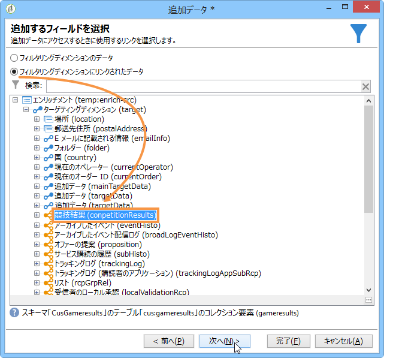
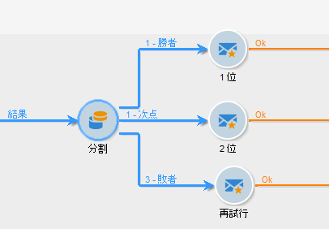

# データのエンリッチメント{#enriching-data}

## データのエンリッチメントについて {#about-enriching-data}

This use case details possible uses of the **[!UICONTROL Enrichment]** activity in a targeting workflow. For more on using the **[!UICONTROL Enrichment]** activity, refer to: [Enrichment](../../workflow/using/enrichment.md).

Web アプリケーション経由での競争への参加を案内する内容が、マーケティングデータベースの連絡先に送られます。The results of the competition are recovered in the **[!UICONTROL Competition results]** table. This table is linked to the contact table (**[!UICONTROL Recipients]**). この表に **[!UICONTROL Competition results]** は、次のフィールドが含まれています。

* 競合名（@game）
* トライアル番号（@trial）
* スコア（@score）

A contact found in the **[!UICONTROL Recipients]** table can be linked to several lines in the **[!UICONTROL Competition results]** table. これら 2 つのテーブルの関係は 1 対 n になります。以下に受信者についての結果ログの例を示します。

この使用例の目的は、最新の競争に参加した参加者に対し、各自の最高スコアに応じて、パーソナライズされた配信をおこなうことにあります。全体で最高のスコアを獲得した受信者には 1 位の賞が、2 番目にスコアの高かった受信者には次点の賞が送られ、その他の受信者は、次回に幸運があるようにとのメッセージを受け取ります。

この使用例を設定するうえで、以下のターゲティングワークフローを作成しました。

ワークフローを作成するには、次の手順に従います。

1. Two **[!UICONTROL Query]** activities and one **[!UICONTROL Intersection]** activity are added to target new subscribers who entered last the competition.
1. The **[!UICONTROL Enrichment]** activity enables us to add data stored in the **[!UICONTROL Competition results]** table. The **[!UICONTROL Score]** field which our delivery personalization will take place on is added to the work table of the workflow.
1. The **[!UICONTROL Split]** type activity enables us to create recipient subsets based on scores.
1. For each subset, a **[!UICONTROL Delivery]** type activity is added.

## 手順1:ターゲット設定 {#step-1--targeting}

1 番目のクエリでは、過去 6 ヶ月以内にデータベースに追加された受信者をターゲティングすることができます。

また、2 番目のクエリでは、最新の競争に参加した受信者をターゲティングすることができます。

An **[!UICONTROL Intersection]** type activity is then added to target the recipients added to the database within the last six months and who entered the last competition.

## 手順2:濃縮 {#step-2--enrichment}

In this example, we want to personalize deliveries according to the **[!UICONTROL Score]** field stored in the **[!UICONTROL Competition results]** table. このテーブルは、受信者テーブルと 1 対 n の関係にあります。The **[!UICONTROL Enrichment]** activity enables us to add data from a table linked to the filtering dimension to the work table of the workflow.

1. エンリッチメントアクティビティの編集画面で、を選択し、 **[!UICONTROL Add data]**&#x200B;をクリック **[!UICONTROL Data linked to the filtering dimension]** して選択しま **[!UICONTROL Next]**&#x200B;す。

   

1. 次に、このオプション **[!UICONTROL Data linked to the filtering dimension]** を選択し、テーブルを選択 **[!UICONTROL Competition results]** してをクリックしま **[!UICONTROL Next]**&#x200B;す。

   

1. IDとラベルを入力し、フィールドでオプ **[!UICONTROL Limit the line count]** ションを選択し **[!UICONTROL Data collected]** ます。 フィールド **[!UICONTROL Lines to retrieve]** で、値として「1」を選択します。 For each recipient, the enrichment activity will add a single line from the **[!UICONTROL Competition results]** table to the work table of the workflow. クリック **[!UICONTROL Next]**.

   

1. この例では、最新の競合に関してのみ、受信者の最高スコアを復元します。To do this, add a filter to the **[!UICONTROL Competition name]** field to exclude all lines related to previous competitions. クリック **[!UICONTROL Next]**.

   

1. Go to the **[!UICONTROL Sort]** screen and click the **[!UICONTROL Add]** button, select the **[!UICONTROL Score]** field and check the box in the **[!UICONTROL descending]** column to sort items of the **[!UICONTROL Score]** fields in descending order. 各受信者について、エンリッチメントアクティビティが最新のゲームの最高スコアに一致する行を追加します。クリック **[!UICONTROL Next]**.

   

1. ウィンドウ **[!UICONTROL Data to add]** で、フィールドをダブルクリック **[!UICONTROL Score]** します。 For each recipient, the enrichment activity will add only the **[!UICONTROL Score]** field. クリック **[!UICONTROL Finish]**.

   

Right-click the inbound transition of the enrichment activity and select **[!UICONTROL Display the target]**. 作業用テーブルには、以下のような情報があります。

リンクされたスキーマは次のようになります。

「エンリッチメント」アクティビティのアウトバウンドトランジションで、このオプションを更新します。スコアが追加された受信者にデータがリンクしていることがわかります。各受信者の最高スコアが復元されています。

一致するスキーマもエンリッチメントされています。

## 手順3:分割と配信 {#step-3--split-and-delivery}

To sort the recipients based on their scores, a **[!UICONTROL Split]** activity is added after the enrichment.

1. 1 番目（**勝者**）のサブセットは、最高のスコアを獲得した受信者が入るように定義します。これをおこなうには、レコード数の制限を定義し、スコアを降順で並べ替え、レコード数を 1 に制限します。

   

1. 2 番目（**次点**）のサブセットには、2 番目に高いスコアを獲得した受信者が入ります。設定は、1 番目のサブセットのものと同じです。

   

1. 3 番目の（**敗者**）サブセットには、残りのすべての受信者が入ります。Go to the **[!UICONTROL General]** tab and check the **[!UICONTROL Generate complement]** box to target all recipients who did not achieve the two highest scores.

   

1. Add a **[!UICONTROL Delivery]** type activity for each subset, using a different delivery template for each.

   

