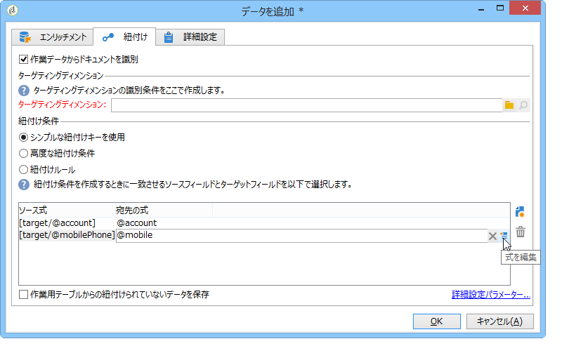
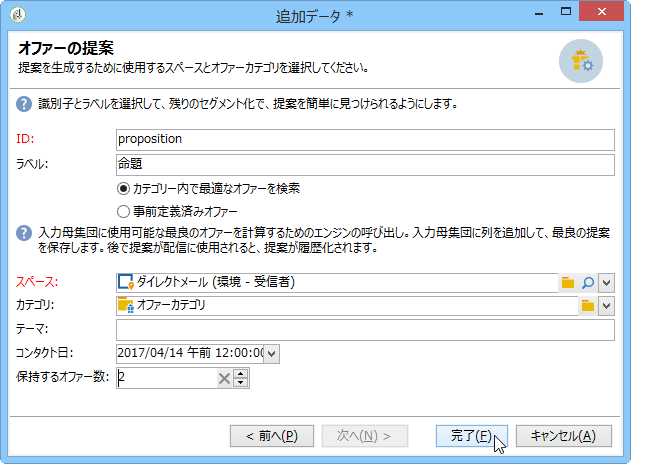
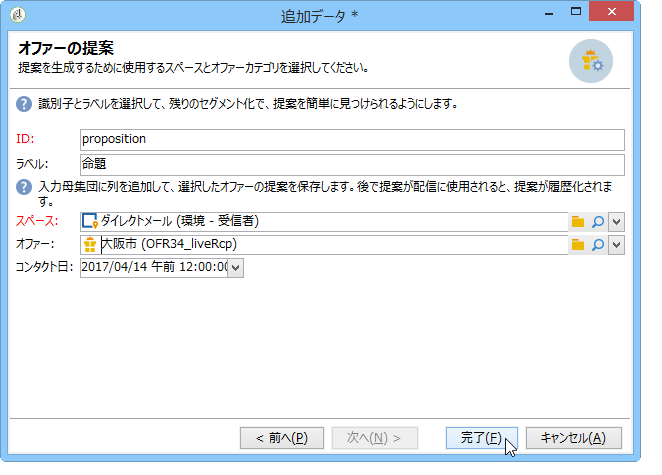

# エンリッチメント{#enrichment}

The **[!UICONTROL Enrichment]** activity lets you add information to a profile list and links to an existing table (create a new join). データベース内のプロファイルと紐付ける条件も定義できます。


## 定義 {#definitions}

エンリッチメントアクティビティを使用するには、データを追加する際に選択できる様々なオプションについて熟知している必要があります。


このオプ **[!UICONTROL Data linked to the filtering dimension]** ションを使用すると、次の項目にアクセスできます。

* フィルタリングディメンションのデータ：作業用テーブルのデータへのアクセス
* フィルタリングディメンションに関係付けられたデータ：作業用テーブルに関係付けられたデータへのアクセス


The **[!UICONTROL A link]** option lets you create a join on any table of the database.


次の 4 つのタイプのリンクがあります。

* **[!UICONTROL Define a collection]**:テーブル間のカーディナリティが1-Nのリンクを定義できます。
* **[!UICONTROL Define a link whose target is still available]**:テーブル間のカーディナリティが1 ～ 1のリンクを定義できます。 結合条件は、ターゲットテーブル内の 1 つのレコードで定義される必要があります。
* **[!UICONTROL Define a link whose target does not necessarily exist in the base]**:テーブル間のカーディナリティが0 ～ 1のリンクを定義できます。 結合条件は、ターゲットテーブル内のゼロまたは 1 つ（最大）のレコードで定義される必要があります。

   このオプションは、アクティビティの **[!UICONTROL Simple Join]** リンクを介してアクセスできるタブ **[!UICONTROL Edit additional data]** で設定され **[!UICONTROL Enrichment]** ています。

* **[!UICONTROL Define a link by searching for a reference among several options]**:このタイプのリンクは、一意のレコードに対する調整を定義します。 Adobe Campaign は、一意のレコードへの参照を格納するターゲットテーブルに外部キーを追加する方法で、ターゲットテーブルへのリンクを作成します。

   このオプションは、アクティビティの **[!UICONTROL Reconciliation and deduplication]** リンクを介してアクセスできるタブ **[!UICONTROL Edit additional data]** で設定され **[!UICONTROL Enrichment]** ています。

「デー [タの強化](../../workflow/using/enriching-data.md) 」と「概要 [リストの作成」の使用例では](../../workflow/using/creating-a-summary-list.md) 、エンリッチメントアクティビティの操作の詳細がコンテキスト内に表示されます。

## 情報の追加 {#adding-information}

Use the **[!UICONTROL Enrichment]** activity to add columns to a work table: this activity can be used as a complement to a query activity.

The configuration of additional columns is detailed in [Adding data](../../workflow/using/query.md#adding-data).

The **[!UICONTROL Primary set]** field lets you select the inbound transition: the data of this activity&#39;s worktable will be enriched.

リンクをク **[!UICONTROL Add data]** リックし、追加するデータのタイプを選択します。 提供されるデータタイプのリストは、プラットフォームにインストールされているモジュールとオプションによって異なります。 最小構成の場合、いつでもフィルタリングディメンションとリンクへ関係付けられたデータを追加できます。


以下の例では、アウトバウンドトラジションは、ターゲットプロファイルの年齢に関する情報でエンリッチメントされています。


エンリッチメントのステージに移行する前に、エンリッチメントアクティビティのインバウンドトラジションを右クリックしてデータを確認します。


作業用テーブルには、次のデータと関連付けられたスキーマが含まれています。


エンリッチメントステージの出力でこの操作を繰り返します。


年齢プロファイルに関係付けられたデータが追加されているのを確認できます。


一致するスキーマもエンリッチメントされています。

## 追加データの管理 {#managing-additional-data}

以前に定義 **[!UICONTROL Keep all additional data from the main set]** した追加データを保持しない場合は、このオプションの選択を解除します。 この場合、エンリッチメントアクティビティで選択した追加の列のみが、送信用作業用テーブルに追加されます。アクティビティのアップストリームに追加された追加情報は保存されません。


エンリッチメントステージ出力のデータとスキーマは次のようになります。


## リンクを作成 {#creating-a-link}

エンリッチメントアクティビティを使用して、作業データと Adobe Campaign データベースの間にリンクを作成できます。これは、インバウンドデータ間のワークフローへのローカルリンクとなります。

例えば、受信者のアカウント番号、国および E メールが含まれるデータファイルを読み込む場合、プロファイル内の情報を更新するために国テーブルへのリンクを作成する必要があります。

それには、次の手順に従います。

1. 次のタイプのファイルを収集し、読み込みます。

   ```
   Account number;Country;Email
   18D65;FRANCE;agnes@gmail.com
   243PP;RUSSIA;paul@gmail.com
   55H87;CROATIA;dave@gmail.com
   56U81;USA;susan@gmail.com
   853PI;ITALY;anna@gmail.com
   890LP;FRANCE;robert@gmail.com
   83TY2;SWITZERLAND;mike@gmail.com
   ```

1. エンリッチメントアクティビティを編集し、「**データを追加...**」リンクをクリックして、国テーブルとの結合を作成します。

   

1. オプションを選 **[!UICONTROL Link definition]** 択し、ボタンをクリック **[!UICONTROL Next]** します。 作成されるリンクのタイプを指定します。この例では、ファイルの受信者の国を、データベースの専用テーブル内の使用可能な国のリストにある国と紐付けします。オプションを選 **[!UICONTROL Define a link by searching for a reference among several options]** 択します。 Select the country table in the **[!UICONTROL Target schema]** field.

   

1. 最後に、データベース内でソースファイル値のリンク先となるフィールドを選択します。

   

このエンリッチメントアクティビティの出力で、一時スキーマには国テーブルへのリンクが含まれます。


## データの紐付け {#data-reconciliation}

エンリッチメントアクティビティは、データベース内に読み込まれたコアデータなど、データの紐付けの設定に使用できます。In this case, the **[!UICONTROL Reconciliation]** tab lets you define the link between the data in the Adobe Campaign database and the data in the work table.

オプション **[!UICONTROL Identify the targeting document based on work data]** を選択し、リンクを作成するスキーマを指定して、結合条件を定義します。これを行うには、作業データ(**[!UICONTROL Source expression]**)とターゲットディメンション(**[!UICONTROL Destination expression]**)で調整するフィールドを選択します。

1 つまたは複数の紐付け条件を使用できます。



複数の結合条件が指定される場合、データを相互にリンクさせるには、すべての条件が検証される必要があります。

## オファーの提案の挿入 {#inserting-an-offer-proposition}

エンリッチメントアクティビティを使用すると、配信の受信者へのオファーに、オファーやリンクを追加できます。

エンリッチメントアクティビティについて詳しくは、この[節](../../workflow/using/enrichment.md)を参照してください。

例えば、配信の前に受信者クエリ用のデータをエンリッチメントできます。


クエリを設定した後におこなう作業（この[節](../../workflow/using/query.md)を参照）：

1. エンリッチメントアクティビティを追加し、開きます。
1. タブで、を **[!UICONTROL Enrichment]** 選択します **[!UICONTROL Add data]**。
1. 追加す **[!UICONTROL An offer proposition]** るデータのタイプを選択します。

   

1. 追加される提案の識別子とラベルを指定します。
1. オファーの選択を指定します。これには、次の 2 つのオプションを使用できます。

   * **[!UICONTROL Search for the best offer in a category]**:このオプションを選択し、オファーエンジン呼び出しパラメーター（オファースペース、カテゴリまたはテーマ、連絡日、保持するオファー数）を指定します。 エンジンは、これらのパラメーターに基づいて、追加するオファーを自動的に計算します。We recommend completing either the **[!UICONTROL Category]** or the **[!UICONTROL Theme]** field, rather than both at the same time.

      

   * **[!UICONTROL A predefined offer]**:このオプションを選択し、オファースペース、特定のオファーおよび連絡日を指定して、オファーエンジンを呼び出さずに、追加するオファーを直接設定します。

      

1. 次に、選択したチャネルに対応する配信アクティビティを設定します。Refer to [Cross-channel deliveries](../../workflow/using/cross-channel-deliveries.md).

   プレビュー可能な提案の数は、配信で直接実行された設定ではなく、エンリッチメントアクティビティで実行された設定によって決まります。

オファーの提案を指定する際には、オファーへのリンクの参照することにもできます。この詳細については、次の「オファーへのリンクの [参照」を参照してください](#referencing-a-link-to-an-offer)。

## オファーへのリンクの参照 {#referencing-a-link-to-an-offer}

エンリッチメントアクティビティでは、オファーへのリンクを参照することもできます。

手順は次のとおりです。

1. アクテ **[!UICONTROL Add data]** ィビティのタブでを選択 **[!UICONTROL Enrichment]** します。
1. In the window where you choose the type of data to add, select **[!UICONTROL A link]**.
1. 設定するリンクのタイプとターゲットを選択します。この場合、ターゲットはオファースキーマです。

   

1. エンリッチメントアクティビティのインバウンドテーブルデータ（ここでは受信者テーブル）とオファーテーブルとの結合を指定します。例えば、オファーコードを受信者にリンクできます。

   

1. 次に、選択したチャネルに対応する配信アクティビティを設定します。Refer to [Cross-channel deliveries](../../workflow/using/cross-channel-deliveries.md).

   >[!NOTE]
   >
   >プレビュー可能な提案の数は、配信で実行された設定によって決まります。

## オファーのランク付けと重み付けの格納 {#storing-offer-rankings-and-weights}

デフォルトでは、オファーの配信に「**エンリッチメント**」アクティビティを使用すると、オファーのランク付けと重み付けが提案テーブルに格納されません。

The **[!UICONTROL Offer engine]** activity does store this information by default.

次の方法でこの情報を保存することができます。

1. エンリッチメントアクティビティ内で、クエリの後、配信アクティビティの前に、オファーエンジンの呼び出しを作成します。この[節](../../interaction/using/integrating-an-offer-via-a-workflow.md#specifying-an-offer-or-a-call-to-the-offer-engine)を参照してください。
1. アクティビティのメインウィンドウで、を選択しま **[!UICONTROL Edit additional data...]**&#x200B;す。

   

1. Add the **[!UICONTROL @rank]** columns for the ranking and **[!UICONTROL @weight]** for the offer weight.

   

1. 追加を確認し、ワークフローを保存します。

これで、オファーのランキングと重み付けが自動的に格納されるようになります。This information is visible in the delivery&#39;s **[!UICONTROL Offers]** tab.
