# ワークフローの実行{#executing-a-workflow}

ワークフローの実行に関するトラブルシューティングのガイドラインについては、[この節](../../production/using/workflow-execution.md)を参照してください。

## ワークフローの開始 {#starting-a-workflow}

ワークフローは、必ず手動で開始します。開始しても、スケジューラー（[スケジューラー](../../workflow/using/scheduler.md)を参照）経由で指定された情報またはアクティビティのスケジュール設定に基づいて、ワークフローが非アクティブのままになることもあります。

ターゲティングワークフローの実行に関連するアクション（開始、停止、一時停止など）は、**非同期**&#x200B;プロセスです。プロセスの実行順序は記録され、サーバーが順序を適用できるようになるとすぐに実行されます。

ツールバーを使用して、ワークフローの実行を開始およびトラッキングできます。

**[!UICONTROL アクション]**&#x200B;メニューおよび右クリックメニューから選択できる各オプションについては、次項で詳しく説明します。

### アクションツールバー {#actions-toolbar}

ツールバーのボタンについて詳しくは、この[節](../../campaign/using/marketing-campaign-deliveries.md#building-the-main-target-in-a-workflow)を参照してください。「**[!UICONTROL アクション]**」ボタンを使用して、選択したワークフローに対して実行する追加の実行オプションにアクセスできます。または、**[!UICONTROL ファイル／アクション]**&#x200B;メニューを選択するか、ワークフローを右クリックして「**[!UICONTROL アクション]**」を選択することもできます。

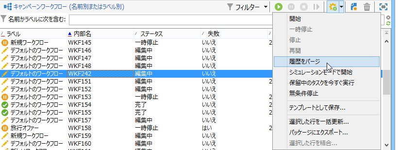

* **[!UICONTROL 開始]**

   このアクションは、ワークフローの実行を開始します。「**終了**」、「**編集中**」、「**一時停止**」のワークフローのステータスが、「**開始済み**」に変わります。続いて、ワークフローエンジンが、ワークフローの実行を処理します。ワークフローが一時停止していた場合は再開します。それ以外の場合は、ワークフローが最初から開始し、初期のアクティビティが有効化されます。

   開始は非同期プロセスです。リクエストは保存され、ワークフローサーバーでただちに処理されます。

* **[!UICONTROL 一時停止]**

   このアクションは、ワークフローのステータスを「**一時停止**」に設定します。ワークフローが再開するまでは、一切のアクティビティは有効化されません。ただし、進行中の操作は一時停止されません。

* **[!UICONTROL 停止]**

   このアクションは、現在実行中のワークフローを停止します。インスタンスのステータスは「**終了**」に設定されます。可能な場合、進行中の操作を中止します。インポートおよび SQL クエリはただちにキャンセルされます。

   停止は非同期プロセスです。停止リクエストが登録されると、ワークフローサーバーは進行中の操作をキャンセルします。このため、ワークフローインスタンスの停止には時間がかかります。特に、ワークフローが複数のサーバーで実行されている場合は、各サーバーがそれぞれ進行中のタスクのキャンセルを処理する必要があるので、時間がかかります。

* **[!UICONTROL 再起動]**

   ワークフローを停止したあとに、再起動します。多くの場合、この操作をおこなうことでワークフローの再起動が高速化されます。また、停止にある程度の時間がかかるときに、再起動を自動化するのに便利です。再起動を自動化する理由は、ワークフローの停止中は「停止」コマンドを利用できないからです。

   **[!UICONTROL 開始 / 一時停止 / 停止 / 再起動]**&#x200B;の各アクションは、ツールバーの実行アイコンから実行できます。詳しくは、[この節](../../campaign/using/marketing-campaign-deliveries.md#creating-a-targeting-workflow)を参照してください。

* **[!UICONTROL 履歴をパージ]**

   このアクションでは、ワークフローの履歴をパージできます。詳しくは、[ログのパージ](../../workflow/using/monitoring-workflow-execution.md#purging-the-logs)を参照してください。

* **[!UICONTROL シミュレーションモードで開始]**

   ワークフローを、リアルモードとは対照的なシミュレーションモードで開始できます。つまり、このモードを有効にした場合、データベースおよびファイルシステムに影響のないアクティビティ（**[!UICONTROL クエリ]**、**[!UICONTROL 和集合]**、**[!UICONTROL インタラクション]**&#x200B;など）だけが実行されます。影響のあるアクティビティ（「**[!UICONTROL エクスポート]**」、「**[!UICONTROL インポート]**」など）とそれらのアクティビティと同じ分岐にある後続のアクティビティは、実行されません。

* **[!UICONTROL 保留中のタスクを今すぐ実行]**

   このアクションでは、保留中のタスクをただちに開始できます。特定のタスクを開始するには、そのタスクのアクティビティを右クリックして、「**[!UICONTROL 保留中のタスクを今すぐ実行]**」を選択します。

* **[!UICONTROL 条件なしの停止]**

   このオプションは、ワークフローのステータスを「**[!UICONTROL 終了]**」に変更します。通常の停止プロセスが実施数分後に失敗する場合にのみ、最終手段として使用します。条件なしの停止を使用できるのは、進行中の実際のワークフロージョブが何もないことを確認できている場合だけです。

   >[!CAUTION]
   >
   >このオプションはエキスパートユーザー向け機能として予約されています。

* **[!UICONTROL テンプレートとして保存]**

   このアクションは、選択したワークフローに基づいて、新しいワークフローテンプレートを作成します。作成したテンプレートを保存するフォルダーを、指定する必要があります（「**[!UICONTROL フォルダー]**」フィールドで指定）。

   「**[!UICONTROL 選択したラインを一括更新]**」と「**[!UICONTROL 選択した行を結合]**」の各オプションは、すべての&#x200B;**[!UICONTROL アクション]**&#x200B;メニューから選択できる一般的なプラットフォームオプションです。詳しくは、[この節](../../platform/using/updating-data.md)を参照してください。

### 右クリックメニュー {#right-click-menu}

1 つまたは複数のワークフローアクティビティが選択されている場合、右クリックすることで選択したものを操作できます。

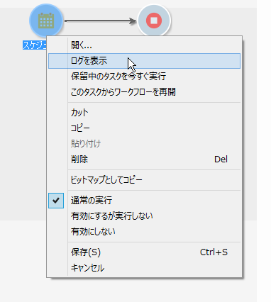

右クリックメニューでは、次のオプションを使用できます。

**[!UICONTROL 開く]**：アクティビティのプロパティを開きます。

**[!UICONTROL ログを表示]**：選択したアクティビティのタスク実行ログを表示します。[ログの表示](../../workflow/using/monitoring-workflow-execution.md#displaying-logs)を参照してください。

**[!UICONTROL 保留中のタスクを今すぐ実行]**：保留中のタスクをただちに開始します。

**[!UICONTROL タスクからワークフローを再起動]**：このアクティビティ用に以前に保存しておいた結果を使用して、ワークフローを再起動します。

**[!UICONTROL 切り取り / コピー / 貼り付け / 削除]**：アクティビティを切り取り、コピー、貼り付け、削除します。

**[!UICONTROL ビットマップとしてコピー]**：すべてのアクティビティのスクリーンショットを撮ることができます。

**[!UICONTROL 通常の実行 / 有効にするが実行しない / 有効にしない]**：これらのオプションは、「**[!UICONTROL 詳細設定]**」タブからも選択できます。詳しくは、[実行](../../workflow/using/advanced-parameters.md#execution)を参照してください。

**[!UICONTROL 保存 / キャンセル]**：ワークフローに加えた変更を保存またはキャンセルします。

>[!NOTE]
>
>アクティビティのグループを選択し、上記のいずれかのコマンドを適用することができます。

右クリックメニューの詳しい説明は、この[節](../../campaign/using/marketing-campaign-deliveries.md#executing-a-workflow)でも参照できます。

## ワークフローのライフサイクル {#workflow-life-cycle}

ワークフローサイクルは、3つの主要なステップがあります。

* **編集中**

   これは、最初のデザインフェーズです。新規ワークフローが作成されると、ステータスは「編集中」となります。ワークフローのサーバーによる処理はまだ開始されず、編集しても問題は発生しません。

* **開始済み**

   初期のデザインフェースが完了したら、ワークフローを開始できます。このフェーズでは、インスタンスがサーバーによって処理され、個々のタスクが実行されます。ワークフローは、このフェーズでも編集できますが、いくつか注意事項があります。

* **終了**

   進行中のタスクがなくなったとき、またはオペレーターがインスタンスを明示的に停止したときに、ワークフローは「終了」となります。

例えば、次のワークフローでは、「**開始**」アクティビティと「**配信**」アクティビティがアウトライン化され、「**承認**」アクティビティが点滅します。

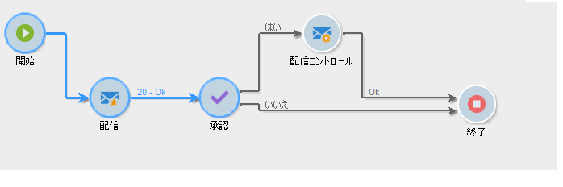

つまり、最初の 2 つのアクティビティの実行は成功し、承認アクティビティは進行中です（作成されたが、まだ完了していないなど）。

「**配信**」アクティビティに続くトランジションの上に表示されている「**574 -Ok**」という文字列は、配信準備で 574 人の受信者がターゲッティングされ、操作に成功したことを示しています。実行時にトランジションに追加されるこの情報は、データを処理するアクティビティによって自動生成されます。

ワークフローは開始され、「**承認**」アクティビティ内に指定されたグループに属するオペレータが意思決定するのを待機しています。グループに属しているオペレーターが、E メールアドレスまたは携帯電話番号を登録している場合、通知が届きます。

オペレーターの管理について詳しくは、この[節](../../platform/using/access-management.md)を参照してください。

ワークフローの監視方法について詳しくは、[この節](../../workflow/using/monitoring-workflow-execution.md)を参照してください。

## データのライフサイクル {#data-life-cycle}

### 作業用テーブル {#work-table}

ワークフローでは、1 つのアクティビティから別のアクティビティへ移されたデータは、一時的な作業用テーブルに保存されます。

このデータは、適切なトランジションを右クリックすることで、表示して分析することができます。

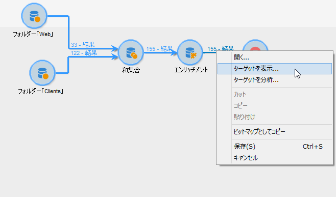

これを実行するには、該当するメニューを選択します。

* ターゲットを表示

   このメニューは、ターゲット母集団に対して使用可能なデータと、作業用テーブルの構造を表示します（「**[!UICONTROL スキーマ]**」タブ）。

   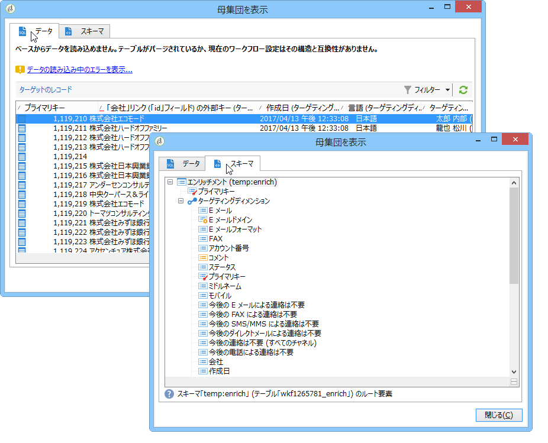

   詳しくは、[作業用テーブルとワークフローのスキーマ](../../workflow/using/monitoring-workflow-execution.md#worktables-and-workflow-schema)を参照してください。

* ターゲットを分析

   このメニューは、トランジションのデータの統計とレポートを作成できる記述的分析ウィザードを表示します。

   詳しくは、[この節](../../reporting/using/using-the-descriptive-analysis-wizard.md)を参照してください。

ワークフローが実行されると、ターゲットデータはパージされます。最後の作業用テーブルだけにアクセスできます。ワークフローを設定し、すべての作業用テーブルをアクセス可能なまま維持することもできます。それには、「**[!UICONTROL 2 つの実行間の中間母集団の結果を保存]**」オプションを選択します。

ただし、データが大量にある場合、このオプションを有効化しないことをお勧めします。

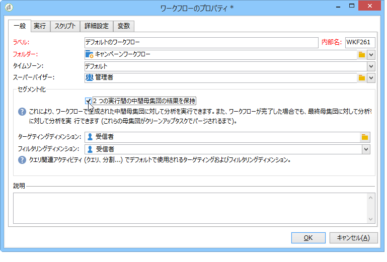

### ターゲットデータ {#target-data}

ワークフローの作業用テーブルに保存されたデータは、パーソナライゼーションフィールドからアクセスできます。

このようにすることで、リストを経由して収集したデータ、または調査に対する回答に基づくデータを使用できます。それには、次の構文を使用します。

```
%= targetData.FIELD %
```

「**[!UICONTROL ターゲット式]**」（targetData）タイプのパーソナライゼーション要素は、ターゲティングワークフローには使用できません。配信ターゲットは、ワークフロー内に作成され、配信のインバウンドトランジション内に指定される必要があります。

配信の配達確認を作成するには、パーソナライゼーションデータが入力できるように、配達確認のターゲットが&#x200B;**[!UICONTROL アドレス置換]**&#x200B;モードに基づいて作成される必要があります。詳しくは、[この節](../../delivery/using/steps-defining-the-target-population.md#using-address-substitution-in-proof)を参照してください。

次の例では、パーソナライズしたメールで使用するために、顧客に関する情報のリストを収集しようとしています。

次の手順に従います。

1. 情報を収集するワークフローを作成し、既にデータベース内にあるデータと紐付けをおこなってから、配信を開始します。

   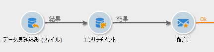

   この例では、ファイルの内容は次のようになります。

   ```
   Music,First name,Last name,Account,CD/DVD,Card
   Pop,David,BLAIR,4323,CD,0
   Rock,Daniel,ARCARI,3222,DVD,1
   Disco,Uma,ALTON,0488,DVD,0
   Jazz,Paul,BOLES,6475,CD,1
   Jazz,David,BOUKHARI,0841,DVD,1
   [...]
   ```

   ファイルを読み込むには、次の手順を適用します。

   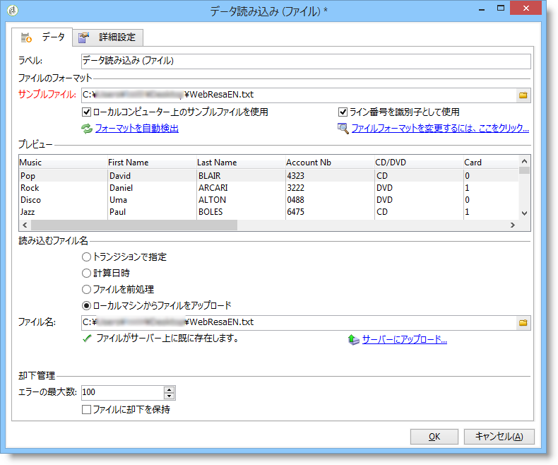

1. 「**[!UICONTROL エンリッチメント]**」タイプアクティビティを設定し、収集したデータを、既に Adobe Campaign データベース内にあるデータと紐付けします。

   ここでは、紐付けキーがアカウント番号です。

   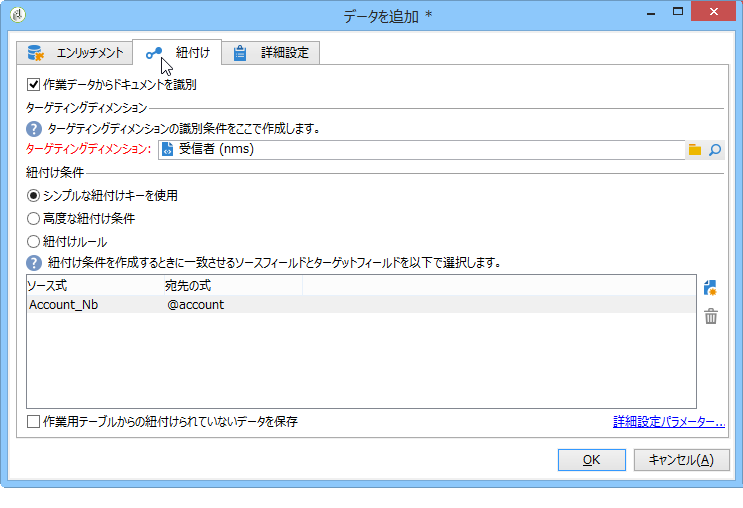

1. 次に、テンプレートに基づいて作成され、インバウンドトランジションによって受信者が指定された「**[!UICONTROL 配信]**」を設定します。

   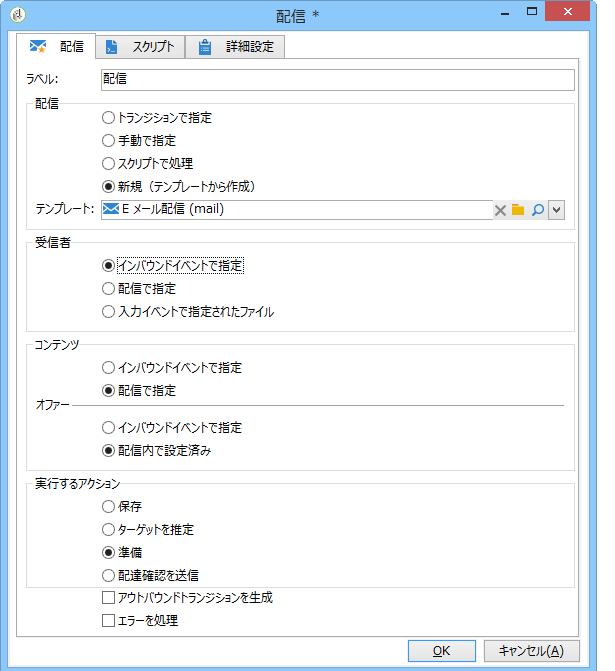

   >[!CAUTION]
   >
   >トランジションに含まれているデータのみが、配信のパーソナライズに使用されます。「**targetData**」タイプのパーソナライゼーションフィールドは、「**[!UICONTROL 配信]**」アクティビティのインバウンドの母集団用にのみ使用可能です。

1. 配信テンプレートで、ワークフローで収集したフィールドを使用します。

   それには、「**[!UICONTROL ターゲット式]**」タイプのパーソナライゼーションフィールドを挿入します。

   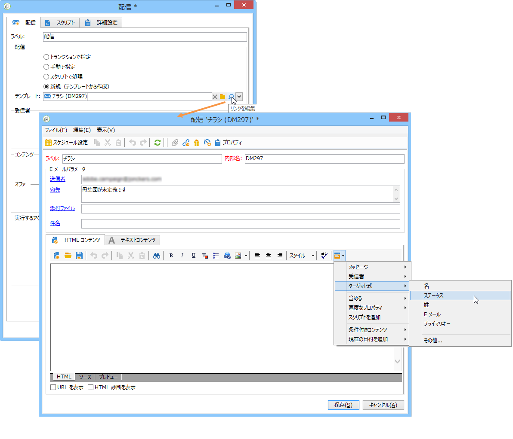

   ここでは、ワークフローで収集されたファイル内に記述された顧客の好きな音楽ジャンルとメディアタイプ（CD または DVD）を挿入します。

   さらに、ロイヤリティのあるカード所有者（例えば Card の値が 1 と等しい受信者）にクーポンを追加します。

   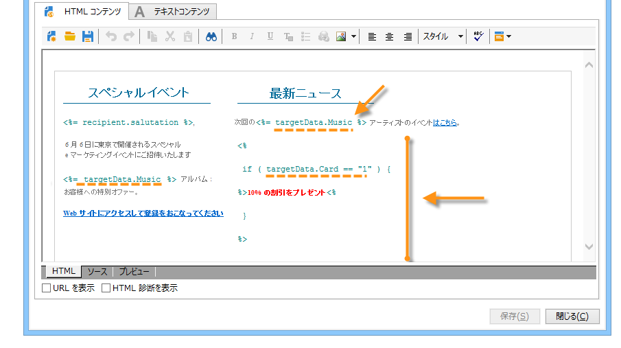

   「**[!UICONTROL ターゲット式]**」（targetData）タイプのデータが、すべてのパーソナライゼーションフィールドと同じ特性を使用して、配信に挿入されます。これらのデータは、本文、リンクラベル、またはリンク自体に使用されます。

   収集された受信者宛てのメッセージには、次のデータが含まれます。

   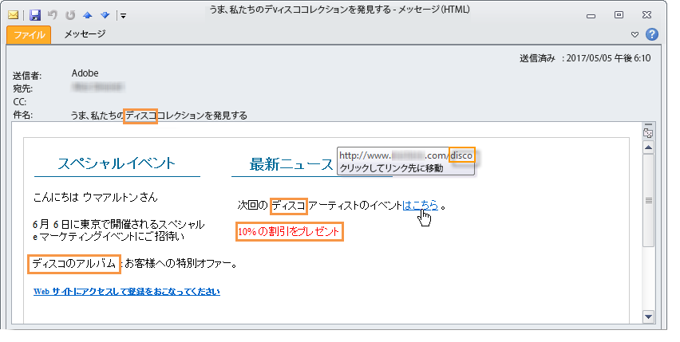

## 承認の定義 {#defining-approvals}

承認により、オペレーターはワークフロー管理に関する意思決定をおこなったり、実行の継続を確定したりできます。

オペレーターのグループにメッセージが送信され、ワークフローは応答を待って再開します。ワークフローは停止せず、その他の操作が実行されます。例えば、複数の保留中の承認が同時に存在する場合があります。

承認には、オペレーターが選択できるオプションが複数含まれていることがあります。ただし、オペレーターに実行してもらうタスク（ターゲティングの実施など）を送信するために、選択肢の数を 1 つに制限することもできます。オペレーターは、そのタスクが実行された後で、応答できるようになります（その後、プロセスが再開します）。次の例に、これらの承認タイプを示します。

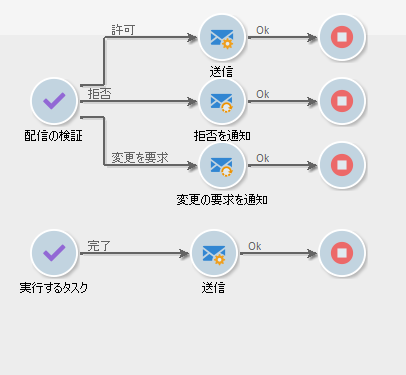

操作では、承認が必要なすべてのステージは、同じ原則に基づきます。

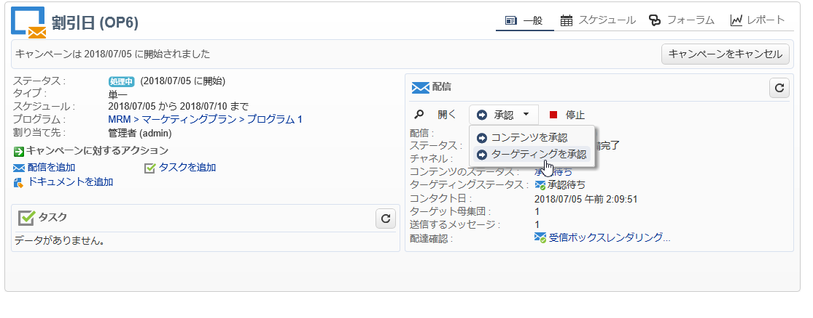

承認の例については、この[節](../../campaign/using/marketing-campaign-approval.md#checking-and-approving-deliveries)を参照してください。

オペレーターは、2 つの方法（メールメッセージ内にリンクされた Web ページを使用するか、コンソール経由）のいずれかで、応答できます。

>[!NOTE]
>
>いったん保存した応答は、変更できません。

### E メールの送信 {#sending-emails}

Web ページへのリンクが記載された承認メッセージを受け取り、ページ上で応答することができます。ターゲット済みのオペレーターが、承認 E メールを受け取るようにするには、オペレーターの E メールアドレスが入力されている必要があります。入力していない場合、オペレータは応答にコンソールを使用する必要があります。

オペレーターの管理について詳しくは、この[節](../../platform/using/access-management.md)を参照してください。

承認の E メールは、継続的に送信されます。デフォルトの配信テンプレートは **[!UICONTROL notifyAssignee]** です。**[!UICONTROL 管理／キャンペーン管理／テクニカル配信テンプレート]**&#x200B;フォルダーに保存されています。このシナリオは、カスタマイズ可能です。テンプレートのコピーを作成して、アクティビティごとに編集することをお勧めします。

このテンプレートを使用して作成された配信は、**[!UICONTROL 管理／プロダクション／自動作成オブジェクト／テクニカル配信／ワークフロー通知]**&#x200B;フォルダーに保存されます。

### コンソールからの承認 {#approval-via-the-console}

操作では、承認される要素はキャンペーンダッシュボードに表示されます。

テクニカルワークフローについては、ユーザーが承認できるタスクは、**[!UICONTROL 管理／プロダクション／自動作成オブジェクト／承認待ち]**&#x200B;フォルダーのツリー構造からアクセスできます。

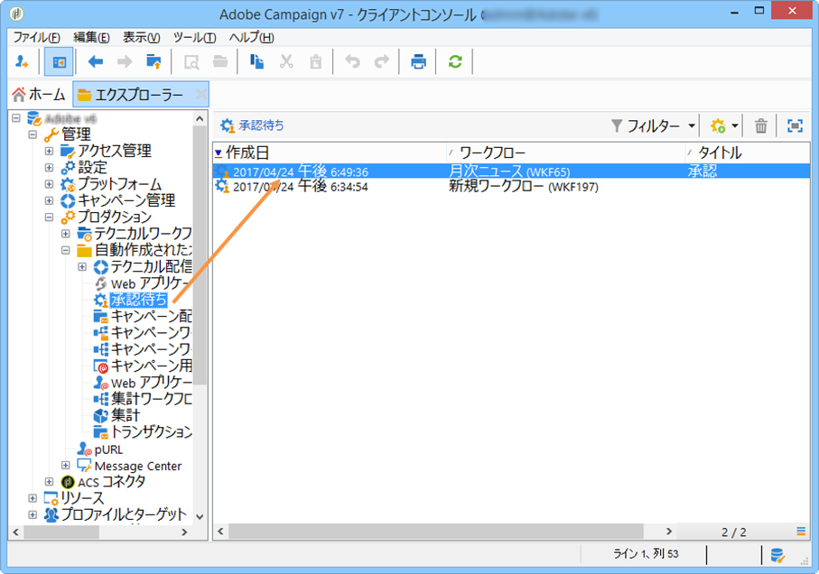

### グループ {#groups}

承認は、フィルター条件を使用して選択されたオペレーターのグループ、1 人のオペレーター、またはオペレーターセットに割り当てられます。

1. 最もシンプルな承認形態は、オペレーターの応答と同時にタスクが完了することです。その他のオペレーターが応答を試みた場合、既に別のオペレータによって応答済みであると通知されます。
1. 複数の承認について詳しくは、[複数の承認](#multiple-approval)を参照してください。

承認をおこなうオペレーターグループには、個人ではなく、役割または機能を指名します。例えば、「ハリーのグループ」ではなく、「キャンペーンの予算」グループの方が適切です。グループには、タスクを承認するオペレーターを最低でも 2 人以上含めることをお勧めします。オペレーターが 2 人いれば、1 人が不在の場合にもう 1 人が応答できます。

### 有効期限 {#expirations}

有効期限は、異なるタイプのアクティビティ、特に承認で使用される専用のトランジションです。有効期限は、所定の時間が経過しても応答がない場合、またはワークフローを続行する場合に、アクションのトリガーとして使用できます（例えば、異なるグループに承認を割り当てるなど）。

アクティビティの承認プロパティの 2 番目のタブで、1 つ以上の有効期限を定義できます。さらに、複数の有効期限タイプを定義できます。

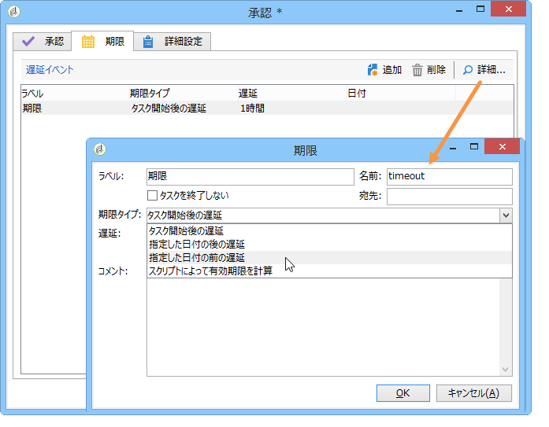

新しい有効期限を追加するには、「**[!UICONTROL 追加]**」をクリックします。作成される有効期限ごとに、トランジションが追加されます。次の操作をおこなうことができます。

* リスト内でセルをクリックする（または F2 キーを押す）ことで、代表的なパラメーターを変更できます。
* または、「**[!UICONTROL 詳細...]**」ボタンをクリックすることで、式を編集できます。

>[!NOTE]
>
>有効期限は時系列で処理されるので、順序を指定する必要はありません。

「**[!UICONTROL タスクを終了しない]**」オプションを選択した場合、遅延の発生時に承認がアクティブのままになります。このモードでは、承認をアクティブにしたまま、リマインダーを管理をできます。オペレーターは引き続き応答できます。このオプションはデフォルトでは無効になっています。有効期限に達したタスクは完了したと見なされ、期限後にオペレーターが応答することはありません。

次の 4 つのタイプの有効期限を作成できます。

* **タスク開始後の遅延**：指定された長さの時間を、承認が有効化された日付に追加することで、有効期限が計算されます。
* **指定した日付の後の遅延**：指定された長さの時間を、指定した日付に追加することで、有効期限が計算されます。
* **指定した日付の前の遅延**：指定された長さの時間を、指定した日付から引くことで、有効期限が計算されます。
* **スクリプトによって有効期限を計算**：有効期限は、JavaScript を使用して計算されます。

   次の例では、（**vars.deliveryId** によって識別される）配信開始日付の 24 時間前に有効期限を計算します。

   ```
   var delivery = nms.delivery.get(vars.deliveryId)
   var expiration = delivery.scheduling.contactDate
   var oneDay = 1000*60*60*24
   expiration.setTime(expiration.getTime() - oneDay)
   return expiration
   ```

### 複数の承認 {#multiple-approval}

複数の承認は、すべての承認オペレーターが応答できるようにするメカニズムです。トランジションは応答ごとに有効化されます。

複数の承認は、投票または調査のメカニズムに有用です。期日を追加することで、所定の期間が経過した後に回答数を数え、結果を処理することができます。

### 必要な権限 {#required-rights}

承認リクエストに応答できるように、グループ内のオペレーターには少なくとも次の権限が必要です。

* ワークフローへの書き込み権限
* 承認するタスクが含まれているフォルダーへの読み取り/書き込み権限

「ワークフローの実行」グループにはこれらの 3 つの権限が付与されています。このグループに追加されたオペレーターは、承認リクエストに応答する権限を持ちます。

## アーキテクチャ {#architecture}

ワークフローは特定のモジュールによって処理されます。このモジュールは、複数のサーバーから起動し、処理の負荷を分散することができます。


* 「ワークフローインスタンスランナー」（runwf）プロセスは、所定のワークフローインスタンスのすべてのタスクを実行します。一定期間、実行されるタスクがない場合、プロセスは「passive」になります。つまり、データベース内でステータスを保存し、停止します。
* 「ワークフローサーバー」（wfserver）モジュールは、現在のワークフローインスタンスを監視します。実行するタスクがある場合、このモジュールは対応するインスタンスを有効化（または再有効化）するプロセスを作成します。

オペレーターがワークフローに対するアクションを実行すると（開始、停止、一時停止など）、アクションは nlserver モジュールによって即座に実行されるのではなく、ワークフローモジュールに処理されるまでキューに入れられます。
