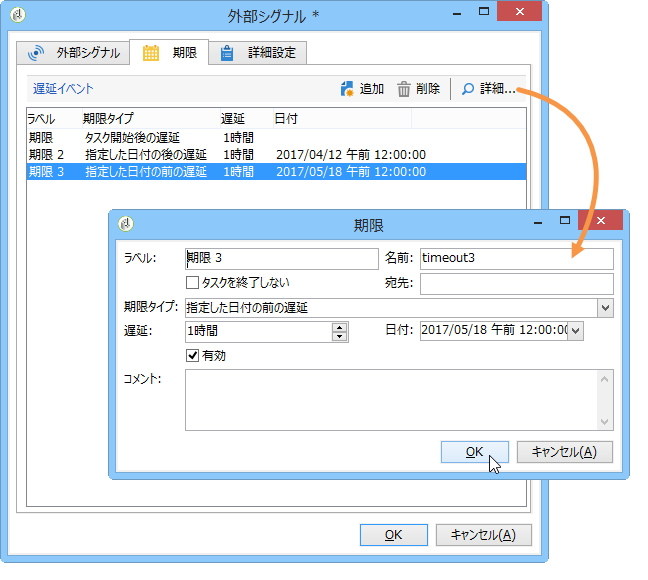
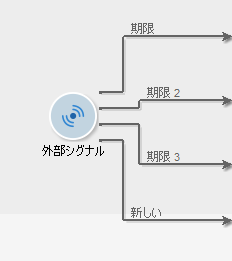

# 外部シグナル{#external-signal}

「**外部シグナル**」アクティビティを使用して、スケジュールに対して、ワークフロー内のタスクセットの実行をトリガーできます。

「外部シグナル」タスクが有効化されたら、このタスクは無期限に、または指定された期間の終わりまで停止されます。そのトランジションは、SOAP 呼び出し **PostEvent(sessionToken, workflowId, activity, transition, parameters, complete).** によって有効化されます。**[!UICONTROL complete]** パラメーターを使用すると、後続の呼び出しに反応しないようにタスクを完了できます。

PostEvent 関数について詳しくは、SOAP 呼び出しに関するオンラインドキュメントを参照してください。

このアクティビティを設定して、信号を受信しなかった場合のイベントを定義することができます。それには、アクティビティを編集し、「**[!UICONTROL 期限]**」タブをクリックします。「**[!UICONTROL 挿入]**」ボタンをクリックして、イベントを作成して設定します。

期限の設定について詳しくは、[有効期限](../../workflow/using/defining-approvals.md)を参照してください。

「**遅延**」フィールドでは、選択した単位で期限を指定できます。[待機](../../workflow/using/wait.md)を参照してください。

各行は、期限のタイプとトランジションとの紐付けを表します。

