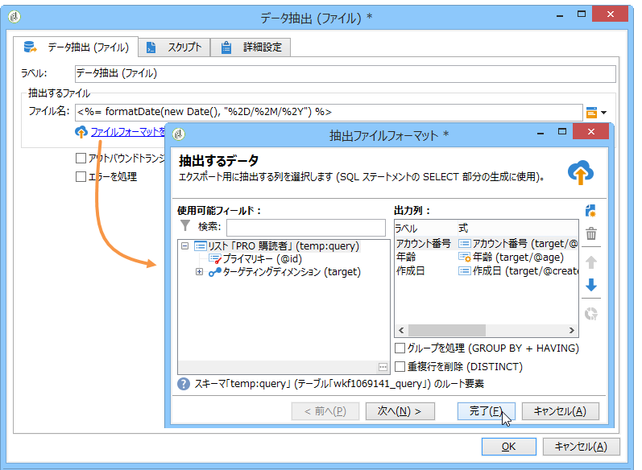
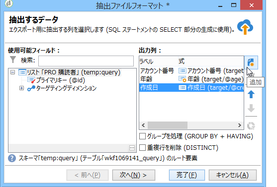
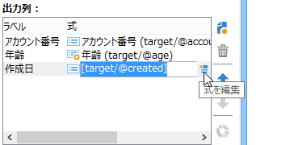
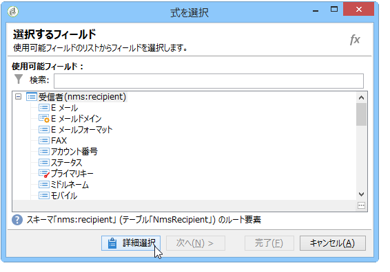
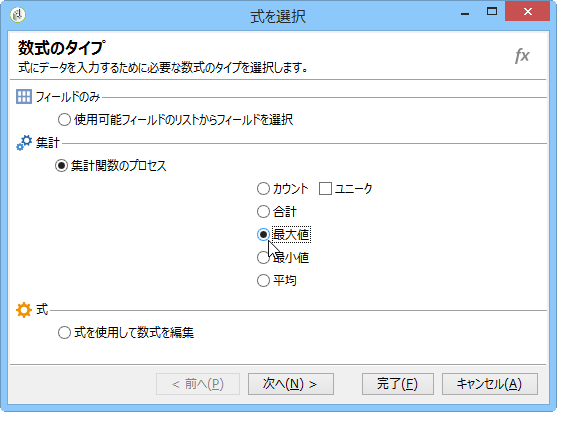

# データ抽出 (ファイル){#extraction-file}

You can extract data from a workflow table in an external file using the **[!UICONTROL Data extraction (file)]** activity.

>[!CAUTION]
>
>このアクティビティには、抽出されるデータを含めるインバウンドトランジションが必ず必要です。

データ抽出を設定するには、次の手順に従います。

1. 出力ファイルの名前を指定します。この名前には、フィールドの右側にあるパーソナライゼーションボタン経由で挿入される変数を含めることができます。
1. 抽出す **[!UICONTROL Edit the file format...]** るデータをクリックして選択します。

   

   The **[!UICONTROL Handle groupings (GROUP BY + HAVING)]** option adds an extra step to filter the final result of the aggregate, for example on a given purchase order type, customers who have ordered more than 10 times, etc.

1. 必要に応じて、結果ファイルの出力用に、「計算結果」や「処理結果」などの新しい列を追加します。To do this, click the **[!UICONTROL Add]** icon

   

   In the additional line, click the **[!UICONTROL Edit expression]** icon to define the content of the new column.

   

   次に、選択ウィンドウにアクセスします。Click **[!UICONTROL Advanced selection]** to choose the process to be applied to the data.

   

   リストから目的の式を選択します。

   

## 集計関数のリスト {#list-of-aggregate-functions}

使用可能な集計関数のリストは以下のとおりです。

* **[!UICONTROL Count]** （集計フィールドの）重複する値を含む、集計するフィールドのnull以外の値をすべてカウントするには、

   **[!UICONTROL Distinct]** を使用して、集計するフィールドの異なる値およびnull以外の値の合計数をカウントします（重複する値は計算の前に除外されます）。

* **[!UICONTROL Sum]** 数値フィールドの値の合計を計算するには
* **[!UICONTROL Minimum value]** フィールドの最小値（数値以外）を計算するには、
* **[!UICONTROL Maximum value]** フィールドの最大値を計算するには（数値以外の場合）、
* **[!UICONTROL Average]** を使用して、数値フィールドの値の平均を計算します。

