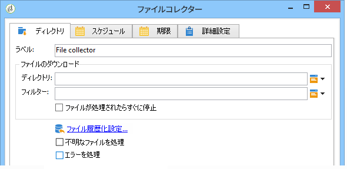
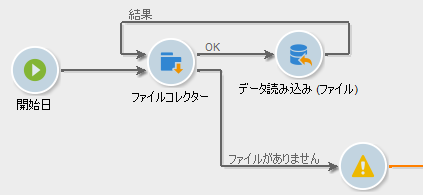

# ファイルコレクター{#file-collector}

**ファイルコレクター**&#x200B;は、ディレクトリへの 1 つまたは複数のファイルの到着を監視し、それぞれの受信ファイルのトランジションを有効化します。各イベントに関して、変数 **[!UICONTROL filename]** に受信したファイルの完全名が含まれます。収集したファイルは、アーカイブの目的で別のディレクトリに移され、1 回のみとしてカウントされます。

デフォルトで、ファイルコレクターには、スケジュール設定されたタイミングでファイルの有無を調べる永続的なタスクが割り当てられています。

ファイルコレクターが監視するファイルは、このワークフローを担当する wfserver モジュールが実行されるサーバー上に存在する必要があります。1 つのインスタンスに複数の wfserver モジュールがデプロイされている場合は、これらのファイルを使用するアクティビティのアフィニティか、またはワークフローのアフィニティ全体を指定する必要があります。

## プロパティ {#properties}

The first tab of the **[!UICONTROL File collector]** activity lets you select the source directory and, if necessary, filter the collected files. その他のタブは、「受信電子メ [ール](../../workflow/using/inbound-emails.md) (およびタ&#x200B;**[!UICONTROL Schedule]** ブ)」 **[!UICONTROL Expiry]** で詳細です。

1. **ファイルのダウンロード**

   * **[!UICONTROL Directory]**

      ダウンロードするファイルが含まれているディレクトリ。このディレクトリは、あらかじめサーバー上に作成しておく必要があります。サーバー上に存在しない場合、エラーが発生します。

   * **[!UICONTROL Filter]**

      このフィルター条件と一致するファイルのみがダウンロードされます。それ以外のディレクトリ内のファイルは無視されます。フィルターを指定しない場合、ディレクトリ内のすべてのファイルがダウンロードの対象となります。フィルターの例： ***.zip**、 **import-*.txt**.

   * **[!UICONTROL Stop as soon as a file has been processed]**

      このオプションを選択すると、最初のファイルを受信した直後にタスクが終了します。フィルターの条件に一致する複数のファイルがディレクトリ内にあっても、ダウンロードされるのは 1 つのファイルのみです。このオプションにより、1 つのイベントのみが送信されます。対象となるファイルは、アルファベット順に並べたリストの先頭に表示されます。

      For an unscheduled activity, if no file matching the filter is found in the specified directory, and if the **[!UICONTROL Process file nonexistence]** option is not enabled, an error will be raised.

   * **[!UICONTROL Execution schedule]**

      Determines the frequency of the file presence check via the parameters of the **[!UICONTROL Schedule]** tab.

1. **エラー処理**

   次の 2 つのオプションを使用できます。

   * **[!UICONTROL Process file nonexistence]**

      このオプションは、フィルター条件に一致するファイルが指定ディレクトリにないことが検出されると、そのたびに特別なトランジションを開始します。

      タスクがスケジュール設定されていない場合、このトランジションが有効化されるのは 1 回のみです。

   * **[!UICONTROL Processing errors]**

      このオプションは、エラーが発生したときに有効化される特殊なトランジションを生成します。この場合、ワークフローはエラーステータスに変更されず、実行は継続されます。

      対象となるエラーは、ファイルシステムエラーです（ファイルを移動できない、ディレクトリにアクセスできない、など）。

      このオプションは、無効な値など、アクティビティの設定に関するエラーは処理しません。

1. **履歴化**

   次の手順を参照し **[!UICONTROL File historization]** てください。 [Webダウンロード](../../workflow/using/web-download.md)。

ファイルを処理する順番は指定できません。一連のファイルを順番に処理するには、このオプションを **[!UICONTROL Stop as soon as a file has been processed]** 使用してループを作成します。 このようにすると、ファイルはアルファベット順に処理されます。このオ **[!UICONTROL Process file nonexistence]** プションを使用して、繰り返しを完了できます。

## 出力パラメーター {#output-parameters}

* filename

ファイル名を入力します。このファイル名は、履歴化ディレクトに移された後のファイル名です。したがってファイルのパスが変更されますが、履歴化ディレクトに既に同じ名前のファイルが存在していた場合は、ファイル名も変えられます。拡張子は変更されません。
