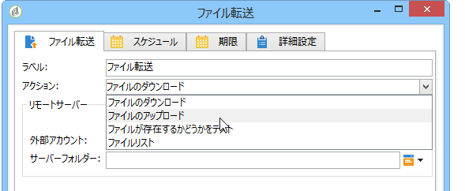
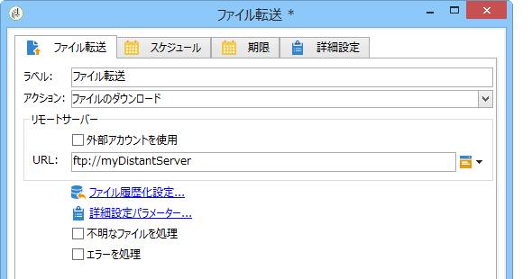
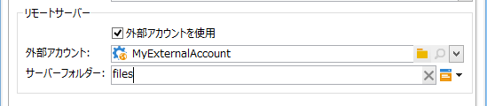
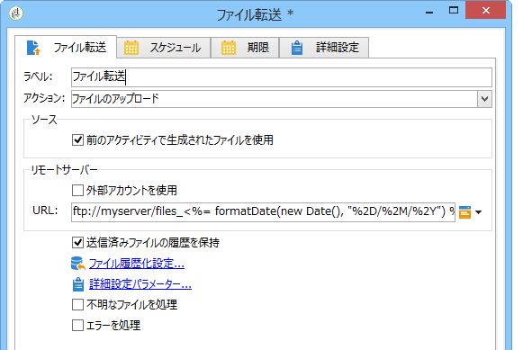
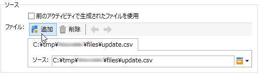
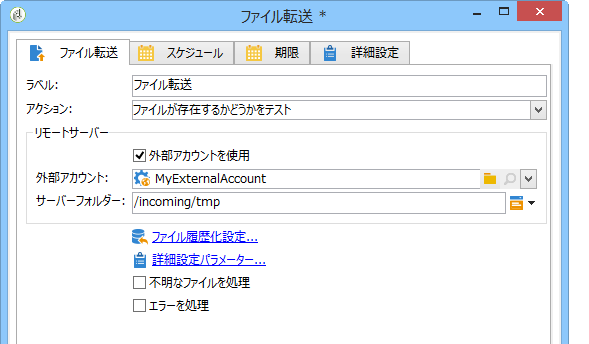

# ファイル転送{#file-transfer}

「**ファイル転送**」アクティビティで、ファイルの送受信、サーバー上のファイルの有無の確認、ファイルのリスト作成ができます。使用されるプロトコルは、Amazon Simple Storage Service（S3）、FTP または SFTP のいずれかです。S3またはSFTP接続を使用すると、Adobe Real-time Customer Data Platformを使用して、セグメントデータをAdobe Campaignにインポートすることもできます。 For more on this, refer to this [documentation](https://docs.adobe.com/content/help/en/experience-platform/rtcdp/destinations/destinations-cat/adobe-destinations/adobe-campaign-destination.html).

## プロパティ {#properties}

Use the drop-down list of the **[!UICONTROL Action]** field to select the action of the activity.

設定は、選択したアクションによって異なります。

1. **ファイルの受信**

   To receive files stored on a remote server, select **[!UICONTROL File download]** in the **[!UICONTROL Action]** field. URL を該当するフィールドに入力する必要があります。

   

   ツリー **[!UICONTROL Use an external account]** のノードで設定されたS3、FTP、またはSFTPのアカウントからアカウントを選択 **[!UICONTROL Administration > Platform > External accounts]** する場合に選択します。 次に、ダウンロードするファイルが含まれているサーバーのディレクトリを指定します。

   

1. **ファイル転送**

   To send a file to a server, select **[!UICONTROL File upload]** in the **[!UICONTROL Action]** field. You must specify the target server in the **[!UICONTROL Remote server]** section of the editor. パラメーターは、上述のファイルのダウンロードと同じです。

   送信するファイルは、前のアクティビティのものを指定できます。In this case, the **[!UICONTROL Use the file generated by the previous activity]** option must be selected.

   

   また、このオプションは、その他のファイルを対象とする場合があります。To select them, uncheck the option and then click **[!UICONTROL Insert]**. 送信するファイルのパスを指定します。To add another file, click **[!UICONTROL Insert]** again. これで各ファイルにそれぞれタブが作成されます。

   

   矢印を使用してタブの順序を変更します。これで送信するファイルの順番を決められます。

   このオプ **[!UICONTROL Keep history of files sent]** ションを使用すると、送信されたファイルを追跡できます。 この履歴にはディレクトリからアクセスできます。

1. **ファイルが存在するかどうかをテスト**

   ファイルの存在をテストするには、フィールドでオ **[!UICONTROL Test to see if file exists]** プションを選択し **[!UICONTROL Action]** ます。 リモートサーバーの設定は、ファイルのダウンロードの設定と同じです。詳しくは、この[節](#properties)を参照してください。

   

1. **ファイルの表示**

   To list the files, select the **[!UICONTROL File listing]** option from the **[!UICONTROL Action]** field. リモートサーバーの設定は、ファイル受信の設定と同じです。詳しくは、この[節](#properties)を参照してください。

   The **[!UICONTROL List all files]** option, available when selecting the **[!UICONTROL File listing]** action, allows you to store all files present on the server in the event variable **vars.filenames** wherein the file names are separated by `\n` characters.

すべてのファイルを転送する場合、次の 2 つのオプションがあります。

* The **[!UICONTROL Process missing file]** option adds a transition which is activated if no file is found in the specified directory.
* このオ **[!UICONTROL Process errors]** プションは「処理エラー」 [で詳しく説明します](../../workflow/using/monitoring-workflow-execution.md#processing-errors)。

The **[!UICONTROL Advanced parameters...]** link lets you access the following options:

* **[!UICONTROL Delete the source files after transfer]**

   リモートサーバー上のファイルを消去します。

* **[!UICONTROL Use SSL]**

   SSL プロトコルを使用したファイル転送で、セキュア接続を使用できます。

* **[!UICONTROL Display the session logs]**

   S3、FTP または SFTP 転送のログを取得し、ワークフローのログに含めることができます。

* **[!UICONTROL Disable passive mode]**

   データ転送に使用する接続ポートを指定できます。

このリ **[!UICONTROL File historization settings...]** ンクを使用すると、 [Webダウンロード](../../workflow/using/web-download.md) (手順&#x200B;**[!UICONTROL File historization]** )で詳細に説明したオプションにアクセスできます。

## 入力パラメーター {#input-parameters}

* filename

   送信したファイルの名前を入力します。

## 出力パラメーター {#output-parameters}

* filename

   このオプションが選択されている場合の、受け取ったフ **[!UICONTROL Use the file generated by the previous activity]** ァイルの完全な名前。

