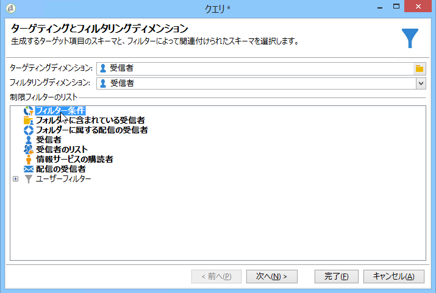
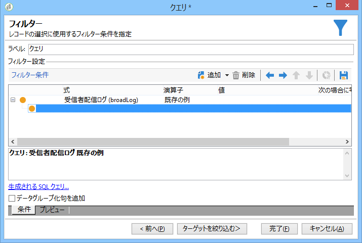
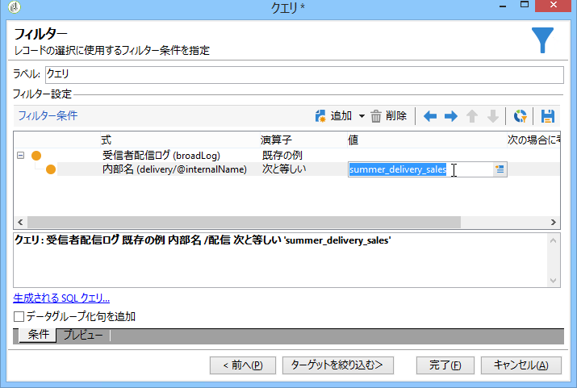
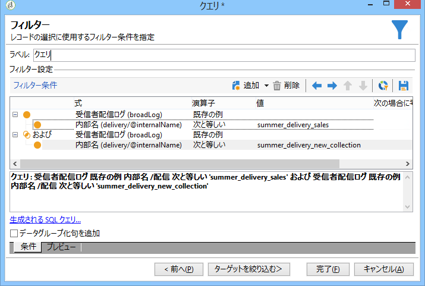

# 重複した受信者のフィルタリング {#filtering-duplicated-recipients}

この例では、配信に複数回出現する受信者をフィルターし、重複したプロファイルを取得します。

この例を作成するには、次の手順に従います。

1. Drag and drop a **[!UICONTROL Query]** activity in a workflow and open the activity.
1. をクリッ **[!UICONTROL Edit query]** クし、ターゲットディメンションとフィルターディメンションをに設定しま **[!UICONTROL Recipients]**&#x200B;す。

   

1. 次のようにフィルター条件を定義して配信ログ内に存在する受信者をターゲットにします。「**式**」列で「**受信者配信ログ（broadlog）**」を選択し、「**オペレーター**」列で「**既存の例**」を選択します。

   

1. 次のようにフィルター条件を定義して配信をターゲットにします。「式」 **[!UICONTROL Internal name]** 列および「演算子」列 **[!UICONTROL equal to]** でを選択します。
1. 「値」列にターゲットにした配信の内部名を追加します。

   

1. 演算子 **[!UICONTROL AND]** を使用して、別の配信をターゲットにして同じ操作を繰り返します。

   

アウトバウンドトランジションで配信のターゲットにした受信者が重複しています。
