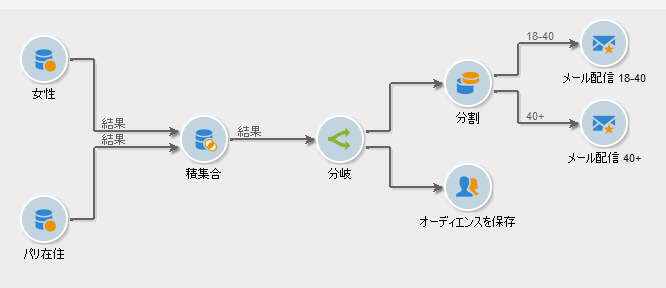

# 分岐{#fork}

**[!UICONTROL 分岐]**&#x200B;アクティビティを使用して、複数のアウトバウンドトランジションを作成し、同じワークフロー内で複数のアクティビティを個別に実行できます。

>[!IMPORTANT]
>
>**[!UICONTROL 分岐]**&#x200B;アクティビティの後に追加するアウトバウンドトランジションは、同時に実行されません。 この動作は、ワークフローのパフォーマンスに影響を与える可能性があります。 複数のアクティビティを個別に実行する必要がある場合は、**[!UICONTROL 分岐]**&#x200B;アクティビティを使用します。 必要に応じて、ワークフローの後続の部分の前に、アウトバウンドアクティビティを結合できます。

**[!UICONTROL Fork]**&#x200B;アクティビティとその関連アクティビティを設定するには、次の手順に従います。

1. **[!UICONTROL 分岐]**&#x200B;アクティビティを開き、アウトバウンドトランジションの名前とラベルを定義します。

   

1. 各アウトバウンドトランジションを開き、設定します。
1. （オプション）アウトバウンドトランジションに参加するには、 AND結合アクティビティを追加します。 [詳細情報](and-join.md)。

   ワークフローの後続の部分は、結合されたアウトバウンドトランジションの完了時にのみ実行されます。

## 例：セグメント化

この例では、異なるEメールが異なる母集団グループに送信されます。 クエリの後に&#x200B;**[!UICONTROL Fork]**&#x200B;アクティビティを使用して、2つのアクションを並行して実行します。

* クエリ結果の保存
* 複数の配信を送信するための結果のセグメント化

   

ワークフローは、次のアクティビティで構成されます。

1. **** Queryactivity

   次の2つの母集団グループが選択されます。女性とパリ人。

1. **** Intersectionactivity

   クエリ結果の積集合、つまりパリの女性が選択されます。

1. **** Forkactivity

   計算された母集団は保存され、同時に、次の2つのグループに分類されます。

   1. 18歳から40歳のパリの女性
   1. 40歳以上のパリの女性

1. ****&#x200B;配信アクティビティ

   各母集団グループに異なるEメールが送信されます。

## 使用例：誕生日のメールを送る

繰り返しEメールが、リストに記載された受信者に誕生日に送信されます。 **[!UICONTROL 分岐]**&#x200B;アクティビティは、閏年の2月29日に生まれた受信者を含めるために使用します。 [この使](sending-a-birthday-email.md) 用例の詳細を説明します。

## 使用例：ワークフローでコンテンツを自動化する

コンテンツブロックの作成と配信は自動化されます。 **[!UICONTROL 分岐]**&#x200B;アクティビティを使用してターゲットが計算され、同時にコンテンツが作成されます。 [この使](../../delivery/using/automating-via-workflows.md#creating-the-delivery-and-its-content) 用例の詳細を説明します。

その後、必要に応じて、各アウトバウンドトランジションを設定し、[AND 結合](and-join.md)アクティビティを使用して結合できます。 このようにして、残りのワークフローは、**[!UICONTROL 分岐]**&#x200B;アクティビティのアウトバウンドトランジションが終了した場合にのみ実行されます。

## 関連トピック

* [AND結合アクティビティ](and-join.md)
* [使用例：誕生日のEメール](sending-a-birthday-email.md)
* [使用例：コンテンツの作成と配信](../../delivery/using/automating-via-workflows.md#creating-the-delivery-and-its-content)