# ワークフローヒートマップ {#workflow-heatmap}

Adobe Campaign Workflow HeatMapは、現在実行中のすべてのワークフローを色分けしたグラフィック表現で構成されます。 インスタンス管理者のみが使用できます。

様々なキャンペーンプロセスを監視するその他の方法については、このページ [を参照しま](https://helpx.adobe.com/campaign/kb/acc-maintenance.html)す。

## ワークフローヒートマップについて {#about-the-workflow-heatmap}

Workflow HeatMapを使用すると、同時ワークフローの数の概要を簡単に把握でき、Adobe Campaignプラットフォーム管理者は、インスタンスの負荷を監視し、それに従ってワークフローを計画できます。

より正確に言えば、プラットフォーム管理者は次のことを行うことができます。

* 同時ワークフローの確認と理解
* 期間別にワークフローをフィルターして、問題が発生する可能性のあるワークフローを確認する
* 期間別にアクティビティをフィルターし、問題が発生する可能性のあるアクティビティを確認する
* 個々のワークフローとすべての関連アクティビティ（期間別）を簡単に見つける
* ワークフロータイプ(技術ワークフ[ローまたはキャンペー](../../workflow/using/building-a-workflow.md#technical-workflows) ンワークフロー )
* 分析する特定のワークフローを探す

>[!NOTE]
>
>ワークフローヒートマ **ップに加え**、一連のワークフローの状態を監視し、定期的なメッセージをスーパーバイザーに送信できるワークフローを作成できます。 詳しくは、[該当する節](../../workflow/using/supervising-workflows.md)を参照してください。

ワークフローヒートマップを使用するには、次の概念を十分に理解しておく必要があります。 [Workflows](../../workflow/using/about-workflows.md)、 [Activities](../../workflow/using/about-activities.md) 、 [Workflow Best Practices](../../workflow/using/workflow-best-practices.md)を参照してください。

Workflow HeatMapは、18.10リリースからAdobe Campaignでデフォルトで使用できます。 8700 ～ 8977(18.10)のビルドがある場合は、この機能を利用することもできます。 対応するパッケージをリクエストするには、アドビカ [スタマーケアに問い合わせ](https://support.neolane.net/) 、このページの指 [示に従ってパッケージのインストール](https://helpx.adobe.com/campaign/kb/install-workflow-heatmap-package.html) 方法を理解してください。

Workflow HeatMapに初めてアクセスすると、次のポップアップウィンドウが表示されます。 この契約により、米国での移行と保存が可能になり、Adobe Campaignでは次のことが可能になります。

* インスタンスを監視して、パフォーマンスの問題を調査します。
* 異常値検出用のデータを収集します。

データの転送は、Adobe IDを使用してAdobe Campaignに接続しているユーザーのみが利用できます。

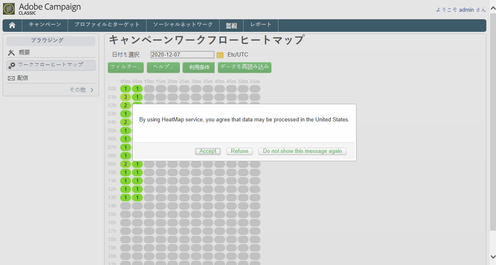

次の3つのオプションを使用できます。

* **[!UICONTROL Accept]** :この契約に同意することにより、異常値検出の際に支援を受けられるように、Adobe Campaignでデータを収集し、米国にデータを転送することを承認します。
* **[!UICONTROL Refuse]** :契約を却下すると、データは転送されませんが、ワークフローヒートマップを使用することはできます。
* **[!UICONTROL Do not show this message again]** :をクリックす **[!UICONTROL Do not show this message again]** ると、ワークフローヒートマップにアクセスする際にポップアップウィンドウが表示されなくなりますが、ボタンからは引き続き使用 **[!UICONTROL Term of use]** できます。

この選択は最終的なものではありません。ボタンをクリックして、いつでも変更で **[!UICONTROL Term of use]** きます。

## HeatMapの使用 {#using-the-heatmap}

>[!NOTE]
>
>管理権限を持つユーザーのみがキャンペーンワークフローのHeatMapにアクセスできます。

1. に移動し、リ **[!UICONTROL Monitoring]** ンクをクリック **[!UICONTROL Workflow HeatMap]** してページを表示 **[!UICONTROL Campaign Workflow HeatMap]** します。

   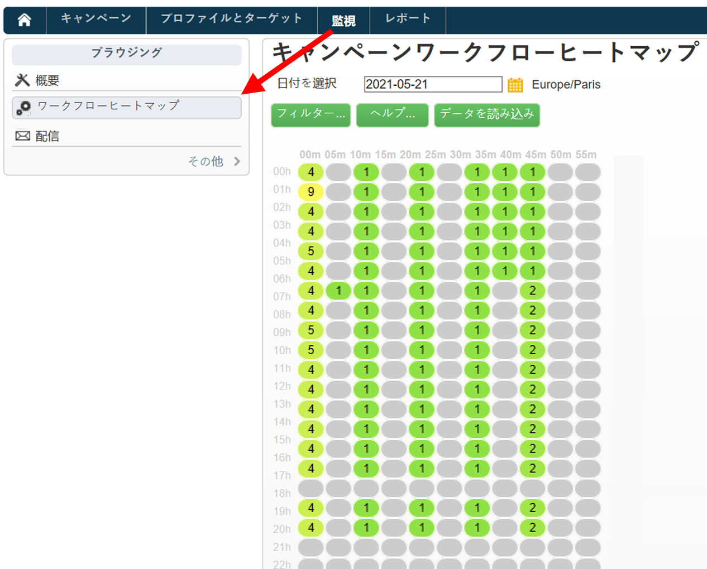

1. カレンダーをクリックして日を選択します。

   デフォルトでは、このページには現在の日のワークフローアクティビティが表示されます。 変更して過去の任意の日を選択できます。

   >[!NOTE]
   >
   >ワークフローによって削除されていないワークフローの **[!UICONTROL Database cleanup]** みが表示されます。 For more on the Database cleanup workflow, refer to [this section](../../production/using/database-cleanup-workflow.md).\
   >デフォルトでは、Workflow HeatMapのタイムゾーンは、現在の管理者ユーザーに対して定義されているタイムゾーンです。 例えば、操作しているマーケティングユーザーと同じ領域にいない場合は、この値を変更できます。

1. ボタンをクリッ **[!UICONTROL Filters]** クします。

   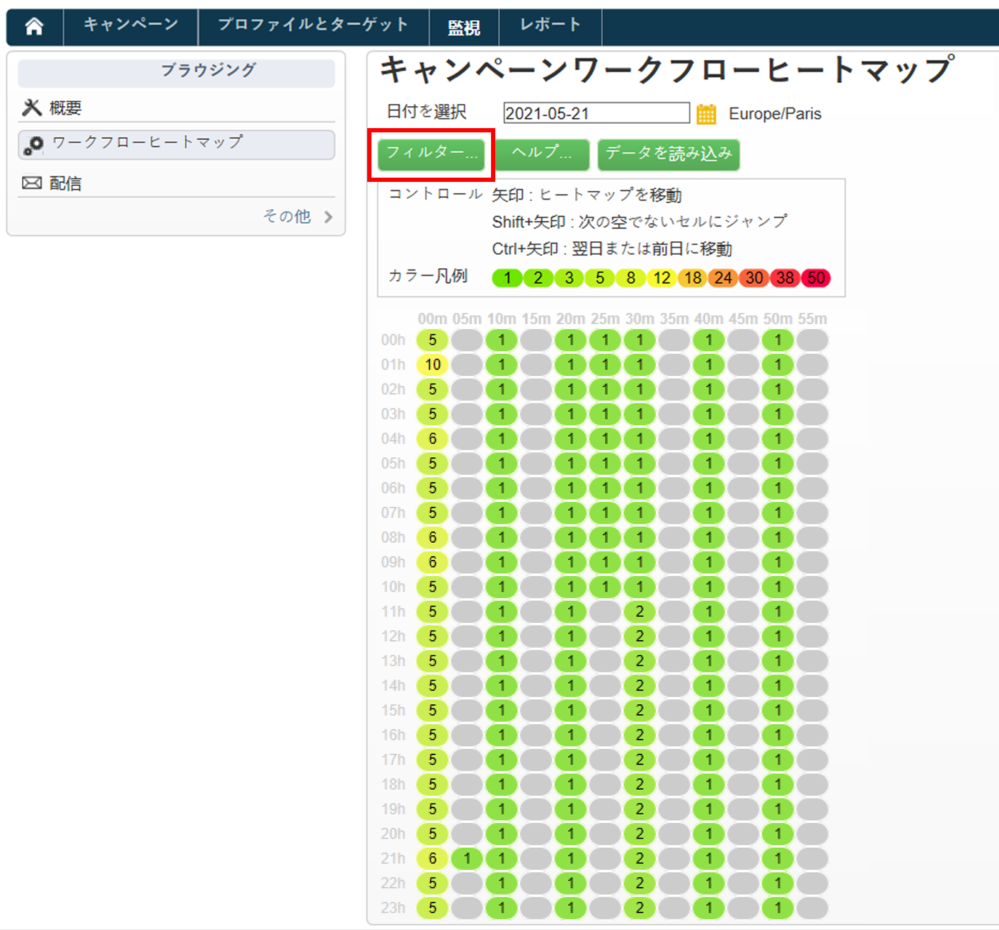

1. スライダを使用して、最小時間を0秒から1時間に設定します。 これにより、一定の秒数または分数を超える間実行中のワークフローのみを検索できます。

   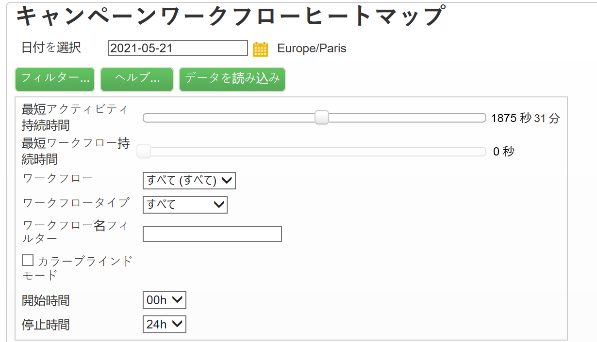

1. リストから特定のワークフローを選択することもで **[!UICONTROL Workflows]** きます。

   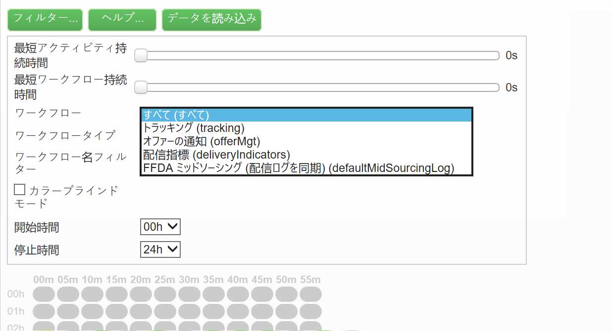

   >[!NOTE]
   >
   >フィルタ **[!UICONTROL Min duration]** ーが適用されます。 特定のワークフローが見つからない場合は、最小期間を0にリセットして、すべてのワークフローがリストに表示されるようにします。

1. また、次の項目をフィルターすることもできま **[!UICONTROL Workflow type]** す。

   * **[!UICONTROL Technical]** :既製 [の技術ワークフローとデータ管理ワークフ](../../workflow/using/building-a-workflow.md#technical-workflows) ローのみが表示されます  。
   * **[!UICONTROL Marketing]** :マーケティングキャンペーンにリンクされたワークフロー(キャンペーン [ワークフロー](../../workflow/using/building-a-workflow.md#campaign-workflows))のみが表示されます。

1. 特定のワークフローを名前で検索する場合は、このフィールドも使用で **[!UICONTROL Workflow name filter]** きます。

   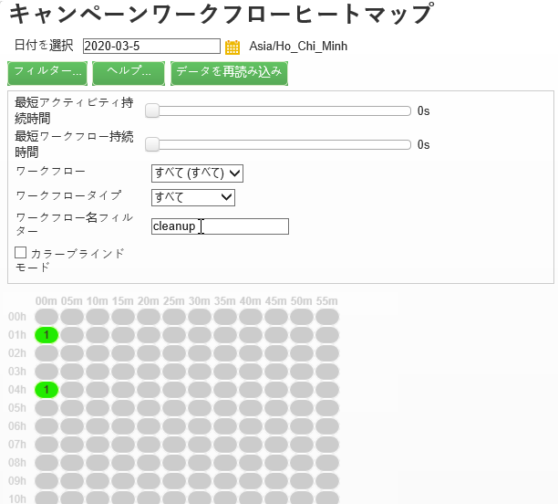

1. その間に一部のワークフローを編集した場合は、ボタンをクリ **[!UICONTROL Reload data]** ックして、グリッドに表示されているデータを更新します。

## HeatMapの読み取り {#reading-the-heatmap}

キャンペーンワークフローのHeatMapは、グリッドの左上から右下に自然に読み取り可能で、緑から赤の色分け範囲を持つ「ホットゾーン」を見つけることができます。

* 濃い赤色のセルは、多数のワークフローが同時に実行されている期間に対応します。
* 灰色のセルは、ワークフローが実行されていない期間に対応します。

カラーコードの適用方法とHeatMapのナビゲーション方法を確認するには、ボタンをクリック **[!UICONTROL Help]** します。

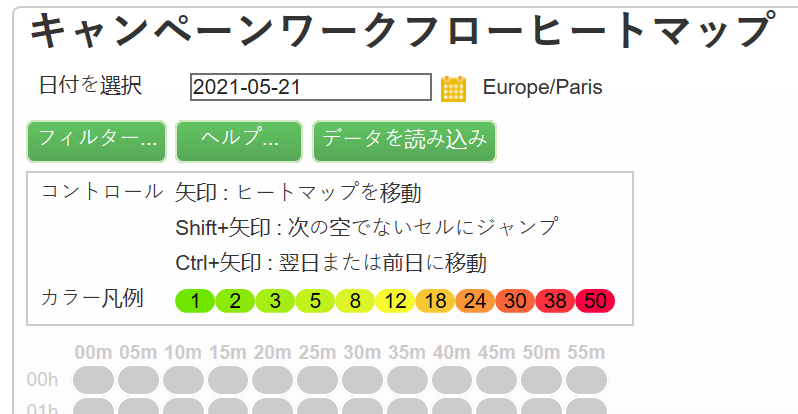

各行は1時間を表し、各セルはその時間の5分を表します。

グリッドには、これらの5分間のそれぞれに対して同時に実行されているすべてのワークフローが表示されます。

次の例では、午前8時から午前8時5分の間に、3つのワークフローが実行されています（それぞれの期間に関係ありません）。

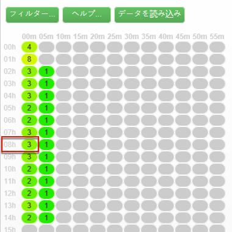

1. 色付きのセルをクリックすると、この期間中に実行されるすべての同時ワークフローの詳細が表示されます。

   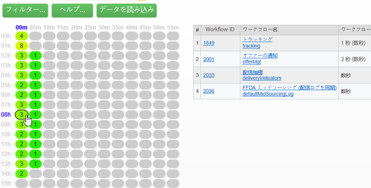

   各ワークフローに対して、そのワークフローに含まれるすべてのアクティビティが、期間と共に表示されます。

1. ワークフローIDまたは名前をクリックして、ワークフローを直接開きます。
1. ビューに戻るには、ボ **[!UICONTROL Campaign Workflow HeatMap]** タンをクリックし **[!UICONTROL Home]** ます。

## 使用例：heatmapを使用したアクション {#use-cases--using-the-heatmap-to-take-actions}

キャンペーンワークフローのHeatMapが役立つ主なケースは2つあります。

### 同時ワークフロー数の削減 {#reducing-the-number-of-concurrent-workflows}

Workflow HeatMapは、キャンペーン管理者がインスタンスの負荷を把握し、適切なタイミングで既存または新規のワークフローを計画する際に役立ちます。

1. ビューで、 **[!UICONTROL Campaign Workflow HeatMap]** ボタンをクリック **[!UICONTROL Filters]** します。
1. durationは、数秒または数分に設定します。
1. 期間フィルターを増やすことで、重要でない最短のワークフローを除外します。

   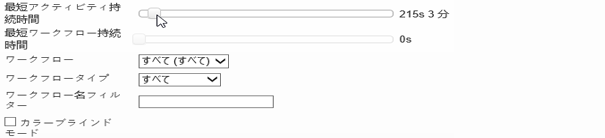

1. 結果を調べてインスタンスの負荷を把握し、適切なアクションを実行します。

   * パフォーマンスの問題が発生し、1つ以上の赤いセルがグリッドに表示される場合は、複数のワークフローの開始時間を変更することを検討してください。 マーケティングユーザーに、ワークフローをビジー（「ホット」）期間から利用可能な時間スロットに手動で移動するよう依頼します。 これは、日常的に安定した活動を維持する必要があります。
   * ピークを避け、インスタンスが過負荷にならないようにするには、新しいワークフローを計画する前にHeatMapを確認し、最適な時間を選択します。 新しいワークフローを開始するには、グリッド内のグレーまたは緑のセルに対応するタイムスロットを考慮します。

### パフォーマンスに影響を与える長期にわたるワークフローの検索 {#finding-long-running-workflows-that-impact-performance}

キャンペーン管理者は、ワークフローヒートマップを使用して、アクティビティの速度を低下させる可能性のある最も長いワークフローを見つけることができます。

1. ビューで、 **[!UICONTROL Campaign Workflow HeatMap]** ボタンをクリック **[!UICONTROL Filters]** します。
1. 期間を1時間に設定します。

   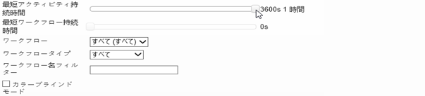

1. フィルターを減らして、結果を増や **[!UICONTROL Min duration]** します。
1. 結果を調べて、最も長いワークフローを見つけ、サーバとデータベースのリソース（CPU、RAM、ネットワーク、IOPSなど）により多くの影響を与える可能性がある。
1. 適切な対応を行います。

   * マーケティングユーザーに、処理時間を短縮するために、最も長いワークフローを分割するように通知します。
   * 特定のワークフローと特定のアクティビティ（JavaScript、インポート、エクスポートなど）に関する詳細な分析を開始し、問題を切り離して、より簡単に解決します。

## 例：HeatMapを使用したワークフロー計画の改善 {#example--using-the-heatmap-to-improve-workflow-planning}

次の例は、Adobe Campaign Workflow HeatMapを使用する場合の計画の効率化とパフォーマンスの向上を示しています。

この場合、多くのユーザーがワークフローのパフォーマンスに不満を抱いています。 何がアクティビティの速度を落としているか、問題の解決方法を確認する必要があります。

1. に移動し、リ **[!UICONTROL Monitoring]** ンクをクリック **[!UICONTROL Workflows]** してページを表示 **[!UICONTROL Campaign Workflow HeatMap]** します。
1. フィルター **[!UICONTROL Min duration]** を5分に設定します。
1. フィルターをに **[!UICONTROL Workflow type]** 設定しま **[!UICONTROL Marketing]** す。
1. HeatMapグリッドから、次の点を確認します。

   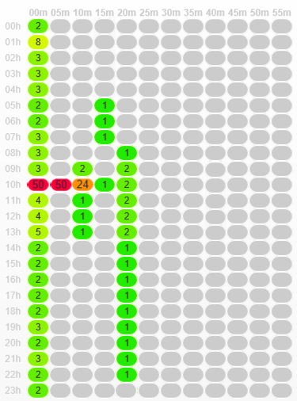

   * 午前10時に50回の長期（5分以上）のキャンペーンワークフローが実行されています。
   * ほとんどは保留中の状態になっています（デフォルトでは、同時実行の制限は20に設定されています）。
   * 保留中のワークフローは、毎日手動で再開する必要があります。
   * パフォーマンスが低い。

1. 午前10時から50のワークフローを開始する代わりに、1日の残りの時間帯にワークフローの開始時間を均等に配分します。
1. ページに戻り、ボ **[!UICONTROL Campaign Workflow HeatMap]** タンをクリックし **[!UICONTROL Reload data]** ます。
1. 次の点を確認します。

   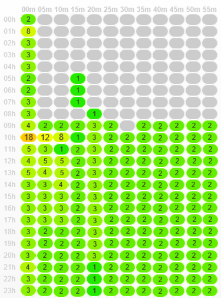

   * 18の長期キャンペーンワークフローが、まだ午前10時に実行されています。
   * これ以上、保留中の状態のワークフローはありません（同時実行の制限は20に設定されたままです）。
   * ワークフローの開始時間は、1日を通して均等に配分されます。
   * パフォーマンスの問題に対して不満を言うユーザーは他にいません。
