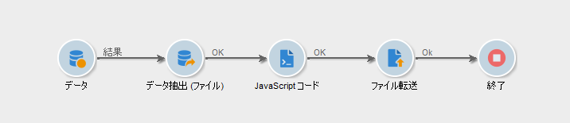
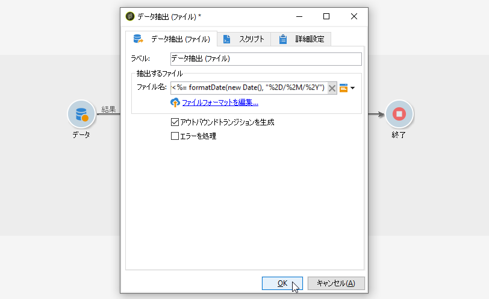
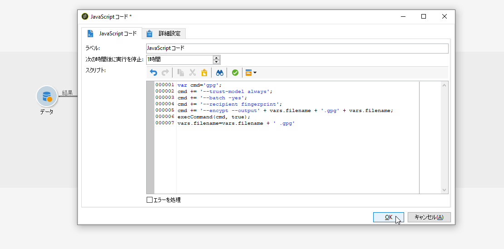
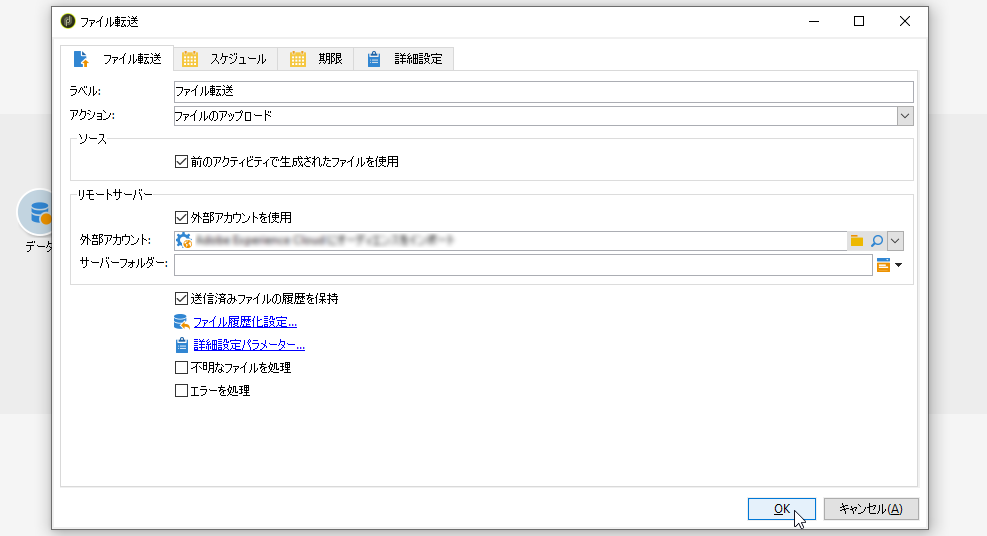

# ワークフローデータの使用方法{#how-to-use-workflow-data}

## データベースの更新 {#updating-the-database}

収集したすべてのデータは、データベースを更新するために、または配信内で使用できます。例えば、メッセージのコンテンツのパーソナライゼーション機能をエンリッチメントすること（メッセージ内に契約件数を含める、過去 1 年間のショッピングカートの平均購入額を指定するなど）や、母集団のターゲティングを詳細におこなうこと（契約の共有者にメッセージを送る、オンラインサービスの高額契約者上位 1,000 人をターゲティングするなど）ができます。このデータは、リストにエクスポートまたはアーカイブできます。

### リストおよびダイレクト更新 {#lists-and-direct-updates}

Adobe Campaign データベースのデータおよび既存のリストは、2 つの専用アクティビティを使用して更新できます。

* 「**[!UICONTROL リスト更新]**」アクティビティを使用して、データリスト内に作業用テーブルを保存できます。

   既存のリストを選択するか、新規リストを作成することができます。ここでは、名前が自動生成されます（場合によってはレコードフォルダーも）。

   

   [リストの更新](../../workflow/using/list-update.md)を参照してください。

* **[!UICONTROL データを更新]**&#x200B;アクティビティでは、データベースのフィールドを一括で更新します。

   詳しくは、[データを更新](../../workflow/using/update-data.md)を参照してください。

### 購読／購読解除の管理 {#subscription-unsubscription-management}

ワークフロー経由で受信者の情報サービスの購読を登録および解除する方法については、[購読サービス](../../workflow/using/subscription-services.md)を参照してください。

## ワークフロー経由での送信 {#sending-via-a-workflow}

### 配信アクティビティ {#delivery-activity}

配信アクティビティについて詳しくは、[配信](../../workflow/using/delivery.md)を参照してください。

### 配信のエンリッチメントとターゲティング {#enriching-and-targeting-deliveries}

コンテンツまたはターゲット母集団の選択のフレームワークをカスタマイズするために、配信はワークフロー内のデータを処理できます。

例えば、直接メール配信のフレームワーク内では、ワークフロー内で実行されるデータ操作から取り出した追加データを、抽出ファイルに含めることができます。


通常のパーソナライゼーションフィールドに加えて、ワークフローステージからのパーソナライゼーションフィールドを、配信コンテンツに追加できます。以下の例に示すように、ワークフローアクティビティ内で定義された追加データは、直接メール配信のフレームワーク内で出力ファイルの名前を定義するために、配信ウィザード内に保持され、アクセスできるようになります。


ワークフローテーブル内に含まれるデータは、名前で識別されます。名前は常に、「**targetData**」リンクから構成されます。詳しくは、[ターゲットデータ](../../workflow/using/data-life-cycle.md#target-data)を参照してください。

さらに、メール配信のフレームワークでは、パーソナライゼーションフィールドで、ターゲティングワークフローステージで実行されるターゲット式のデータを使用できます。以下に例を示します。


セグメントコードがターゲティングアクティビティ内に指定されている場合、それらのコードはワークフローテーブルの特定の列に追加され、パーソナライゼーションフィールドと共に提供されます。すべてのパーソナライゼーションフィールドを表示するには、パーソナライゼーションボタン経由でアクセス可能な&#x200B;**[!UICONTROL ターゲット式／その他...]**&#x200B;リンクをクリックします。


## データのエクスポート {#exporting-data}

### ファイルの圧縮または暗号化 {#zipping-or-encrypting-a-file}

Adobe Campaign では、圧縮されたファイルや暗号化されたファイルをエクスポートできます。「**[!UICONTROL データ抽出（ファイル）]**」アクティビティを通じてエクスポートを定義する際にファイルを圧縮または暗号化する後処理を定義できます。

手順は以下のとおりです。

1. [Campaign コントロールパネル](https://docs.adobe.com/content/help/ja-JP/control-panel/using/instances-settings/gpg-keys-management.html#encrypting-data)を使用して、インスタンスに GPG キーペアをインストールします。

   >[!NOTE]
   >
   >Campaign コントロールパネルは、AWS でホストされるすべてのお客様が利用できます（自分のマーケティングインスタンスをオンプレミスでホストするお客様を除く）。

1. インストールした Adobe Campaign がアドビによってホストされている場合：必要なユーティリティをサーバーにインストールするようカスタマーサポートに依頼します。
1. Adobe Campaign のインストールがオンプレミスの場合：使用するユーティリティ（例：GPG、GZIP）およびアプリケーションサーバー上の必要なキー（暗号化キー）をインストールします。

その後、アクティビティの「**[!UICONTROL スクリプト]**」タブまたは「**[!UICONTROL JavaScript コード]**」アクティビティでコマンドまたはコードを使用できます。例として、次のユースケースを示します。

**関連トピック：**

* [処理前のファイルの解凍または復号化](../../workflow/using/importing-data.md#unzipping-or-decrypting-a-file-before-processing)
* [データ抽出（ファイル）アクティビティ](../../workflow/using/extraction--file-.md)

### ユースケース：コントロールパネルにインストールされたキーを使用したデータの暗号化および書き出し {#use-case-gpg-encrypt}

このユースケースでは、Campaign コントロールパネルにインストールされたキーを使用してデータを暗号化およびエクスポートするためのワークフローを作成します。

GPG キーを使用してデータを暗号化する方法を示すチュートリアルビデオについては、[こちら](https://docs.adobe.com/content/help/ja-JP/campaign-classic-learn/tutorials/administrating/control-panel-acc/gpg-key-management/using-a-gpg-key-to-encrypt-data.html)を参照してください。

このユースケースを実行する手順は次のとおりです。

1. GPG ユーティリティを使用して GPG キーペア（公開鍵／秘密鍵）を生成し、公開キーを Campaign コントロールパネルにインストールします。詳細な手順については、[Campaign コントロールパネルのドキュメント](https://docs.adobe.com/content/help/ja-JP/control-panel/using/instances-settings/gpg-keys-management.html#encrypting-data)を参照してください。

1. Campaign Classic で、データをエクスポートするワークフローを作成し、Campaign コントロールパネル経由でインストールされた秘密鍵を使用してデータをエクスポートします。これをおこなうには、次のようにワークフローを作成します。

   

   * **[!UICONTROL クエリ]**&#x200B;アクティビティ：この例では、クエリを実行して、エクスポートするデータをデータベースから選択します。
   * **[!UICONTROL データ抽出（ファイル）]**&#x200B;アクティビティ:：データをファイルに抽出します。
   * **[!UICONTROL JavaScript コード]**&#x200B;アクティビティ:：抽出するデータを暗号化します。
   * **[!UICONTROL ファイル転送]**&#x200B;アクティビティ：データを外部ソース（この例では SFTP サーバー）に送信します。

1. **[!UICONTROL クエリ]**&#x200B;アクティビティを設定して、目的のデータをデータベースから選択します。詳しくは、[こちら](../../workflow/using/query.md)を参照してください。

1. データ&#x200B;**[!UICONTROL 抽出（ファイル）]**&#x200B;アクティビティを開き、必要に応じて設定します。アクティビティの設定方法に関するグローバルな概念については、[こちら](../../workflow/using/extraction--file-.md)を参照してください。

   

1. **[!UICONTROL JavaScript コード]**&#x200B;アクティビティを開き、次のコマンドをコピー＆ペーストして、抽出するデータを暗号化します。

   >[!IMPORTANT]
   >
   >コマンドの&#x200B;**フィンガープリント**&#x200B;の値を、Campaign コントロールパネルにインストールされた公開鍵のフィンガープリントに置き換えてください。

   ```
   var cmd='gpg ';
   cmd += ' --trust-model always';
   cmd += ' --batch -yes';
   cmd += ' --recipient fingerprint';
   cmd += ' --encrypt --output ' + vars.filename + '.gpg ' + vars.filename;
   execCommand(cmd,true);
   vars.filename=vars.filename + '.gpg'
   ```

   

1. **[!UICONTROL ファイル転送]**&#x200B;アクティビティを開き、ファイルの送信先の SFTP サーバーを指定します。アクティビティの設定方法に関するグローバルな概念については、[こちら](../../workflow/using/file-transfer.md)を参照してください。

   

1. これで、ワークフローを開始できます。ワークフローを実行すると、クエリで選択された対象データが、暗号化された .gpg ファイルにエクスポートされ、SFTP サーバーに転送されます。

   
