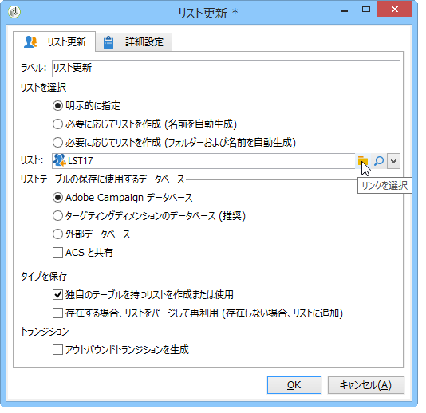
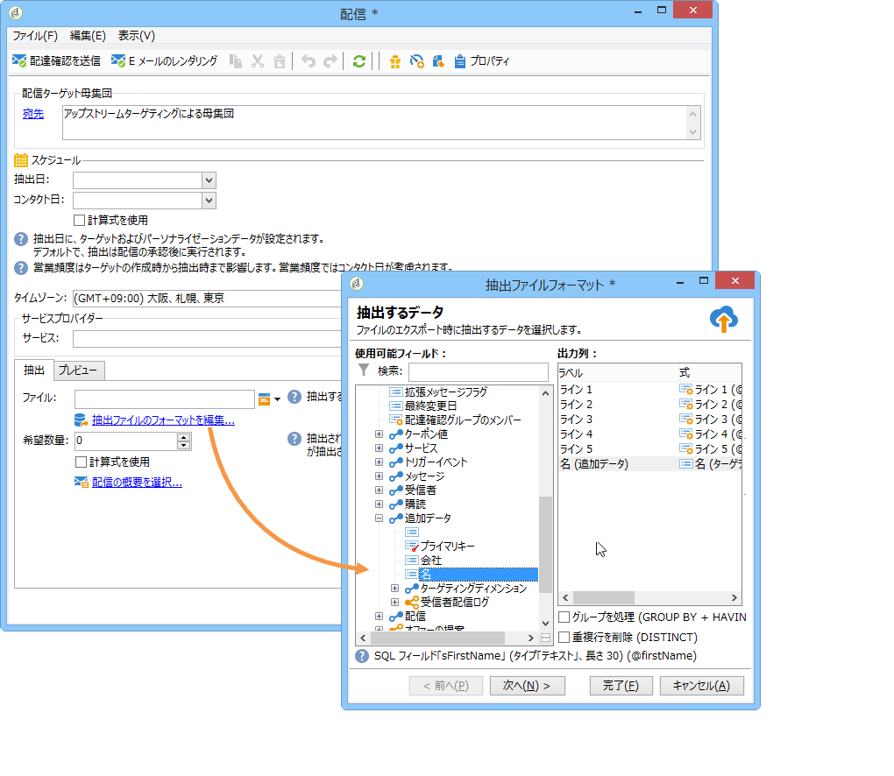
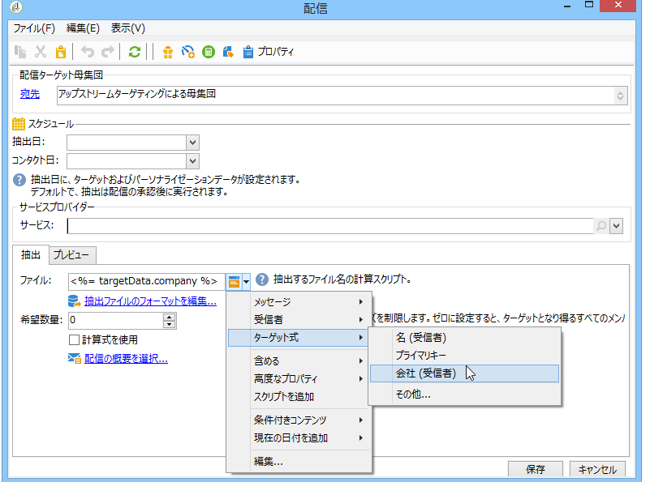
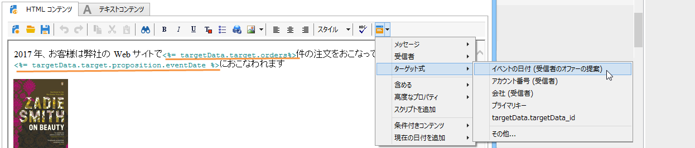
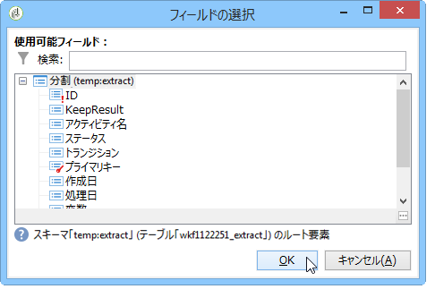

# ワークフローデータの使用方法{#how-to-use-workflow-data}

## データベースの更新 {#updating-the-database}

収集したすべてのデータは、データベースを更新するために、または配信内で使用できます。例えば、メッセージのコンテンツのパーソナライゼーション機能をエンリッチメントすること（メッセージ内に契約件数を含める、過去 1 年間のショッピングカートの平均購入額を指定するなど）や、母集団のターゲティングを詳細におこなうこと（契約の共有者にメッセージを送る、オンラインサービスの高額契約者上位 1,000 人をターゲティングするなど）ができます。このデータは、リストにエクスポートまたはアーカイブできます。

### リストおよびダイレクト更新 {#lists-and-direct-updates}

Adobe Campaign データベースのデータおよび既存のリストは、2 つの専用アクティビティを使用して更新できます。

* The **[!UICONTROL List update]** activity lets you store worktables in a datalist.

   既存のリストを選択するか、新規リストを作成することができます。ここでは、名前が自動生成されます（場合によってはレコードフォルダーも）。

   

   詳しくは、リス [トの更新を参照](../../workflow/using/list-update.md)。

* The **[!UICONTROL Update data]** activity performs a mass update of the fields in the database.

   For more on this, refer to [Update data](../../workflow/using/update-data.md).

### 購読／購読解除の管理 {#subscription-unsubscription-management}

To find out about subscribing and unsubscribing recipients to an information service via a workflow, refer to [Subscription Services](../../workflow/using/subscription-services.md).

## ワークフロー経由での送信 {#sending-via-a-workflow}

### 配信アクティビティ {#delivery-activity}

The delivery activity is detailed in [Delivery](../../workflow/using/delivery.md).

### 配信のエンリッチメントとターゲティング {#enriching-and-targeting-deliveries}

コンテンツまたはターゲット母集団の選択のフレームワークをカスタマイズするために、配信はワークフロー内のデータを処理できます。

例えば、直接メール配信のフレームワーク内では、ワークフロー内で実行されるデータ操作から取り出した追加データを、抽出ファイルに含めることができます。



通常のパーソナライゼーションフィールドに加えて、ワークフローステージからのパーソナライゼーションフィールドを、配信コンテンツに追加できます。以下の例に示すように、ワークフローアクティビティ内で定義された追加データは、直接メール配信のフレームワーク内で出力ファイルの名前を定義するために、配信ウィザード内に保持され、アクセスできるようになります。



ワークフローテーブル内に含まれるデータは、名前で識別されます。名前は常に、「**targetData**」リンクから構成されます。For more on this, refer to [Target data](../../workflow/using/executing-a-workflow.md#target-data).

さらに、メール配信のフレームワークでは、パーソナライゼーションフィールドで、ターゲティングワークフローステージで実行されるターゲット式のデータを使用できます。以下に例を示します。



セグメントコードがターゲティングアクティビティ内に指定されている場合、それらのコードはワークフローテーブルの特定の列に追加され、パーソナライゼーションフィールドと共に提供されます。To display all personalization fields, click the **[!UICONTROL Target extension > Other...]** link accessible via the personalization button.



## データのエクスポート {#exporting-data}

### ファイルの圧縮または暗号化 {#zipping-or-encrypting-a-file}

Adobe Campaign では、圧縮されたファイルや暗号化されたファイルをエクスポートできます。When defining an export through a **[!UICONTROL Data extraction (file)]** activity, you can define a post-processing to zip or to encrypt the file.

手順は以下のとおりです。

* インストールした Adobe Campaign がアドビによってホストされている場合：必要なユーティリティをサーバーにインストールするよう[サポート](https://support.neolane.net)に依頼します。
* Adobe Campaignのインストールがオンプレミスの場合：使用するユーティリティをインストールします(例：GPG、GZIP)と、アプリケーションサーバー上の必要なキー（暗号化キー）。

この場合、以下のようなコマンドやコードを使用できます。

```
function encryptFile(file) {  
  var systemCommand = “gpg --encrypt --recipient  recipientToEncryptTo ” + file;  
  var result = execCommand(systemCommand, true); 
}
```

ファイルのインポート時には、ファイルを解凍または復号化することもできます。See [Unzipping or decrypting a file before processing](../../workflow/using/importing-data.md#unzipping-or-decrypting-a-file-before-processing).
