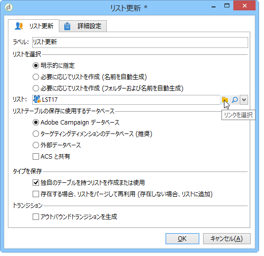
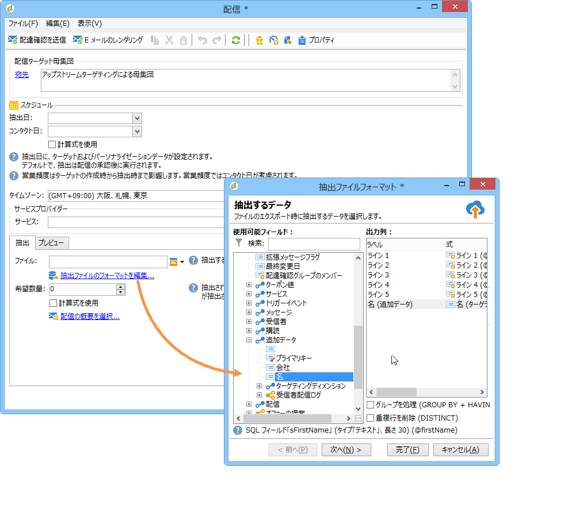
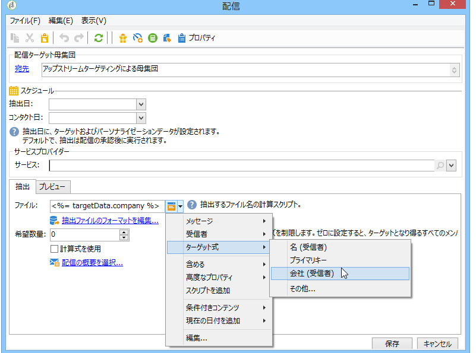
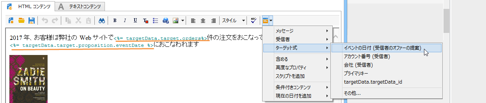
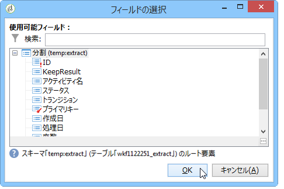

# ワークフローデータの使用方法{#how-to-use-workflow-data}

## データベースの更新 {#updating-the-database}

収集したすべてのデータは、データベースを更新するために、または配信内で使用できます。 例えば、メッセージコンテンツのパーソナライゼーションの可能性を強化できます（メッセージに契約数を含める、過去1年間の平均ショッピングカートを指定するなど）。 または、集団ターゲティングの詳細（契約共同所有者へのメッセージの送信、オンラインサービスの優良顧客1,000人のターゲティングなど）。 このデータは、リストにエクスポートまたはアーカイブできます。

### リスト更新とダイレクト更新 {#lists-and-direct-updates}

Adobe Campaign データベースのデータおよび既存のリストは、2 つの専用アクティビティを使用して更新できます。

* 「**[!UICONTROL リスト更新]**」アクティビティを使用して、データリスト内にワークテーブルを保存できます。

  既存のリストを選択するか、新規リストを作成することができます。 ここでは、名前が自動生成されます（場合によってはレコードフォルダーも）。

  

  [リストの更新](list-update.md)を参照してください。

* **[!UICONTROL データを更新]**&#x200B;アクティビティでは、データベースのフィールドを一括で更新します。

  詳しくは、[データを更新](update-data.md)を参照してください。

### 購読／購読解除の管理 {#subscription-unsubscription-management}

ワークフローを介した受信者の情報サービスへの購読登録と情報サービスからの購読登録解除については、[購読サービス](subscription-services.md)を参照してください。

## ワークフローを介した送信 {#sending-via-a-workflow}

### 配信アクティビティ {#delivery-activity}

配信アクティビティについて詳しくは、[配信](delivery.md)を参照してください。

### 配信のエンリッチメントとターゲティング {#enriching-and-targeting-deliveries}

コンテンツまたはターゲット母集団の選択のフレームワークをカスタマイズするために、配信はワークフロー内のデータを処理できます。

例えば、ダイレクトメール配信のフレームワーク内では、ワークフロー内で実行されるデータ操作から取り出した追加データを、抽出ファイルに含めることができます。

通常のパーソナライゼーションフィールドに加えて、ワークフローステージからのパーソナライゼーションフィールドを、配信コンテンツに追加できます。 以下の例に示すように、ダイレクトメール配信のフレームワーク内で出力ファイル名を定義するために、ワークフローアクティビティ内で定義された追加データを、配信アシスタント内に保持してアクセスすることができます。

ワークフローテーブル内に含まれるデータは、名前で識別されます。名前は常に、「**targetData**」リンクから構成されます。 詳しくは、[ターゲットデータ](data-life-cycle.md#target-data)を参照してください。

さらに、メール配信のフレームワークでは、パーソナライゼーションフィールドで、ターゲティングワークフローステージで実行されるターゲット式のデータを使用できます。以下に例を示します。

セグメントコードがターゲティングアクティビティ内に指定されている場合、それらのコードはワークフローテーブルの特定の列に追加され、パーソナライゼーションフィールドと共に提供されます。 すべてのパーソナライゼーションフィールドを表示するには、パーソナライゼーションボタン経由でアクセス可能な&#x200B;**[!UICONTROL ターゲット式／その他...]**&#x200B;リンクをクリックします。

