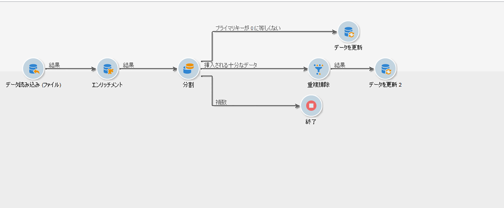
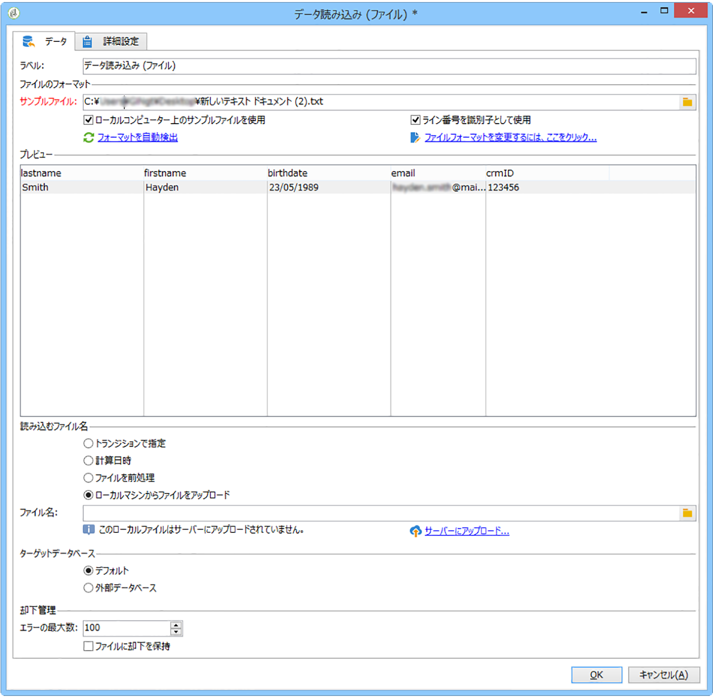
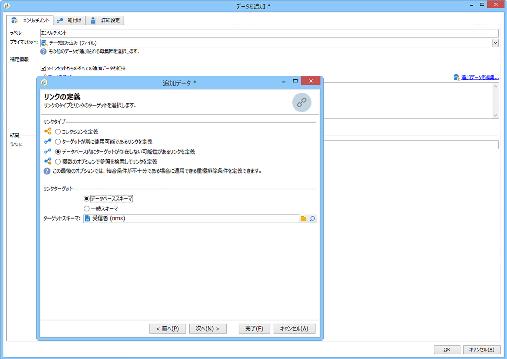
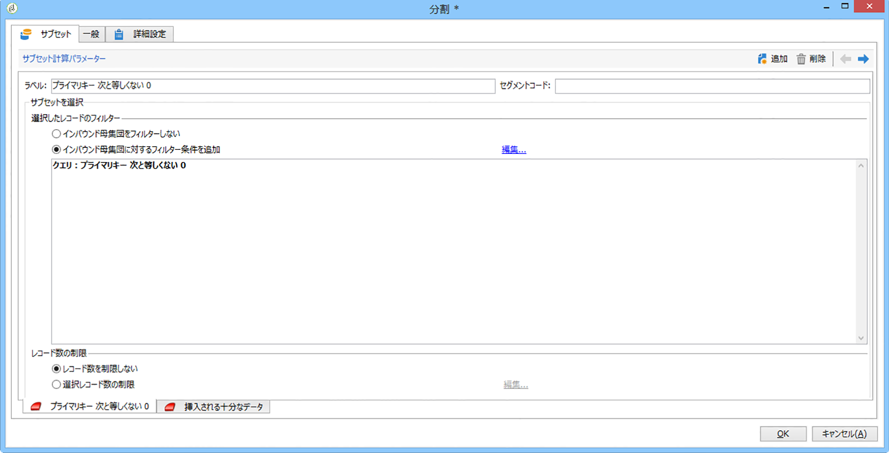
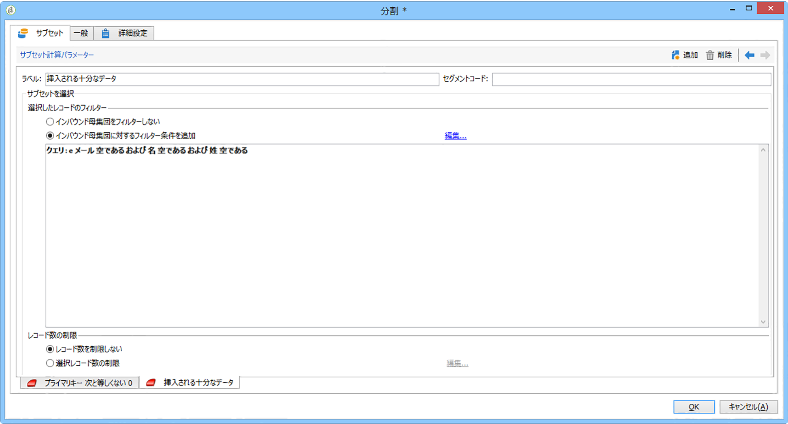
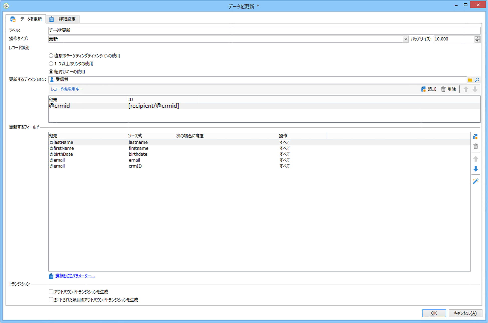
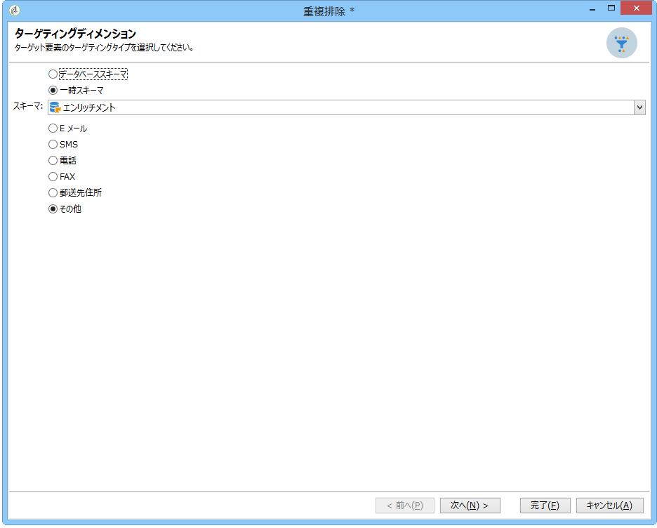
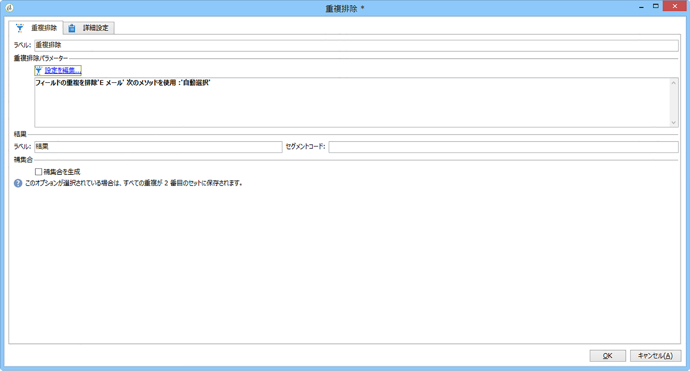
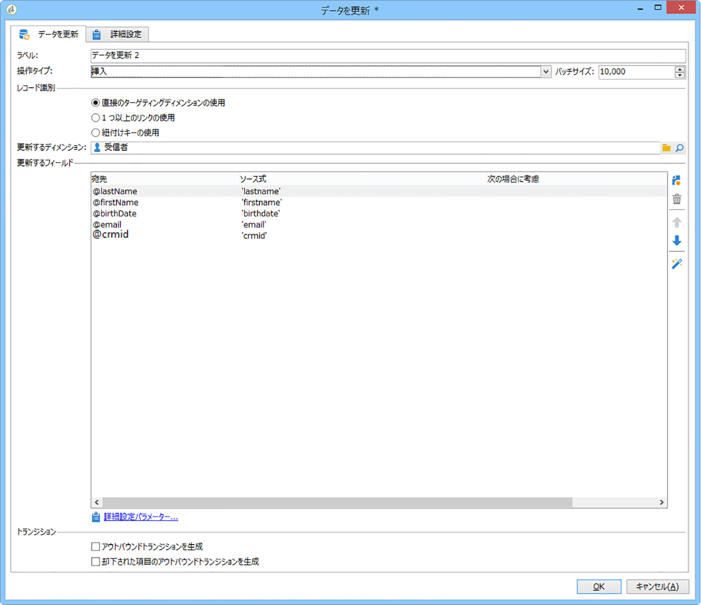
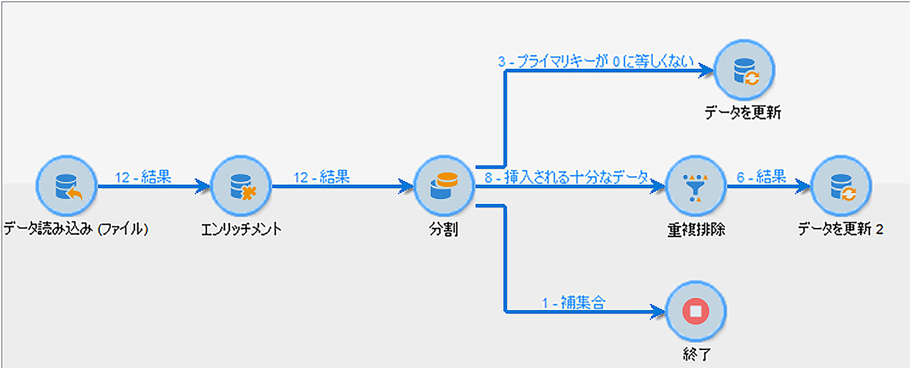

# データのインポート{#importing-data}

## データの収集方法 {#how-to-collect-data}

### リストからのデータの使用：リスト読み込み {#using-data-from-a-list--read-list}

ワークフローに送られるデータを、事前にデータが準備され、構造化されているリストから取り出すこともできます。

このリストは、Adobe Campaign 内に直接作成されている場合も、「**[!UICONTROL リストをインポート]**」オプションを使用してインポートされる場合もあります。このオプションについて詳しくは、この[ページ](../../platform/using/generic-imports-and-exports.md)を参照してください。

ワークフローにおけるリスト読み込みアクティビティの使用について詳しくは、[リスト読み込み](../../workflow/using/read-list.md)を参照してください。

### ファイルからのデータの読み込み {#loading-data-from-a-file}

ワークフロー内で処理されるデータは、Adobe Campaign にインポートできるように、構造化ファイルから抽出することができます。

データアクティビティの読み込みについて詳しくは、[データ読み込み（ファイル）](../../workflow/using/data-loading--file-.md)の節を参照してください。

インポートする構造化ファイルの例：

```
lastname;firstname;birthdate;email;crmID
Smith;Hayden;23/05/1989;hayden.smith@example.com;124365
Mars;Daniel;17/11/1987;dannymars@example.com;123545
Smith;Clara;08/02/1989;hayden.smith@example.com;124567
Durance;Allison;15/12/1978;allison.durance@example.com;120987
```

### 処理前のファイルの解凍または復号化 {#unzipping-or-decrypting-a-file-before-processing}

Adobe Campaign では、圧縮されたファイルや暗号化されたファイルをインポートできます。「**[!UICONTROL データ読み込み（ファイル）]**」アクティビティで読み取る前にファイルを解凍または復号化する前処理を定義できます。

手順は以下のとおりです。

* インストールした Adobe Campaign がアドビによってホストされている場合：必要なユーティリティをサーバーにインストールするよう[サポート](https://support.neolane.net)に依頼します。
* Adobe Campaign のインストールがオンプレミスの場合：使用するユーティリティ（例：GPG、GZIP）およびアプリケーションサーバー上の必要なキー（暗号化キー）をインストールします。

1. ワークフローに「**[!UICONTROL ファイル転送]**」アクティビティを追加して設定します。
1. 「**[!UICONTROL データ読み込み（ファイル）]**」アクティビティを追加し、ファイルのフォーマットを定義します。
1. 「**[!UICONTROL ファイルを前処理]**」オプションをオンにします。
1. 適用する前処理コマンドを指定します。以下に PGP でファイルを復号化する場合の例を示します。

   ```
   <path-to_pgp_if-not_global_or_server/>pgp.exe --decrypt --input nl6/var/vp/import/filename.pgp --passphrase "your password" --recipient recipient @email.com --verbose --output nl6/var/vp/import/filename
   ```

1. ファイルから取得したデータを管理するために必要なその他のアクティビティを追加します。
1. 保存して、ワークフローを実行します。

ファイルのエクスポート時には、ファイルを圧縮または暗号化することもできます。[ファイルの圧縮または暗号化](../../workflow/using/how-to-use-workflow-data.md#zipping-or-encrypting-a-file)を参照してください。

## データをインポートする際のベストプラクティス {#best-practices-when-importing-data}

次に説明するいくつかのシンプルなルールに注意して従うと、データベース内のデータの一貫性を確保し、データベースの更新中またはデータを読み込む際の一般的なエラーを避けるのに非常に役立ちます。

### インポートテンプレートの使用 {#using-import-templates}

ほとんどの読み込みワークフローには、**[!UICONTROL データ読み込み (ファイル)]**、**[!UICONTROL エンリッチメント]**、**[!UICONTROL 分割]**、**[!UICONTROL 重複排除]**、**[!UICONTROL データを更新]**&#x200B;のアクティビティが含まれます。

インポートテンプレートを使用すると、同様のインポートを準備したり、データベース内のデータの一貫性を確保したりするのに非常に便利です。ワークフローテンプレートの作成方法について詳しくは、[ワークフローテンプレート](../../workflow/using/building-a-workflow.md#workflow-templates)の節を参照してください。

プロジェクトで使用されるファイルには重複はないので、多くのプロジェクトでは、インポートは「**[!UICONTROL 重複排除]**」アクティビティなしで作成されます。複数のファイルをインポートすると、重複が発生する場合があります。そうなると、重複排除は困難になります。そのため、すべてのインポートワークフローで重複排除ステップを設けることは、優れた予防措置となります。

受信データは一貫性があり正しいとか、IT 部門や Adobe Campaign スーパーバイザーが対処するとは思わないでください。プロジェクトの間、データクレンジングに留意してください。データをインポートする際には、重複排除し、紐付けし、一貫性を維持します。

インポートテンプレートの例については、[繰り返し発生するインポートの設定](#setting-up-a-recurring-import)の節を参照してください。

### フラットファイルフォーマットの使用 {#using-flat-file-formats}

インポートで最も効率的なフォーマットは、フラットファイルです。フラットファイルは、データベースレベルで、一括モードでインポートできます。

次に例を示します。

* 区切り記号：タブまたはセミコロン
* 最初の行は見出し
* 文字列の区切り記号なし
* 日付フォーマット：YYYY/MM/DD HH:mm:SS

Adobe Campaign では、標準ファイルインポートアクティビティを使用して XML ファイルをインポートすることはできません。JavaScript を使用して XML ファイルをインポートできますが、ファイルあたり 10,000 レコード未満の少量の場合に限られます。

### 圧縮と暗号化の使用 {#using-compression-and-encryption}

可能であれば、インポートおよびエクスポートに zip 形式のファイルを使用します。

Linux では、コマンドラインを使用して、ファイルを解凍すると同時にインポートできます。次に例を示します。

```
zcat nl6/var/vp/import/filename.gz
```

また、安全でないネットワークを通じて送信するファイルは暗号化することをお勧めします。これには、GPG を使用できます。

### ファイルからのバッチでのデータ読み込み {#loading-data-in-batch-from-files}

ファイルからバッチでデータを読み込むことは、（Web サービスを使用するなどして）一度に 1 行ずつ読み込むよりも効率的です。

Web サービスを使用したインポートは効率的ではありません。可能であれば、ファイルを使用することをお勧めします。

また、リアルタイムでプロファイルをエンリッチメントするための外部 Web サービスの呼び出しは、行レベルで機能するので、パフォーマンスの問題およびメモリリークの原因となることが知られています。

データをインポートする必要がある場合、リアルタイムで Web アプリケーションまたは Web サービスを使用するよりも、ワークフローを使用してバッチでおこなうことをお勧めします。

### データ管理の使用 {#using-data-management}

JavaScript を使用した、繰り返しモード（行ごと）の読み込みは、少量に限定する必要があります。

効率を上げるために、常に、データ管理ワークフローで&#x200B;**[!UICONTROL データ読み込み（ファイル）]**&#x200B;アクティビティを使用します。

### 差分モードでのインポート {#importing-in-delta-mode}

標準のインポートは、差分モードでおこなう必要があります。つまり、毎回、テーブル全体ではなく、新規または変更されたデータのみが Adobe Campaign に送信されるようにします。

完全インポートは、最初の読み込みにのみ使用する必要があります。

JavaScript ではなくデータ管理を使用してデータをインポートします。

### 一貫性の維持 {#maintaining-consistency}

Adobe Campaign データベースのデータの一貫性を維持するには、次の原則に従います。

* インポートされたデータが Adobe Campaign の参照テーブルに一致する場合、ワークフローでそのテーブルと紐付けされる必要があります。一致しないレコードは、却下される必要があります。
* インポートされたデータが常に&#x200B;**「正規化」**&#x200B;されている（E メール、電話番号、ダイレクトメールアドレス）ことと、この正規化が信頼でき、何年にもわたって変更されないことを確認します。該当しない場合、データベースに何らかの重複が現れる可能性が高く、Adobe Campaign には「あいまい」一致をおこなうツールがないので、重複を管理および削除することが非常に難しくなります。
* 重複の作成を避けるために、トランザクションデータは、紐付けキーを持ち、既存のデータと紐付けされている必要があります。
* **関連ファイルを順番どおりにインポートします**。

   お互いに依存する複数のファイルでインポートが構成されている場合、ワークフローでファイルが正しい順番でインポートされていることを確認する必要があります。あるファイルが失敗すると、他のファイルはインポートされません。

* データをインポートする際には、**重複排除**&#x200B;し、紐付けし、一貫性を維持します。

## 繰り返し発生するインポートの設定 {#setting-up-a-recurring-import}

同じ構造のファイルを頻繁にインポートする必要がある場合、インポートテンプレートを使用することをお勧めします。

この例では、Adobe Campaign データベースの CRM からのプロファイルのインポートに再利用できるワークフローを事前設定する方法を示します。各アクティビティで使用できるすべての設定について詳しくは、この[節](../../workflow/using/about-activities.md)を参照してください。

1. **[!UICONTROL リソース／テンプレート／ワークフローテンプレート]**&#x200B;から、新しいワークフローテンプレートを作成します。
1. 次のアクティビティを追加します。

   * **[!UICONTROL データ読み込み (ファイル)]**：インポートするデータが含まれるファイルに求められる構造を定義します。
   * **[!UICONTROL エンリッチメント]**：インポートされたデータをデータベースのデータに紐付けします。
   * **[!UICONTROL 分割]**：フィルターを作成して、紐付けできたかどうかによって別々にレコードを処理します。
   * **[!UICONTROL 重複排除]**：データベースに挿入される前に、受信ファイルのデータを重複排除します。
   * **[!UICONTROL データを更新]**：データベースをインポートされたプロファイルで更新します。
   

1. 「**[!UICONTROL データ読み込み（ファイル）]**」アクティビティを設定：

   * サンプルファイルをアップロードすることで、求められる構造を定義します。サンプルファイルには、インポートに必要なすべての列と、いくつかの行のみが含まれている必要があります。ファイルフォーマットをチェックおよび編集して、各列のタイプが正しく設定されていることを確認します（テキスト、日付、整数など）。次に例を示します。

      ```
      lastname;firstname;birthdate;email;crmID
      Smith;Hayden;23/05/1989;hayden.smith@mailtest.com;123456
      ```

   * 「**[!UICONTROL 読み込むファイル名]**」セクションで、「**[!UICONTROL ローカルマシンからファイルをアップロード]**」を選択して、フィールドを空のままにします。このテンプレートから新しいワークフローを作成するたびに、ここで、定義された構造に対応するファイルを指定できます。

      任意のオプションを使用できますが、それに応じてテンプレートを修正する必要があります。例えば、「**[!UICONTROL トランジションで指定]**」を選択する場合、FTP／SFTP サーバーからインポートするファイルを取得する前に、「**[!UICONTROL ファイル転送]**」アクティビティを追加できます。S3 または SFTP 接続を使用すると、アドビのリアルタイムカスタマーデータプラットフォーム（CDP）でセグメントデータを Adobe Campaign にインポートすることもできます。詳しくは、この[ドキュメント](https://docs.adobe.com/content/help/en/experience-platform/rtcdp/destinations/destinations-cat/adobe-destinations/adobe-campaign-destination.html)を参照してください。

      

1. 「**[!UICONTROL エンリッチメント]**」アクティビティを設定します。ここでのこのアクティビティの目的は、受信データを識別することです。

   * 「**[!UICONTROL エンリッチメント]**」タブで、「**[!UICONTROL データを追加]**」を選択し、インポートされたデータと受信者ターゲティングディメンションの間のリンクを定義します。この例では、結合条件の作成に **CRM ID** カスタムフィールドが使用されています。一意のレコードを識別できる限り、必要なフィールドまたはフィールドの組み合わせを使用します。
   * 「**[!UICONTROL 紐付け]**」タブで、「**[!UICONTROL 作業データからドキュメントを識別]**」オプションを未チェックのままにします。
   

1. 「**[!UICONTROL 分割]**」アクティビティを設定して、あるトランジションで紐付けされた受信者を取得し、2 番目のトランジションで紐付けされていないが十分なデータを持っている受信者を取得します。

   紐付けされた受信者を含むトランジションは、データベースを更新するために使用できます。不明な受信者を含むトランジションは、ファイルで最小限の情報が利用できる場合、データベースに新しい受信者エントリを作成するために使用できます。

   紐付けできず、十分なデータを持たない受信者は、補集合アウトバウンドトランジションで選択され、別のファイルにエクスポートしたり、単純に無視したりできます。

   * アクティビティの「**[!UICONTROL 一般]**」タブで、フィルタリング設定として「**[!UICONTROL 追加データのみを使用]**」を選択して、「**[!UICONTROL ターゲティングディメンション]**」が「**[!UICONTROL エンリッチメント]**」に自動的に設定されていることを確認します。

      「**[!UICONTROL 補集合を生成]**」オプションをチェックして、データベースにレコードを挿入できないかどうかを確認できるようにします。必要に応じて、補完データのさらなる処理（ファイルエクスポート、リスト更新など）を適用できます。

   * 「**[!UICONTROL サブセット]**」タブの最初のサブセットで、インバウンド母集団のフィルタリング条件を追加して、受信者プライマリキーが 0 に等しくないレコードのみを選択します。この方法では、データベースの受信者に紐付けされたファイルのデータがそのサブセットで選択されます。

      

   * データベースに挿入される十分なデータを持つ紐付けられていないレコードを選択する 2 番目のサブセットを追加します（例：E メールアドレス、姓名）。

      サブセットは、作成順に処理されます。つまり、2 番目のサブセットが処理されるときに、データベースに既に存在するすべてのレコードは最初のサブセットで既に選択されています。

      

   * 最初の 2 つのサブセットで選択されていないすべてのレコードは、**[!UICONTROL 補集合]**&#x200B;で選択されます。

1. 以前設定した「**[!UICONTROL 分割]**」アクティビティの最初のアウトバウンドトランジションの後にある「**[!UICONTROL データを更新]**」アクティビティを設定します。

   * インバウンドトランジションのみがデータベースに既に存在する受信者を含むので、「**[!UICONTROL 操作タイプ]**」として「**[!UICONTROL 更新]**」を選択します。
   * 「**[!UICONTROL レコード識別]**」セクションで、「**[!UICONTROL 紐付けキーの使用]**」を選択して、ターゲティングディメンションと&#x200B;**[!UICONTROL エンリッチメント]**&#x200B;で作成したリンクの間のキーを定義します。この例では、**CRM ID** カスタムフィールドが使用されています。
   * 「**[!UICONTROL 更新するフィールド]**」セクションで、ファイルの対応する列の値で更新する受信者ディメンションのフィールドを指定します。ファイル列の名前が受信者ディメンションフィールドの名前と同一またはほとんど同じ場合、自動選択ボタンを使用して、異なるフィールドを自動的に一致させることができます。

      

1. 紐付けられていない受信者を含むトランジションの後にある「**[!UICONTROL 重複排除]**」アクティビティを設定します。

   * 「**[!UICONTROL 設定を編集]**」を選択し、ワークフローの「**[!UICONTROL エンリッチメント]**」アクティビティから生成された一時スキーマにターゲティングディメンションを設定します。

      

   * この例では、一意のプロファイルを見つけるために、E メールフィールドが使用されています。入力されていることがわかっており、一意の組み合わせを構成する任意のフィールドを使用できます。
   * **[!UICONTROL 重複排除方法]**&#x200B;画面で、「**[!UICONTROL 詳細設定パラメーター]**」を選択し、「**[!UICONTROL 0 ID レコードの自動フィルターを無効にする]**」オプションをチェックして、0 に等しいプライマリキーを持つレコード（このトランジションのすべてのレコードである必要がある）が除外されないことを確認します。
   

1. 以前設定した「**[!UICONTROL 重複排除]**」アクティビティの後にある「**[!UICONTROL データを更新]**」アクティビティを設定します。

   * インバウンドトランジションのみがデータベースに存在しない受信者を含むので、「**[!UICONTROL 操作タイプ]**」では「**[!UICONTROL 挿入]**」を選択します。
   * 「**[!UICONTROL レコード識別]**」セクションで、「**[!UICONTROL 直接のターゲティングディメンションの使用]**」を選択して、**[!UICONTROL 受信者]**&#x200B;ディメンションを選択します。
   * 「**[!UICONTROL 更新するフィールド]**」セクションで、ファイルの対応する列の値で更新する受信者ディメンションのフィールドを指定します。ファイル列の名前が受信者ディメンションフィールドの名前と同一またはほとんど同じ場合、自動選択ボタンを使用して、異なるフィールドを自動的に一致させることができます。

      

1. データベースに挿入されていないデータをトラッキングする場合、「**[!UICONTROL 分割]**」アクティビティの 3 番目のトランジションの後に、「**[!UICONTROL データ抽出（ファイル）]**」アクティビティおよび「**[!UICONTROL ファイル転送]**」アクティビティを追加します。これらのアクティビティを設定して、必要な列をエクスポートし、ファイルを取得可能な FTP または SFTP サーバーにファイルを転送します。
1. 「**[!UICONTROL 終了]**」アクティビティを追加し、ワークフローテンプレートを保存します。

これで、テンプレートが使用できるようになり、すべての新規ワークフローに利用できます。必要な操作は、「**[!UICONTROL データ読み込み（ファイル）]**」アクティビティにインポートするデータを含むファイルを指定することです。



