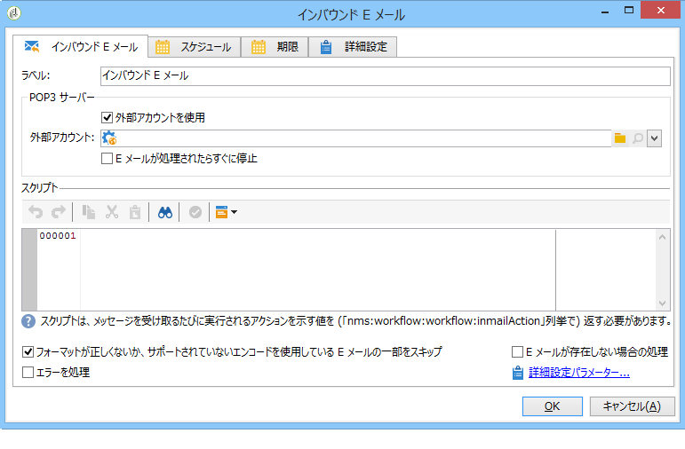
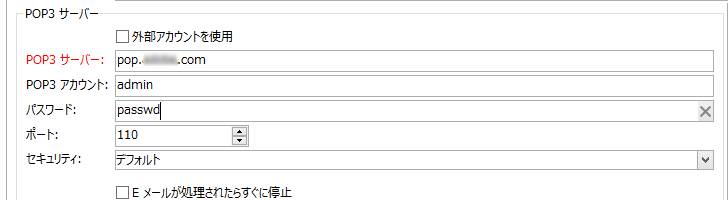
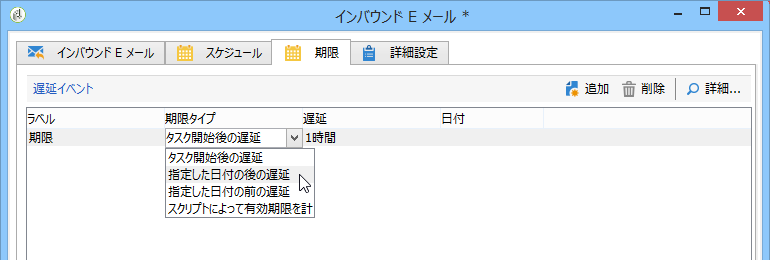

# インバウンド E メール{#inbound-emails}

「**インバウンド E メール**」アクティビティでは、POP3 メールサーバーから E メールメッセージをダウンロードして処理できます。

「**インバウンド E メール**」アクティビティの最初のタブで、POP3 サーバーのパラメーターとメール受信時に実行するスクリプトを入力できます。2 番目のタブではアクティビティのスケジュールを設定でき、3 番目のタブではアクティビティの有効期限を設定できます。

1. **[!UICONTROL Inbound Emails]**

   * **[!UICONTROL Use an external account]**

      このオプションが有効化されている場合、ネットワーク接続のパラメーターを入力せずに外部 POP3 アカウントを選択できます。The **[!UICONTROL External account]** field specifies the external POP3 account to be used to connect to the email service. このオプションは、「外部アカウントを使用」オプションが有効にされている場合のみ表示されます。

      このオプションを選択しない場合は、次のパラメーターを指定する必要があります。

      

      * **[!UICONTROL POP3 server]**

         POP3 サーバーの名前

      * **[!UICONTROL POP3 account]**

         ユーザーの名前。

      * **[!UICONTROL Password]**

         アカウントのパスワード

      * **[!UICONTROL Port]**

         POP3 接続のポート番号デフォルトのポート番号は 110 です。
   * **[!UICONTROL Stop as soon as email is processed]**

      このオプションを設定すると E メールが 1 個ずつ処理されます。このアクティビティは、トランジションを 1 回のみ有効化した後、処理を完了し、未処理の E メールをサーバー上に残します。

1. **[!UICONTROL Script]**

   このスクリプトは、E メールを処理し、メールの内容に応じて様々な処理を実行します。スクリプトは E メールごとに実行されます。また、E メールに実行される処理（放置または削除）およびアウトバウンドトランジションの有効化を指定できます。

   戻りコードは、次のいずれかの値になります。

   * 1 - サーバーから E メールを削除して、アウトバウンドトランジションを有効化します。
   * 2 - サーバーに E メールを残して、アウトバウンドトランジションを有効化します。
   * 3 - サーバーから E メールを削除します。
   * 4 - サーバーに E メールを残します。
   E メールのコンテンツには、グローバル変数 **[!UICONTROL mailMessage]** からアクセスできます。

1. **[!UICONTROL Schedule]**

   To define a schedule for the activity, click the **[!UICONTROL Scheduling]** tab and check **[!UICONTROL Plan execution]**. Click the **[!UICONTROL Change]** button to configure the schedule.

   スケジュールの設定は、スケジュール設定アクティビティの場合と同じです。「スケジューラ [ー](../../workflow/using/scheduler.md)」を参照。

1. **[!UICONTROL Expiration]**

   You can define expiration delays via the **[!UICONTROL Expiration]** tab.

   

   有効期限の設定は、スケジュール設定アクティビティの場合と同じです。「有効期限」を参 [照してくださ](../../workflow/using/executing-a-workflow.md#expirations)い。

