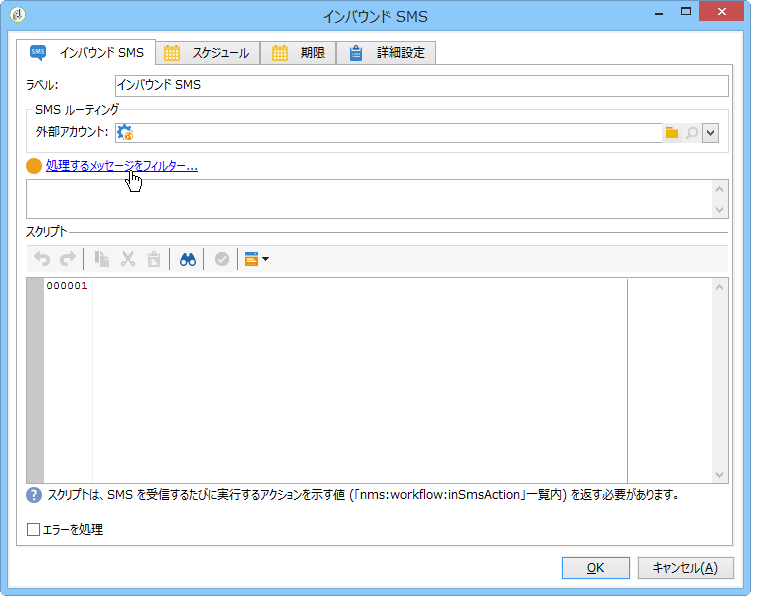
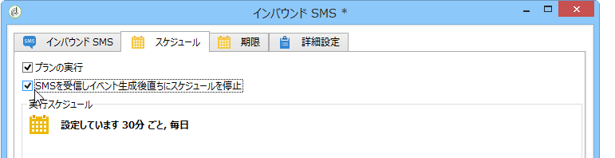

# インバウンド SMS{#inbound-sms}

「**インバウンド SMS**」アクティビティでは、外部サーバーからテキストメッセージをダウンロードして処理できます。

## プロパティ {#properties}

「**インバウンド SMS**」アクティビティの最初のタブで SMS メッセージのルーティングのパラメーターを入力し、メッセージの受信時に実行するスクリプトを入力します。2 番目のタブではアクティビティのスケジュールを設定でき、3 番目のタブではアクティビティの有効期限を設定できます。

1. **[!UICONTROL SMS routing]**:SMSリカバリに使用する外部アカウントを選択します。 外部アカウントは、ツリーのノード **[!UICONTROL Administration > Platform > External accounts]** を介して設定されます。
1. **[!UICONTROL Script]**
1. **[!UICONTROL Schedule]**

   

1. **[!UICONTROL Expiration]**

タブ、タ **[!UICONTROL Script]**&#x200B;ブは、「イ **[!UICONTROL Schedule]** ンバウ **[!UICONTROL Expiry]** ンド電子メール」に詳 [細に記載されま](../../workflow/using/inbound-emails.md)す。
