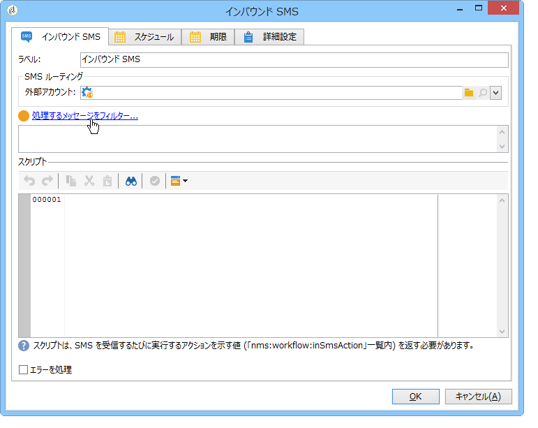
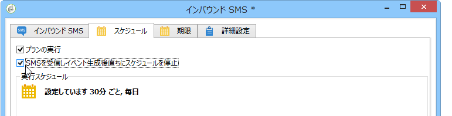

# インバウンド SMS {#inbound-sms}

「**インバウンド SMS**」アクティビティでは、外部アカウントからテキストメッセージをダウンロードして処理できます。

## プロパティ {#properties}

「**インバウンド SMS**」アクティビティの最初のタブで SMS メッセージのルーティングのパラメーターを入力し、メッセージの受信時に実行するスクリプトを入力します。 2 番目のタブではアクティビティのスケジュールを設定でき、3 番目のタブではアクティビティの有効期限を設定できます。

1. **[!UICONTROL SMS ルーティング]**：SMS メッセージの取得に使用する外部アカウントを選択します。 外部アカウントは、Adobe Campaign ツリーの&#x200B;**[!UICONTROL 管理者／プラットフォーム／外部アカウント]**&#x200B;ノードで設定できます。
1. **[!UICONTROL スクリプト]**
1. **[!UICONTROL スケジュール]**

   

1. **[!UICONTROL 有効期限]**

「**[!UICONTROL スクリプト]**」、「**[!UICONTROL スケジュール]**」および「**[!UICONTROL 有効期限]**」の各タブについて詳しくは、[インバウンドメール](inbound-emails.md)を参照してください。
