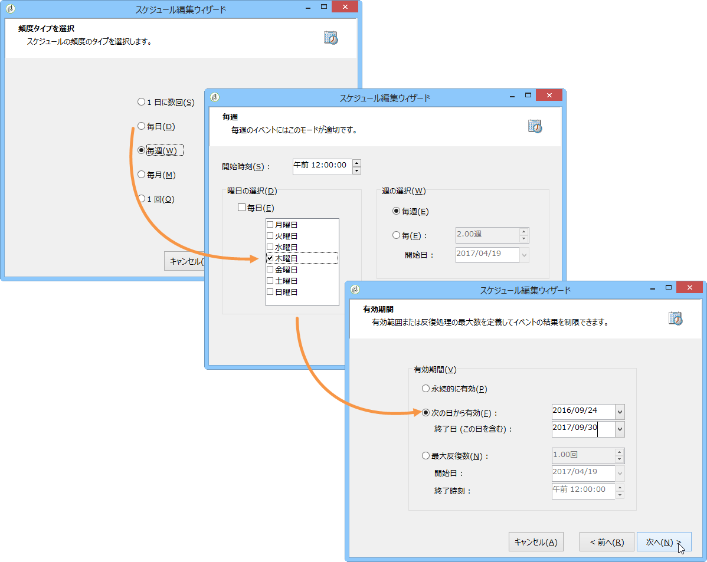
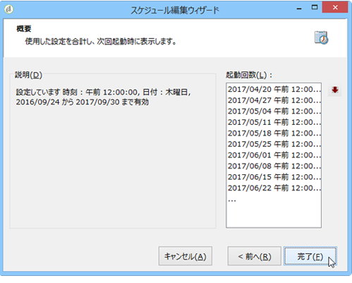
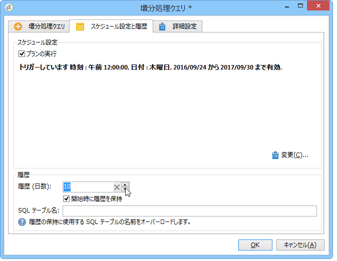
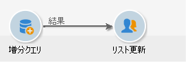
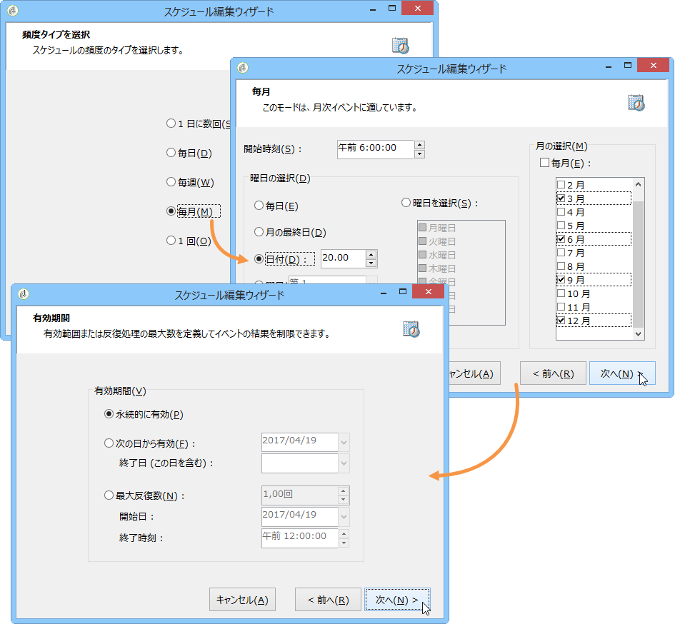

# 増分クエリ{#incremental-query}

増分クエリは、指標に基づいて定期的にターゲットを選択します。その際、過去にターゲティングされた人を除外します。

ターゲット済みの母集団は、ワークフローインスタンス別およびアクティビティ別にメモリに保存されています。例えば、同じテンプレートから開始される 2 つのワークフローは、同じログを共有しません。一方、同じワークフローインスタンスの同じ増分クエリに基づく 2 つのタスクは、同じログを共有します。

増分クエリは、標準クエリと同じ方法で定義しますが（[クエリの作成](../../workflow/using/query.md#creating-a-query)を参照）、実行がスケジュールされる点で異なります。

>[!CAUTION]
>
>いずれかの増分クエリの実行時の結果が **0** と等しい場合、クエリのプログラムされた次回の実行まで、ワークフローは一時停止します。このため、増分クエリに続くトランザクションとアクティビティが、次回の実行前に処理されることはありません。

手順は次のとおりです。

1. 「**[!UICONTROL スケジュール設定と履歴]**」タブで、「**[!UICONTROL 実行をスケジュールする]**」オプションを選択します。一旦作成されたタスクはアクティブなままになり、クエリの実行スケジュールに指定された時間になるとトリガーされます。ただし、このオプションを無効にした場合、**一度に全部**&#x200B;のクエリがただちに実行されます。
1. 「**[!UICONTROL 変更]**」ボタンをクリックします。

   **[!UICONTROL スケジュール編集ウィザード]**&#x200B;ウィンドウで、頻度のタイプと、イベントの繰り返し、イベントの有効期間を設定します。

   

1. 「**[!UICONTROL 完了]**」をクリックしてスケジュールを保存します。

   

1. 「**[!UICONTROL スケジュール設定と履歴]**」タブの下部セクションで、履歴として残す日数を選択できます。

   

   * **[!UICONTROL 履歴（日数）]**

      既にターゲット済みの受信者は、ターゲットされた日から履歴の最大日数に達する日まで、ログに履歴として保持されます。値がゼロの場合、受信者がログからパージされることはありません。

   * **[!UICONTROL 開始時に履歴を保持]**

      アクティビティが有効になったときに、ログがパージされないようにします。

   * **[!UICONTROL SQL テーブル名]**

      このパラメーターは、履歴データを保持するデフォルトの SQL テーブルをオーバーロードします。

## 増分クエリの例：四半期ごとのリスト更新 {#example-of-an-incremental-query--quarterly-list-update}

次の例では、増分クエリを使用して、受信者リストを自動更新します。これらの受信者は、季節ごとのマーケティングキャンペーンの一部としてターゲットされています。

季節ごとのマーケティングキャンペーンでは、季節に合ったスポーツアクティビティを季節の初めに提案します。そのため、受信者リストは四半期ごとに更新されます。ただし、リストの受信者がこのキャンペーンのターゲット設定されるのは、9 ヶ月に 1 回のみにする必要があります。これにより、受信者の資格取得頻度の間隔が空き、年間を通じて季節ごとに異なるアクティビティが提供されます。

1. 新しいワークフローに、増分クエリとリスト更新アクティビティを追加します。
1. アクティビティの「**[!UICONTROL 増分クエリ]**」タブを](../../workflow/using/query.md#creating-a-query)クエリの作成[の説明に従って設定します。
1. 「**[!UICONTROL スケジュール設定と履歴]**」タブを選択し、履歴の日数を 270 日と指定します。この指定により、既にターゲットされた受信者は、今後 270 日間（およそ 9 ヶ月間）はターゲットされません。

   次に、「**[!UICONTROL 変更]**」ボタンをクリックします。

1. 次の季節が始まる前にリストが確実に更新されるようにするには、「**[!UICONTROL 毎月]**」を選択します。
1. 次の画面で、「3 月」、「6 月」、「9 月」、「12 月」を選択します。毎月「20 日」を選択し、ワークフローの開始時刻を選択します。
1. 次に、クエリの有効期間を選択します。例えば、このアクティビティを永続的にアクティブにしたい場合、「**[!UICONTROL 永続的な有効性]**」を選択します。

   

1. 増分クエリを承認した後で、[リストの更新](../../workflow/using/list-update.md)の説明に従って、リスト更新アクティビティを設定します。

このように設定しておくことで、次の季節が始まる直前にワークフローが自動的に開始されます。リストは更新され、オファーを受ける資格のある新しい受信者が含められます。

## 出力パラメーター {#output-parameters}

* tableName
* schema
* recCount

この 3 つの値セットは、クエリのターゲットとなる母集団を識別します。**[!UICONTROL tableName]** はターゲットの識別子を記録するテーブル名、**[!UICONTROL schema]** は母集団のスキーマ（通常は nms:recipient）、**[!UICONTROL recCount]** はテーブル内の要素の数です。
