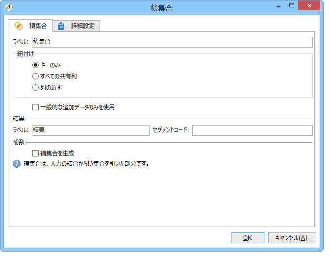
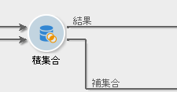
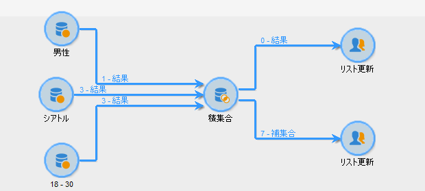

# 積集合{#intersection}

「**積集合**」タイプのアクティビティは、受信したターゲットの積集合からターゲットを作成します。

積集合は、すべてのインバウンドアクティビティの結果に共通する母集団のみを抽出します。ターゲットは、受信したすべての結果から作成されます。そのため、すべての先行アクティビティは、積集合が実行される前に完了している必要があります。このアクティビティを設定するには、結果を考慮してアクティビティのラベルとオプションを入力する必要があります。

交差点アクティビティの設定と使用の詳細については、 [Extracting joint data (Intersection)を参照してください](../../workflow/using/targeting-data.md#extracting-joint-data--intersection-)。

Check the **[!UICONTROL Generate complement]** option if you wish to process the remaining population. 補集合には、すべてのインバウンドアクティビティから積集合を引いた結果の和集合が含まれます。その後、次の図のように、追加のアウトバウンドトランジションがアクティビティに追加されます。

## 積集合の例 {#intersection-example}

次の例では、積集合の目的は、リストを作成するための 3 つのシンプルなクエリに共通する受信者の計算です。

1. After three simple queries, insert an **[!UICONTROL Intersection]** -type activity.

   この例では、3 つのクエリはそれぞれ、「男性」、「パリに住んでいる」、「年齢が 18 歳から 30 歳」という属性をターゲティングしています。

1. 積集合を設定します。To do this, select the **[!UICONTROL Keys only]** reconciliation method since the populations resulting from the queries contain consistent data.
1. クエリに追加データを入力していた場合、該当するボックスを選択することで、受信者に共通するデータのみを保持するように選択することもできます。
1. If you wish to use the rest of the data (in regard to the queries but not their intersection), check the **[!UICONTROL Generate complement]** box.
1. リスト更新アクティビティを、積集合の結果の Web サイト後に追加しますさらに、使用したい場合は、リスト更新を補集合へも追加できます。
1. ワークフローを実行します。ここでは、入力された 3 つのクエリすべてを同時に当てはまる受信者は 2 人います。補集合は、3 つのクエリのうち 1 つまたは 2 つに当てはまる最大 5 人の受信者から構成されます。

   積集合の結果は、最初のリスト更新に送られます。補集合の使用を選択していた場合、結果は 2 番目のリスト更新にも送られます。

   

## 入力パラメーター {#input-parameters}

* tableName
* schema

各インバウンドイベントは、これらのパラメーターによって定義されるターゲットを指定する必要があります。

## 出力パラメーター {#output-parameters}

* tableName
* schema
* recCount

この 3 つの値セットは、積集合によって生成されたターゲットを識別します。**[!UICONTROL tableName]** はターゲットの識別子を記録するテーブル名、**[!UICONTROL schema]** は母集団のスキーマ（通常は **[!UICONTROL nms:recipient]**）、**[!UICONTROL recCount]** はテーブル内の要素の数です。
