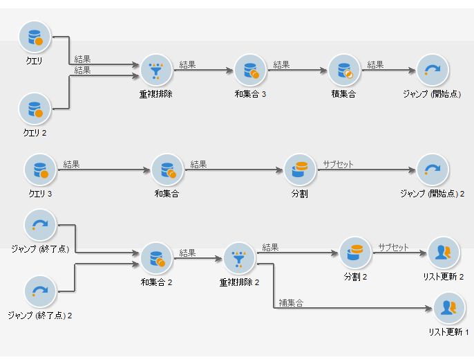
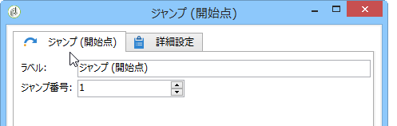

# ジャンプ（開始ポイントと終了ポイント）{#jump-start-point-and-end-point}

「**[!UICONTROL ジャンプ]**」タイプのグラフィカルオブジェクトは、特に、交差するトランジションを持つ複雑なダイアグラムの可読性を向上させます。

ジャンプは、矢印のないトランジションです。ジャンプは、1 つのアクティビティから別のアクティビティに、以下の図のように移動します。

「開始ポイント」タイプのトランジションごとに、それぞれ「終了ポイント」タイプのトランジションを配置する必要があります。

同じワークフロー内に、ジャンプする開始ポイントと終了ポイントを複数挿入できます。各ポイントは、パラメーターに必ず入力される番号によって識別されます。

ダイアグラムの可読性を向上させるには、ジャンプに関連付けけられた画像に、そのジャンプの番号が表示されるように変更します。[アクティビティ画像の管理](../../workflow/using/managing-activity-images.md)を参照してください。
