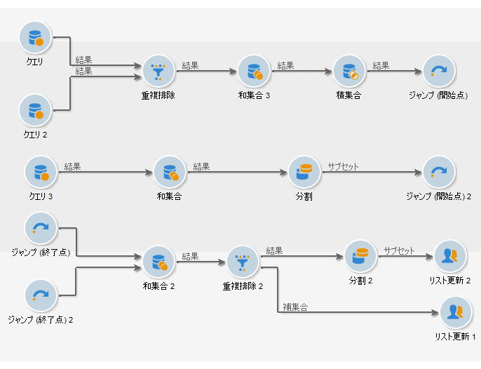
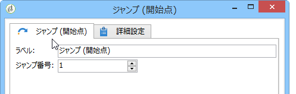

# ジャンプ（開始点と終了点）{#jump-start-point-and-end-point}

「**[!UICONTROL ジャンプ]**」タイプのグラフィックオブジェクトは、特に、交差するトランジションを持つ複雑なダイアグラムを読みやすくするために使用されます。

ジャンプは、矢印のないトランジションです。

ジャンプは、1 つのアクティビティから別のアクティビティに、以下の図のように移動します。

「開始点」タイプのトランジションごとに、それぞれ「終了点」タイプのトランジションを配置する必要があります。

同じワークフロー内に、ジャンプする開始点と終了点を複数挿入できます。 各ポイントは、パラメーターに必ず入力される番号によって識別されます。

ダイアグラムの可読性を向上させるには、ジャンプに関連付けられた画像に、そのジャンプの番号が表示されるように変更します。 [アクティビティ画像の変更](managing-activity-images.md)を参照してください。
