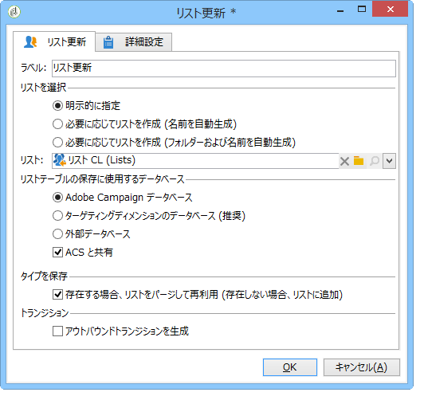
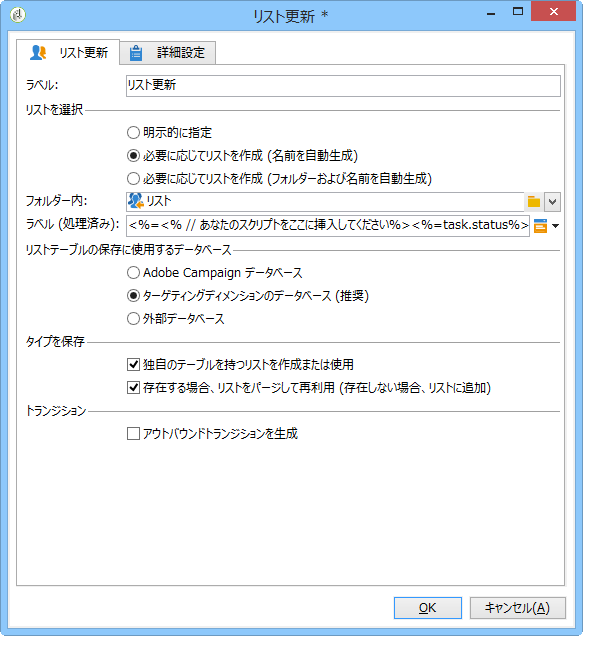
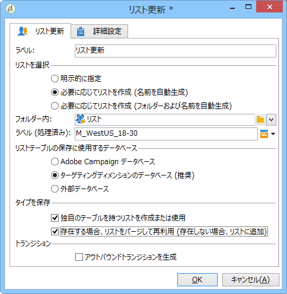

# リスト更新{#list-update}

「**リスト更新**」アクティビティは、受信者リストのトランジションに指定された母集団を保存します。

リストは、既存のグループのリストから選択することもできます。

また、とのオプションを使用して作成する **[!UICONTROL Create the list if necessary (Computed name)]** こともで **[!UICONTROL Create the list if necessary (Computed Folder and Name)]** きます。 これらのオプションにより、任意のラベルを選択してリストを作成し、リストを保存するフォルダーを後で選択できます。ラベルは、スクリプトに動的フィールドを挿入することで自動生成できます。異なる動的フィールドは、ラベルの右側のポップアップメニューで使用できます。

リストが既に存在する場合は、このオプションを選択しない限り、受信者が既存のコンテンツに追加さ **[!UICONTROL Purge the list if it exists (otherwise add to the list)]** れます。 この場合、リストのコンテンツは更新前に削除されます。

作成または更新されたリストで受信者テーブル以外のテーブルを使用する場合は、このオプションをオンにし **[!UICONTROL Create or use a list with its own table]** ます。

このオプションを使用するには、Adobe Campaign インスタンス内でその特定のテーブルが設定されている必要があります。

一般に、ターゲットをリストに保存することは、ワークフローの終わりを示すことになります。By default, the **[!UICONTROL List update]** activity therefore does not have an outbound transition. 追加するオプシ **[!UICONTROL Generate an outbound transition]** ョンを選択します。

## 例：リストの更新 {#example--list-update}

次の例では、リスト更新アクティビティは、フランスに住む 30 歳以上の男性をターゲットにするクエリに従っています。最初のリストは、クエリの結果から作成されます。その後、リストがワークフローから起動されるたびに更新されます。このリストは、例えば、ターゲティングしたキャンペーンの特典のオファーに定期的に使用できます。

1. Add a **[!UICONTROL list update activity]** directly after a query then open it up to edit it.

   For more on creating a query in a workflow, refer to [Query](../../workflow/using/query.md).

1. アクティビティのラベルを選択する必要があります。
1. Select the **[!UICONTROL Create the list if necessary (Calculated name)]** option to show that the list will be created once the first workflow has been executed, then updated with the following executions.
1. リストを保存するフォルダーを選択します。
1. リストのラベルを入力します。動的フィールドを挿入して、リストから名前を自動的に生成することもできます。この例では、コンテンツを見つけやすくするために、リストの名前をクエリと同じにしてあります。
1. ターゲット **[!UICONTROL Purge the list if it exists (otherwise add to the list)]** 条件に一致しない受信者を削除し、新しい受信者をリストに挿入する場合は、このオプションを選択したままにします。
1. また、このオプションはチェ **[!UICONTROL Create or use a list with its own table]** ックしたままにします。
1. このオプションはオフ **[!UICONTROL Generate an outbound transition]** のままにします。
1. 「**[!UICONTROL Ok]**」をクリックして、ワークフローを開始します。

   

   条件に一致する受信者のリストが作成または更新されます。

詳しくは、[受信者のリストの作成](https://docs.campaign.adobe.com/doc/AC/en/Videos/Videos.html)ビデオを参照してください。

## 入力パラメーター {#input-parameters}

* tableName
* schema

グループに保存する母集団を識別します。

## 出力パラメーター {#output-parameters}

* groupId

グループの ID。
