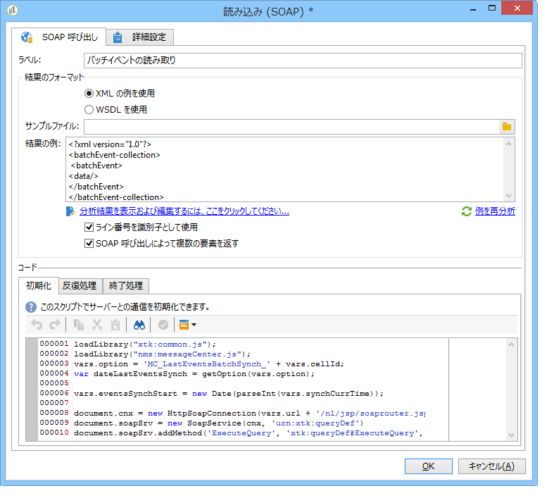
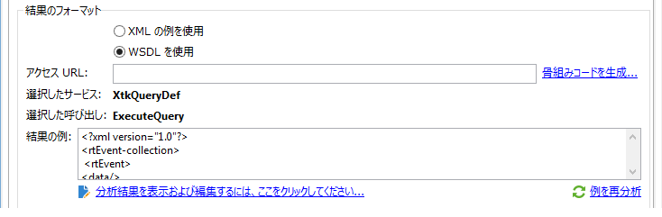
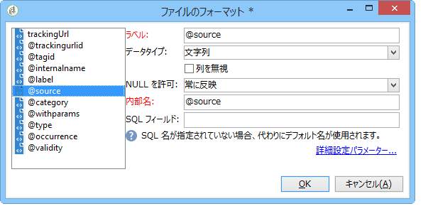

# 読み込み（SOAP）{#loading-soap}

>[!CAUTION]
>
>「**読み込み（SOAP）**」アクティビティは、「**FDA（Federated Data Access）**」モジュールがインストールされている場合にのみ使用できます。使用許諾契約書を確認してください。

外部データベースの FDA から直接データを収集できない場合は、「**読み込み（SOAP）**」アクティビティと「**データの読み込み（RDBMS）**」アクティビティとを組み合わせて使用します。

手順は以下のようになります。

1. XML の例または WSDL のどちらを使用するか選択します。

   次の例は、Message Center モジュールのテクニカルワークフローのものです。

   

1. XML の例を使用する場合は、サンプルファイルを選択してください。ファイルが分析され、結果のサンプルが作成されます。

   WSDL を使用する場合は、該当するアクセス URL を入力してスケルトンコードを生成します。選択したサービスと呼び出しが自動的に更新されて表示されます。

   

1. 「**[!UICONTROL 分析結果を表示および編集するには、ここをクリックしてください]**」を選択して、見つかった各列を指定します。

   

   例を更新する場合は、「**[!UICONTROL 例を再分析]**」を選択します。

   「**[!UICONTROL 詳細設定パラメーター]**」リンクを使用して、列データのフォーマットをカスタマイズすることもできます。インポートされたデータのフォーマットについて詳しくは、この[節](../../platform/using/importing-data.md#import-wizard)を参照してください。

1. 行番号を識別子として使用するか、または SOAP 呼び出しでいくつの要素を返させることを指定することができます。
1. 関数に合わせて、次のタブスクリプトを入力してください。

   * **[!UICONTROL 初期化]**：SOAP 接続を確立します。
   * **[!UICONTROL 反復処理]**：SOAP サービスへの呼び出しを実行します。この関数の戻り値は、必ず WSDL の例の記述と互換性のある XML オブジェクトになります。

      このタブのコードは、null の XML オブジェクトが返されるまで、Adobe Campaign によって繰り返し呼び出されます。

   * **[!UICONTROL 確定]**：接続を切断し、プロセス中に作成された他のリソースを解放します。

