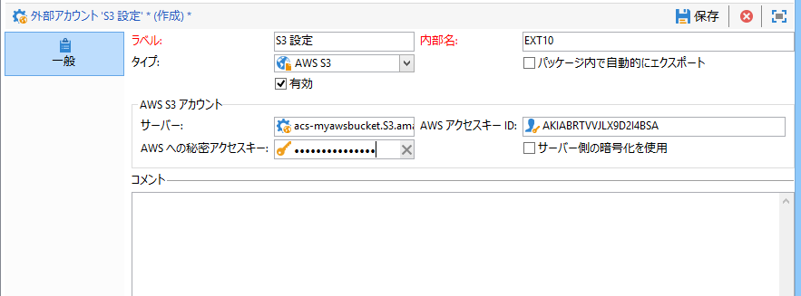
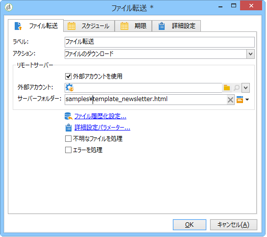
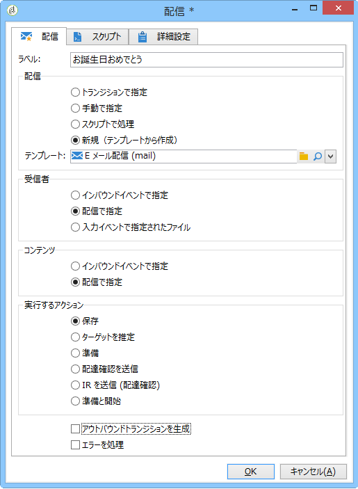
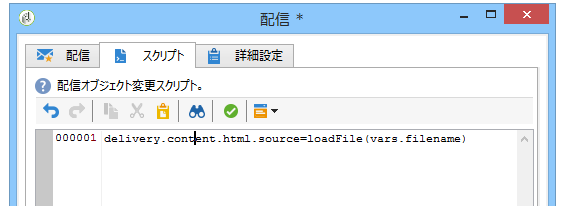

# 配信コンテンツの読み込み{#loading-delivery-content}

Amazon S3、FTP または SFTP サーバー上の HTML ファイルに配信コンテンツが格納されている場合、このコンテンツを Adobe Campaign 配信に容易に読み込むことができます。

手順は次のとおりです。

1. If you haven&#39;t already defined a connection between Adobe Campaign and the (S)FTP server hosting the content files, create a new S3, FTP or SFTP external account in **[!UICONTROL Administration]** > **[!UICONTROL Platform]** > **[!UICONTROL External Accounts]**. この外部アカウントで、S3 または（S）FTP サーバーへの接続を確立するために使用するアドレスと資格情報を指定します。

   以下に S3 外部アカウントの例を示します。

   

1. 新しいワークフローを作成します(例：> > **[!UICONTROL Profiles and Targets]** から作 **[!UICONTROL Jobs]** 成しま **[!UICONTROL Targeting workflows]**&#x200B;す)。
1. Add a **[!UICONTROL File transfer]** activity into your workflow, and configure it by specifying

   * S3 または（S）FTP サーバーへの接続に使用する外部アカウント。
   * S3 または（S）FTP サーバー上のファイルへのパス。
   

1. Add a **[!UICONTROL Delivery]** activity and connect it to the outbound transition of the **[!UICONTROL File transfer]** activity. 次のように設定します。

   * 配信：ニーズに応じて、システムで既に作成されている特定の配信または既存のテンプレートに基づく新しい配信にすることができます。
   * 受信者：この例では、ターゲットが配信自体で指定されていると見なされます。
   * コンテンツ：コンテンツが前のアクティビティに読み込まれた場合でも、を選択しま **[!UICONTROL Specified in the delivery]**&#x200B;す。 リモートサーバー上のファイルから直接コンテンツがインポートされるので、ワークフローの処理時には識別子がなく、インバウンドイベントから取得したものとして識別することができません。
   * 実行するアクション：配信を **[!UICONTROL Save]** 保存し、ワークフローの実行後に>からその配信にア **[!UICONTROL Campaign management]** クセ **[!UICONTROL Deliveries]** スできるようにします。
   

1. In the **[!UICONTROL Script]** tab of the **[!UICONTROL Delivery]** activity, add the following command to load the content of the imported file in the delivery:

   ```
   delivery.content.md.source=loadFile(vars.filename)
   ```

   

1. 保存して、ワークフローを実行します。A new delivery with the loaded content is created under **[!UICONTROL Campaign management]** > **[!UICONTROL Deliveries]**.

>[!NOTE]
>
>SFTP サーバー使用のベストプラクティスおよびトラブルシューティングについて詳しくは、[このページ](../../platform/using/sftp-server-usage.md)を参照してください。

