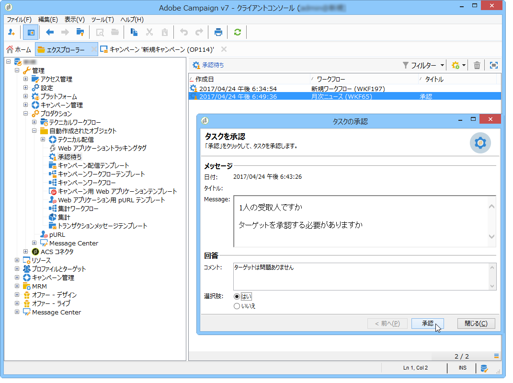

# ローカルの承認{#local-approval}

When integrated into a targeting workflow, the **[!UICONTROL Local approval]** activity lets you set up a recipient approval process before the delivery is sent.

>[!CAUTION]
>
>このアクティビティを使用するには、キャンペーンオプションの 1 つである分散型マーケティングモジュールを購入する必要があります。使用許諾契約書を確認してください。

配布テンプレートを使用したア **[!UICONTROL Local approval]** クティビティの例については、「ローカル承認ア [クティビティの使用」を参照してください](../../workflow/using/using-the-local-approval-activity.md)。

Start by entering a label for the activity and the **[!UICONTROL Action to execute]** field:

* Select the **[!UICONTROL Target approval notification]** option to send a notification email to local supervisors before the delivery, asking them to approve the recipients assigned to them.

   

* **増分クエリ**：クエリを実行し、実行を計画します。「 [Incremental query](../../workflow/using/incremental-query.md) 」の項を参照。

   

## ターゲットの承認通知 {#target-approval-notification}

In this case, the **[!UICONTROL Local approval]** activity is placed between upstream targeting and the delivery:

ターゲットの承認通知のために、以下のようにフィールドに入力します。

* **[!UICONTROL Distribution context]**:タイプアクテ **[!UICONTROL Specified in the transition]** ィビティを使用してターゲット母集団を **[!UICONTROL Split]** 制限する場合は、このオプションを選択します。 この場合、配分テンプレートは分割アクティビティに入力されます。If you are not limiting the targeted population, select the **[!UICONTROL Explicit]** option here and enter the distribution template in the **[!UICONTROL Data distribution]** field.

   データ配信テンプレートの作成について詳しくは、「データ配信ご [とのサブセットレコード数の制限」を参照してください](../../workflow/using/split.md#limiting-the-number-of-subset-records-per-data-distribution)。

* **[!UICONTROL Approval management]**

   * E メール通知に使用する配信テンプレートと件名を選択します。A default template is available: **[!UICONTROL Local approval notification]**. また、承認通知およびフィードバック通知内の受信者リストの上に表示される説明を追加できます。
   * Specify the **[!UICONTROL Approval type]** that corresponds to the approval deadline (date or deadline from the start of the approval). この日付をもって、ワークフローが再開し、それまでに承認されなかった受信者はターゲティング対象から外れます。通知が送信されると、ローカルのスーパーバイザーが連絡先を承認できるように、アクティビティはキューに入ります。

      >[!NOTE]
      >
      >デフォルトでは、承認プロセスが開始されると、アクティビティは 3 日間保留されます。

      リマインダーを 1 つ以上設定し、承認期限が迫っていることをローカルのスーパーバイザーに知らせることができます。これを行うには、リンクをクリック **[!UICONTROL Add a reminder]** します。

* **[!UICONTROL Complementary set]**:このオ **[!UICONTROL Generate complement]** プションを使用すると、承認されていないすべてのターゲットを含む2番目のセットを生成できます。

   >[!NOTE]
   >
   >このオプションはデフォルトでは無効です。

## 配信のフィードバックレポート {#delivery-feedback-report}

In this case, the **[!UICONTROL Local approval]** activity is placed after the delivery:

配信のフィードバックレポートの場合、次のフィールドに入力する必要があります。

* 以前のアクティビティ **[!UICONTROL Specified in the transition]** 中に配信が入力された場合は、このオプションを選択します。 Select **[!UICONTROL Explicit]** to specify the delivery in the local approval activity.
* 配信テンプレートと、通知 E メールのオブジェクトを選択します。There is a default template: **[!UICONTROL Local approval notification]**.

## Example: Approving a workflow delivery {#example--approving-a-workflow-delivery}

この例では、ワークフロー配信の承認プロセスのセットアップ方法を示します。For more information about creating delivery workflows, refer to the [Example: delivery workflow](../../workflow/using/delivery.md#example--delivery-workflow) section.

オペレーターは、2 つの方法（メールメッセージ内にリンクされた Web ページを使用するか、コンソール経由）のいずれかで、配信を承認できます。

* Web 承認

   管理者グループのオペレーターに送信されたメールで、配信ターゲットを承認できます。メッセージは定義されたテキストと JavaScript 式を使用し、JavaScript 式は計算値によって置き換えられます（ここでは「574」）。

   配信を承認するには、該当するリンクをクリックし、Adobe Campaign コンソールにログオンします。

   

   Make a choice and click the **[!UICONTROL Submit]** button.

   

* コンソールからの承認

   ツリー構造では、ノードに **[!UICONTROL Administration > Production > Objects created automatically > Approvals pending]** は、現在接続されている演算子によって承認されるタスクのリストが含まれます。 このリストは、1 行で表示されます。応答するには、この行をダブルクリックします。次のウィンドウが表示されます。

Select **Yes**, then click **[!UICONTROL Approve]**. 応答が記録されたことを通知するメッセージが表示されます。

ワークフロー画面に戻ります。10秒後、図は次のように表示されます。

The workflow has executed the **[!UICONTROL Delivery control]** task, which in this case means starting the delivery previously created. ワークフローは、エラーを生成せずに完了しました。
