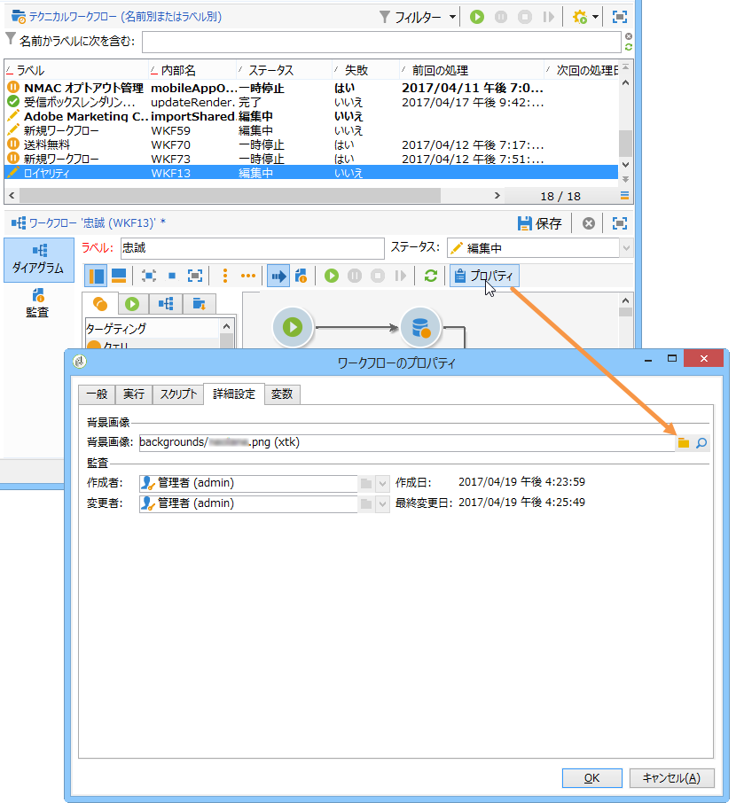
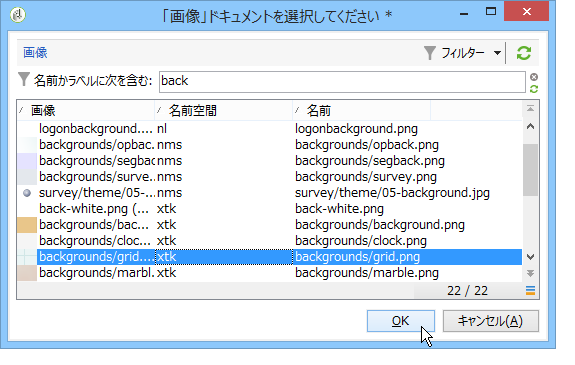
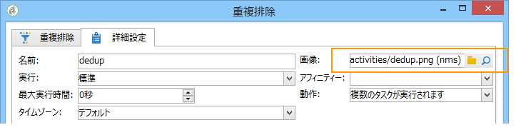
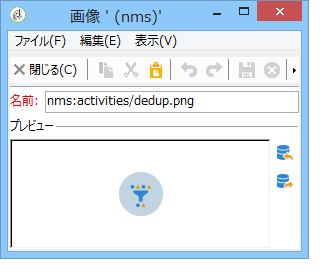

# アクティビティ画像の管理{#managing-activity-images}

さまざまなワークフローのダイアグラムに画像が使用されますが、これらの画像が変更することができます。ただし、それには一定の制限があります。以下に示すのは実装のステージです。

* To change the background image, select the desired targeting workflow, then click the **[!UICONTROL Properties]** tab.

   

   To select the image to be used, click the **[!UICONTROL Select link]** icon to the right of the **[!UICONTROL Background image]** field.

   >[!NOTE]
   >
   >背景画像のピクセルの幅は 4 の倍数にする必要があります。

   

   The **[!UICONTROL Edit link]** icon lets you view the selected image.

* To change the image associated with an activity, double-click the object, then click the **[!UICONTROL Advanced]** tab.

   To select the image to be used, click the **[!UICONTROL Select link]** icon to the right of the **[!UICONTROL Image]** field.

   

   The **[!UICONTROL Edit link]** icon lets you view the selected image.

   

>[!NOTE]
>
>The images saved in the **[!UICONTROL Administration > Configuration > Images]** node of the tree are available for selection.
>  
>画像は、PNG 形式、48 x 48 ピクセル、1,600 万色、透明の背景にする必要があります。

