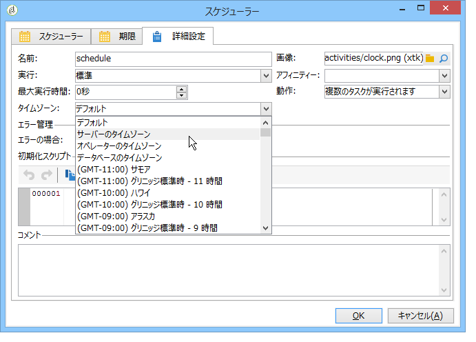

# タイムゾーンの管理{#managing-time-zones}

Adobe Campaign では、関係するさまざまな国の間のタイムラグを、同じインスタンスで管理できます。適用する設定は、インスタンスの作成中に設定できます。

Adobe Campaign でのタイムゾーンの設定について詳しくは、この[節](../../installation/using/time-zone-management.md)を参照してください。

ワークフローでは、アクティビティの実行スケジュールを変更したり、固有のタイムゾーンをアクティビティやワークフロー全体とリンクしたりすることができます。この設定は、ファイルをインポートするときや、配信のスケジュール設定のフレームワークで役立ちます。

## 実行スケジュールの設定 {#execution-scheduling}

スケジューラーを使用して、タスクの実行スケジュールを設定できます（[スケジューラー](../../workflow/using/scheduler.md)を参照）。アクティビティのスケジュール設定オプションでも同じことができます。以下に示すようなアクティビティの「**[!UICONTROL スケジュール]**」タブでこの機能を利用できます。**[!UICONTROL ファイルコレクター]**、**[!UICONTROL ファイル転送]**、**[!UICONTROL Web ダウンロード]**、**[!UICONTROL E メール受信]**、**[!UICONTROL SMS]** などがあります。

スケジュール対象のすべてのタスク、すなわち、スケジュール設定オプションのあるアクティビティすべてについて、適用するタイムゾーンが選択できます。タイムゾーンは、関係するアクティビティの「**[!UICONTROL 詳細設定]**」タブで選択します。

次のような値を選択できます。

* サーバーのタイムゾーン

   Adobe Campaign アプリケーションサーバーのタイムゾーンを使用します。

* ユーザーのタイムゾーン

   ワークフローを実行する Adobe Campaign オペレーターのタイムゾーンを使用します。

* データベースのタイムゾーン

   使用するデータベースサーバーのタイムゾーンを使用します。

* 固有のタイムゾーン

   選択したタイムゾーンを使用します。

**[!UICONTROL デフォルト]**&#x200B;値を選択した場合、ワークフローのタイムゾーンが適用されるか、アプリケーションサーバーのタイムゾーンが適用されます。

## タイムゾーンとアクティビティとのリンク {#linking-a-time-zone-to-an-activity}

ワークフローアクティビティの「**[!UICONTROL 詳細設定]**」タブでは、そのアクティビティのタイムゾーンを選択できます。ほとんどの場合、ワークフローのタイムゾーンを用意するだけで十分ですが、データのインポートのような特定のアクティビティの場合、タイムゾーンを時々オーバーロードして、日付を正しいタイムゾーンとリンクさせることが必要になる場合があります。
