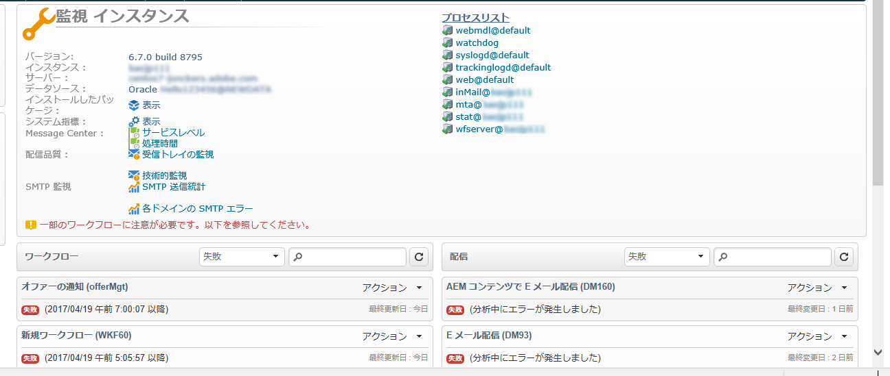
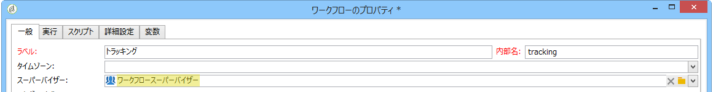
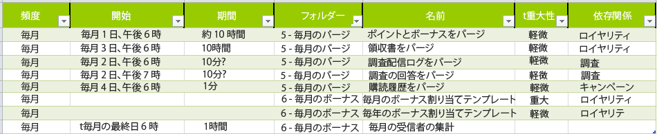

# テクニカルワークフローの監視 {#monitoring-technical-workflows}

テクニカルワークフローは監視する必要があり、失敗した場合にアクションをおこなう必要があります。

様々なキャンペーンプロセスを監視するその他の方法については、このページ [を参照しま](https://helpx.adobe.com/campaign/kb/acc-maintenance.html)す。

## インスタンスの監視ダッシュボード {#instance-monitoring-dashboard}

The instance monitoring dashboard can be accessed via the **[!UICONTROL Monitoring]** universe.

システム指標およびコアファイルの下で、赤でハイライト表示された指標がないことを確認します。ある場合は、次のことをおこないます。

* 必要なプロセスが常に実行中であることを確認します。
* 古すぎるプロセスがないことを確認します。
* 異なるプロセスのログファイルにアラームおよび繰り返し発生するエラーが含まれていないことを確認します。

## テクニカルワークフロー {#technical-workflows}

技術的なワークフローは、> >か **[!UICONTROL Administration]** ら入手 **[!UICONTROL Production]** できま **[!UICONTROL Technical workflows]**&#x200B;す。

正常に動作するようにするには、テクニカルワークフローに応じて次で詳しく説明されている手順を実行します。

各テクニカルワークフローで実行される処理について詳しく理解するには、この[節](../../workflow/using/about-technical-workflows.md)を参照してください。

For **[!UICONTROL Database Cleanup workflow (‘cleanup’)]**:

1. Check that the **[!UICONTROL Database Cleanup]** workflow runs and finishes successfully every day. 詳しくは、この[ページ](../../workflow/using/delivery.md)を参照してください。
1. ジャーナルを確認して、経過時間が長期間、比較的一定していて、他のワークフローに干渉していないことを検証します。
1. 詳しくは、この[ページ](../../production/using/database-cleanup-workflow.md)を確認してください。

For **[!UICONTROL Tracking workflow (‘tracking’)]**:

トラッキングワークフローがスケジュールどおりに実行され（デフォルトでは 1 時間ごと）、繰り返し発生するエラーがジャーナルにハイライト表示されていないことを確認します。詳しくは、[この節](../../workflow/using/delivery.md)を参照してください。

For **[!UICONTROL Deliverability update (‘deliverabilityUpdate’)]**:

1. Check that the **[!UICONTROL Deliverability update]** workflow runs and finishes successfully every day. 詳しくは、この[ページ](../../workflow/using/delivery.md)を参照してください。
1. ルールが定期的に更新されていることをジャーナルで検証します。

For **[!UICONTROL Campaign process ('operationMgt', 'deliveryMgt', ...)]**:

1. Look at all the workflows located under the **[!UICONTROL Campaign process]** folder. 詳しくは、この[ページ](../../workflow/using/campaign.md)を参照してください。
1. ワークフローがスケジュールどおりに実行され、繰り返し発生するエラーがジャーナルにハイライト表示されていないことを確認します。

## ワークフロー監視 {#workflow-supervision}

The **[!UICONTROL Workflow supervisors]** group should contain operators that need to be kept informed of failures and who can take action in time.

問題が発生した場合、アラートが生成され、適切なグループに送信される必要があります。

各オペレーターが有効な E メールアドレスを持っていることを確認します。

毎日のデータインポートなど、プラットフォームを機能させ続けるために実行する必要があるワークフローは、「プロダクション」（チェックボックス）として宣言し、太字で表示する必要があります。

## ワークフローメンテナンスリスト {#workflow-maintenance-list}

すべてのカスタムテクニカルワークフローは、次を含むワークシートにドキュメント化する必要があります。

* ワークフローの名前と場所。
* 目的。
* スケジューリングと依存関係。
* 監視を担当するオペレーター。
* エラー時の処理に関する指示。

## 監視の計画と自動化 {#planning-and-automation-of-monitoring}

ワークフロー監視を計画すると、効率が向上します。毎日おこなう必要があるタスクもあれば、毎週または毎月おこなえばよいタスクもあります。

繰り返しごとに名前が付けられ、実行スケジュールごとに分類されたフォルダーでワークフローを設定すると、監視の効率が向上します。

監視を自動化すると、リソースのオーバーヘッドが削減され、適切な頻度でタスクがスケジュールされるようになります。

特定のタスクが失敗した場合や、重要なテーブルが大きくなりすぎた場合に E メールを送信する監視ワークフローを作成できます。

機能領域またはシステム全体にわたるすべてのワークフローを監視できるビューを作成できます。

また、Adobe Campaign ジョブまたはレポート機能を使用して、常に最新の状態が維持されるドキュメントをオンデマンドで作成できます。
