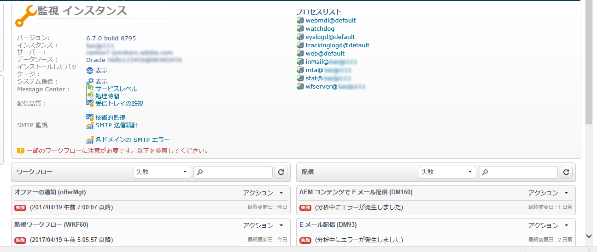
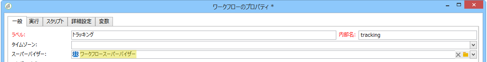
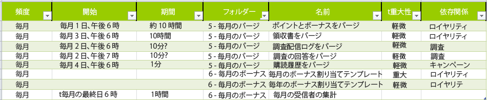

# テクニカルワークフローの監視 {#monitoring-technical-workflows}

テクニカルワークフローは監視が必要で、失敗した場合はアクションを実行する必要があります。

様々なキャンペーンプロセスを監視するその他の方法については、[このページ](../../production/using/monitoring-guidelines.md)で説明しています。

## インスタンス監視ダッシュボード {#instance-monitoring-dashboard}

インスタンス監視ダッシュボードには、「**[!UICONTROL 監視]**」タブからアクセスできます。

システム指標およびコアファイルの下で、赤でハイライト表示された指標がないことを確認します。 ある場合は、次のことをおこないます。

* 必要なプロセスが常に実行中であることを確認します。
* 古すぎるプロセスがないことを確認します。
* 異なるプロセスのログファイルにアラームおよび繰り返し発生するエラーが含まれていないことを確認します。

## テクニカルワークフロー {#technical-workflows}

テクニカルワークフローは、**[!UICONTROL 管理]**／**[!UICONTROL プロダクション]**／**[!UICONTROL テクニカルワークフロー]**&#x200B;から使用できます。

正常に動作するようにするには、テクニカルワークフローに応じて次で詳しく説明されている手順を実行します。

各テクニカルワークフローで実行される処理について詳しく理解するには、この[節](about-technical-workflows.md)を参照してください。

**[!UICONTROL データベースクリーンアップワークフロー（「cleanup」）]**&#x200B;の場合：

1. 毎日、**[!UICONTROL データベースクリーンアップ]**&#x200B;ワークフローが実行され、正常に完了していることを確認します。 詳しくは、この[ページ](../../production/using/database-cleanup-workflow.md)を参照してください。
1. ジャーナルを確認して、経過時間が長期間、比較的一定していて、他のワークフローに干渉していないことを検証します。

**[!UICONTROL トラッキングワークフロー（「tracking」）]**&#x200B;の場合：

トラッキングワークフローがスケジュールどおりに実行され（デフォルトでは 1 時間ごと）、繰り返し発生するエラーがジャーナルにハイライト表示されていないことを確認します。 詳しくは、[この節](delivery.md)を参照してください。

**[!UICONTROL 配信品質の更新（deliverabilityUpdate）]**&#x200B;の場合：

1. 毎日、**[!UICONTROL 配信品質の更新]**&#x200B;ワークフローが実行され、正常に完了していることを確認します。
1. ルールが定期的に更新されていることをジャーナルで検証します。

**[!UICONTROL キャンペーンプロセス（「operationMgt」、「deliveryMgt」など]**）の場合：

1. **[!UICONTROL キャンペーンプロセス]**&#x200B;フォルダーにあるすべてのワークフローを確認します。 詳しくは、この[ページ](about-technical-workflows.md)を参照してください。
1. ワークフローがスケジュールどおりに実行され、繰り返し発生するエラーがジャーナルにハイライト表示されていないことを確認します。

## ワークフロー監視 {#workflow-supervision}

**[!UICONTROL ワークフロースーパーバイザー]**&#x200B;グループは、必ず失敗を知らせる必要があり、時間内に対処できるオペレーターを含む必要があります。

問題が発生した場合、アラートが生成され、適切なグループに送信される必要があります。

各オペレーターが有効なメールアドレスを持っていることを確認します。

毎日のデータインポートなど、プラットフォームを機能させ続けるために実行する必要があるワークフローは、「プロダクション」（チェックボックス）として宣言し、太字で表示する必要があります。

## ワークフローメンテナンスリスト {#workflow-maintenance-list}

すべてのカスタムテクニカルワークフローは、次を含むワークシートにドキュメント化する必要があります。

* ワークフローの名前と場所。
* 目的。
* スケジューリングと依存関係。
* 監視を担当するオペレーター。
* エラー時の処理に関する指示。

## 監視の計画と自動化 {#planning-and-automation-of-monitoring}

ワークフロー監視を計画すると、効率が向上します。 毎日おこなう必要があるタスクもあれば、毎週または毎月おこなえばよいタスクもあります。

繰り返しごとに名前が付けられ、実行スケジュールごとに分類されたフォルダーでワークフローを設定すると、監視の効率が向上します。

監視を自動化すると、リソースのオーバーヘッドが削減され、適切な頻度でタスクがスケジュールされるようになります。

特定のタスクが失敗した場合や、重要なテーブルが大きくなりすぎた場合にメールを送信するモニタリングワークフローを作成できます。

機能領域またはシステム全体にわたるすべてのワークフローを監視できるビューを作成できます。

また、Adobe Campaign ジョブまたはレポート機能を使用して、常に最新の状態が維持されるドキュメントをオンデマンドで作成できます。
