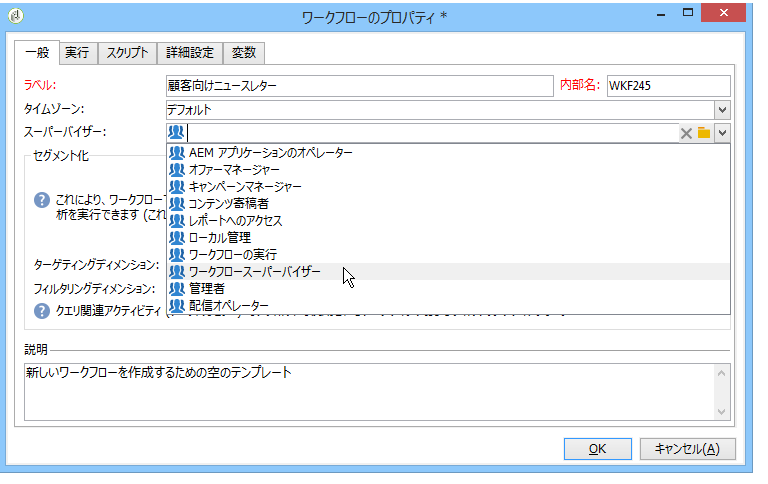

# 監視ワークフローの実行 {#monitoring-workflow-execution}

この節では、ワークフローの実行を監視する方法について説明します。

「一時停止中」、「停止中」または「エラーあり」の一連のワークフローの状態を監視できるワークフローの作成方法に関する使用例も、この節で説明し [ます](../../workflow/using/supervising-workflows.md#supervising-workflows)。

また、インスタンスの管理者は、監査証跡を使用して **** 、ワークフローの状態である、ワークフローに対するアクティビティおよび最後の変更を確認できます。 詳しくは、[該当する節](../../production/using/audit-trail.md)を参照してください。

様々なキャンペーンプロセスを監視するその他の方法については、このページ [を参照しま](https://helpx.adobe.com/campaign/kb/acc-maintenance.html)す。

## 進行情報の表示 {#displaying-progress}

ツールバーの各アイコンを使用して、進行情報を表示し、実行を監視することができます。

The **[!UICONTROL Display progress information]** icon lets you display the status and the activity result in the execution screen.


このオプションを選択した場合、実行したアクティビティは青で、保留中のアクティビティは点滅表示で、警告はオレンジで、エラーは赤色で表示されます。また、アウトバウンドトランジションのアクティビティの結果を表示し、1 秒を超えた場合に、アクティビティのプロパティで定義された結果ラベルと、ジョブの期間をその後に表示します。


## ログの表示 {#displaying-logs}

ログには、ワークフローの履歴または監査証跡が含まれます。ログには、すべてのユーザーアクション、実行されたすべての操作、および発生したすべてのエラーが記録されます。次の操作をおこなうことができます。

* Select the **[!UICONTROL Tracking]** tab in the detail. このリストには、すべてのワークフローメッセージが含まれます。

   

* アクティビティごとにログメッセージをフィルターします。これを行うには、図の上 **[!UICONTROL Display the tasks and the log]** のツールバーをクリックして、図の下にタ **[!UICONTROL Log]** ブとタ **[!UICONTROL Tasks]** ブを表示します。 アクティビティを選択すると、そのアクティビティに関するメッセージだけが表示されます。アクティビティが何も選択されていない場合、すべてのメッセージが表示されます。

   

   >[!NOTE]
   >
   >ダイアグラムの背景をクリックすると、すべての要素の選択を解除できます。

* 指定されたタスクにリンクされているメッセージのみを表示します。To do this, select the **[!UICONTROL Tasks]** tab, and then select an activity in the diagram in order to restrict the list. タスクをダブルクリックして情報を表示します。ウィンドウの最後のタブには、ログが表示されます。

   

   The **[!UICONTROL Details...]** button lets you display all additional information on activity execution. 例えば、検証オペレーターを表示できます。また、該当する場合、下の例のように、承認中に入力したコメントを表示できます。

   

>[!NOTE]
>
>このログは、ワークフローが再起動した場合にパージされません。すべてのメッセージは保存されます。以前の実行のメッセージを破棄したい場合、履歴をパージする必要があります。

ログに、ターゲティングワークフローのアクティビティに関連する実行メッセージのリストが時系列で表示されます。

* ターゲティングキャンペーンのログ

   Once a targeting campaign has been executed, click the **[!UICONTROL Tracking]** tab to view the execution trace.

   

   実行されたキャンペーン、警告やエラーなど、すべてのキャンペーンメッセージが表示されます。

* アクティビティのログ

   さらに、実行ログと、各アクティビティの詳細も表示できます。それには、次の 2 つの方法があります。

   1. ターゲットアクティビティを選択し、アイコンをクリッ **[!UICONTROL Display the tasks and the log]** クします。

      

      図の下のセクションには、2つのタブが表示されます。ログとタスクを参照してください。

      ダイアグラム内で選択済みのアクティビティは、ログとタスクのリストに対するフィルターとして機能します。

      

   1. Right-click the targeted activity and select **[!UICONTROL Display logs]**.

      

      ログは別のウィンドウに表示されます。

## ログのパージ {#purging-the-logs}

ワークフローの履歴は自動でパージされません。すべてのメッセージは、デフォルトで保持されます。History can be purged via the **[!UICONTROL File > Actions]** menu or by clicking the **[!UICONTROL Actions]** button located in the toolbar above the list. 選択 **[!UICONTROL Purge history]**. The options available in the **[!UICONTROL Actions]** menu is detailed in the [Actions toolbar](../../workflow/using/executing-a-workflow.md#actions-toolbar) section.


## 作業用テーブルとワークフローのスキーマ {#worktables-and-workflow-schema}

ワークフローは、特定のアクティビティ経由で操作される作業用テーブルを伝達します。Adobe Campaign では、データ管理アクティビティ経由で、ワークフローの作業用テーブルの列の編集、名前変更およびエンリッチメントが可能です。例えば、契約の共同受益者に関する追加情報を集める際に、クライアントのニーズに従った命名法に応じて列の名前を付けることができます。

さらに、各種作業のディメンション間にリンクを作成したり、ディメンションの変更を定義することもできます。例えば、データベース内に記録された各契約について、契約のメイン所有者を指名し、追加情報内の共同所有者データを使用します。

ワークフローが停止すると、ワークフローの作業用テーブルは自動的に削除されます。If you wish to keep a work table, save it in a list via the **[!UICONTROL List update]** activity (refer to [List update](../../workflow/using/list-update.md)).

## エラーの管理 {#managing-errors}

エラーが発生した場合、ワークフローが一時停止し、エラーの発生時に実行中だったアクティビティが赤く点滅します。In the workflow overview (**[!UICONTROL Monitoring]** universe > **[!UICONTROL Workflows]** link) you can display workflows with errors only, as shown below.


In the Adobe Campaign Explorer, the workflow list displays a **[!UICONTROL Failed]** column by default.


ワークフローでエラーが発生すると、そのワークフローのスーパーバイザーグループに所属しているオペレーターに、E メールによる通知が送られます（プロファイルに E メールアドレスが記載されている場合）。This group is selected in the **[!UICONTROL Supervisor(s)]** field of the workflow properties.



通知コンテンツは、デフォルトのテンプレートで **[!UICONTROL Workflow manager notification]** 設定されます。このテンプレートは、ワークフロープロパ **[!UICONTROL Execution]** ティのタブで選択されています。 通知には、エラーの発生したワークフローの名前と、問題のタスクが記載されます。

通知の例：


ログインしている場合、通知内のリンクをクリックすると、Web モードの Adobe Campaign コンソールが表示され、エラーの発生したワークフローに対処することができます。


エラーが発生した場合に一時停止せず実行を継続するように、ワークフローを設定することもできます。これを行うには、ワークフローを編 **[!UICONTROL Properties]** 集し、セクションでフ **[!UICONTROL Error management]** ィールドのオ **[!UICONTROL Ignore]** プションを選択 **[!UICONTROL In case of error]** します。 無視できる連続エラー数を指定します。連続エラーがこの数を超えると、プロセスが一時停止します。

この場合、エラータスクは中止になります。このモードは、キャンペーンを定期的アクションで後から再試行するように設計されたワークフローに最適です。


>[!NOTE]
>
>この設定は、各アクティビティに個別に適用できます。To do this, edit activity properties and select the error management mode in the **[!UICONTROL Advanced]** tab.

ワークフローの実行のトラブルシューティングの詳細については、専用の節を参照 [してくださ](../../production/using/workflow-execution.md)い。

## エラーを処理 {#processing-errors}

Concerning activities, the **[!UICONTROL Process errors]** option displays a specific transition which will be enabled if an error is generated. この場合、ワークフローはエラーモードに入らず、実行は継続されます。

対象となるエラーは、ファイルシステムエラーです（ファイルを移動できない、ディレクトリにアクセスできない、など）。

このオプションは、無効な値など、アクティビティの設定に関するエラーは処理しません。設定の誤りに関するエラー（ディレクトリが存在しないなど）では、このトランジションは有効になりません。

If a workflow is paused (manually or automatically after an error), the **[!UICONTROL Start]** button restarts the workflow execution where it was stopped. エラーが発生したアクティビティ（一時停止したアクティビティ）は、再実行されます。それより前のアクティビティは再実行されません。

To re-execute all of the workflow activities, use the **[!UICONTROL Restart]** button.

既に実行済みのアクティビティを変更した場合、ワークフローの実行を再開した際に、変更内容は反映されません。

実行前のアクティビティを変更した場合、ワークフローの実行を再開した際に、変更内容は反映されます。

一時停止したアクティビティを変更した場合、ワークフローを再開した際に、変更内容が正確に反映されません。

可能であれば、変更をおこなった場合には、ワークフローを完全に再起動することをお勧めします。

## インスタンスの監視 {#instance-supervision}

The **[!UICONTROL Instance supervision]** page lets you view the Adobe Campaign server activity and display the list of workflows and deliveries with errors.

To access this page, go to the **[!UICONTROL Monitoring]** universe and click the **[!UICONTROL General view]** link.


To display all the workflows, click the **[!UICONTROL Workflows]** link. ドロップダウンリストを使用して、ステータス別にプラットフォーム内のワークフローを表示します。


エラーが発生したワークフローのリンクをクリックし、そのワークフローを開いてログを表示します。


## 同時複数実行の防止 {#preventing-simultaneous-multiple-executions}

1 つのワークフローでは、同時に複数の実行が可能です。場合によっては、これが発生するのを防ぐ必要があります。

例えば、1 時間ごとにワークフローの実行をトリガーするようにスケジューラーを設定できますが、ワークフロー全体の実行に 1 時間以上かかる場合があります。ワークフローが既に実行中の場合、実行をスキップしたいことがあります。

ワークフロー開始時にシグナルアクティビティがある場合、ワークフローが実行中であればシグナルをスキップしたいことがあります。

一般的な原則を次に示します。


解決策としては、インスタンス変数を使用します。インスタンス変数は、ワークフローのすべての並列実行で共有されます。

次に、シンプルなテストワークフローを示します。


The **[!UICONTROL Scheduler]** is triggering an event every minute. The following **[!UICONTROL Test]** activity is going to test the **isRunning** instance variable to decide whether or not to continue the execution:


>[!NOTE]
>
>**isRunning** は、この例のために選択した変数名です。これは、組み込み変数ではありません。

The activity immediately following the **[!UICONTROL Test]** in the **yes** branch must set the instance variable in its **Initialization script**:

```
instance.vars.isRunning = true
```

**はい**&#x200B;分岐の最後のアクティビティは、その&#x200B;**初期化スクリプト**&#x200B;で変数を false に戻す必要があります。

```
instance.vars.isRunning = false
```

注意：

* ワークフローの&#x200B;**プロパティ**&#x200B;の「**変数**」タブで、インスタンス変数の現在の値をチェックできます。
* インスタンス変数は、ワークフローを再開するとリセットされます。
* JavaScript では、テストでの未定義の値は false で、初期化前でもインスタンス変数をテストできます。
* 終了のない初期化スクリプトにログ手順を追加することで、このメカニズムが原因で処理されないアクティビティを監視できます。

   ```
   logInfo("Workflow already running, parallel execution not allowed.");
   ```

この節では、使用例を示します。デー [タ更新の調整](../../workflow/using/coordinating-data-updates.md)。

## データベースメンテナンス {#database-maintenance}

ワークフローは、多くの作業用テーブルを使用します。作業用テーブルは、メンテナンスしないと、領域を消費し、プラットフォーム全体の低速化を招きます。データベースメンテナンスについて詳しくは、この[節](../../production/using/tables-to-maintain.md)を参照してください。

**管理／プロダクション／テクニカルワークフロー**&#x200B;ノードからアクセスできる&#x200B;**データベースクリーンアップ**&#x200B;ワークフローを使用すると、古いデータを削除して、データベースの急激な増加を回避できます。ワークフローは、ユーザーの操作なしで自動的にトリガーされます。この[節](../../production/using/database-cleanup-workflow.md)を参照してください。

また、特定のテクニカルワークフローを作成して、領域を消費する不必要なデータをパージできます。この[節](../../production/using/application-objects.md)とこの[ページ](#purging-the-logs)を参照してください。

## 一時停止中のワークフローの処理 {#handling-of-paused-workflows}

デフォルトでは、ワークフローを一時停止しても作業用テーブルはパージされません。ビルド 8880 以降では、長期間一時停止状態が続いているワークフローは自動的に停止され、作業用テーブルがパージされます。この処理は以下のようにトリガーされます。

* 一時停止状態になっている期間が 7 日を超えたワークフローは監視ダッシュボード（および監視 API）に警告として表示され、スーパーバイザーグループに通知が送信されます。
* 同じことが毎週、**[!UICONTROL cleanupPausedWorkflows]** テクニカルワークフローがトリガーされたときに繰り返されます。ワークフローについて詳しくは、[この節](../../workflow/using/delivery.md)を参照してください。
* 4 回目の通知後（デフォルトでは一時停止状態が 1 ヶ月続いた後）、ワークフローは無条件で停止されます。停止後、ワークフローにログが表示されます。The tables are purged at the next execution **[!UICONTROL cleanup]** workflow

停止までの期間は NmsServer_PausedWorkflowPeriod オプションを通じて設定できます。

ワークフローのスーパーバイザーには通知が届きます。作成者および最後にワークフローを変更したユーザーにも通知が届きます。管理者には通知は届きません。

## ステータスに従ったワークフローのフィルタリング{#filtering-workflows-status}

Campaign Classicインターフェイスを使用すると、事前定義されたビューを使用して、インスタンス上のすべてのワークフローの実行ステータスを監視&#x200B;**できま**&#x200B;す。 これらのビューにアクセスするには、/**[!UICONTROL Administration]**/ノード&#x200B;**[!UICONTROL Audit]**&#x200B;を開&#x200B;**[!UICONTROL Workflows Status]**&#x200B;きます。

次のビューを使用できます。

* **[!UICONTROL Running]**：実行中のすべてのワークフローを表示します。
* **[!UICONTROL Paused]**：一時停止したすべてのワークフローを表示します。
* **[!UICONTROL Failed]**：失敗したすべてのワークフローを表示します。
* **[!UICONTROL Start Pending]**:operationMgtプロセスが開始するのを待機しているすべてのワークフローを表示します。 このビューは、**Marketing campaignsパッケージでのみ使用できます**(Campaign標準パッケージのイ [ンストールを参照](../../installation/using/installing-campaign-standard-packages.md))。


デフォルトでは、これらのビューはフォルダ内でアクセスで&#x200B;**[!UICONTROL Audit]**&#x200B;きます。 ただし、フォルダツリーで選択した場所に再作成できます。 これにより、管理権限のない標準ユーザーも利用できるようになります。

これを行うには：

1. ビューを追加するフォルダを右クリックします。
1. / **[!UICONTROL Add new folder]**&#x200B;で、追&#x200B;**[!UICONTROL Administration]**&#x200B;加するビューを選択します。
1. フォルダをツリーに追加したら、元のフォルダが何であれ、すべてのワークフローが表示されるように、ビューとして設定します。ビューの設定方法の詳細については、この節を参照して [ください](../../platform/using/access-management.md#adding-folders-and-creating-views)。

また、これらのビューに加えて、実行ステータスに従ってワークフローのリストをフィルタリングできるフィルターフォルダーを設定できます。 手順は次のとおりです。

1. ワークフロータイプのフォルダーにアクセスし、/メニュー **[!UICONTROL Filters]** を選択 **[!UICONTROL Advanced filter]** します。
1. ワークフローのフィールドが選択した状態 **[!UICONTROL @status]** と等しくなるようにフィルターを設定します。
1. フィルターを保存し、名前を付けます。 その後、フィルターリストから直接使用できます。


詳しくは、次の節を参照してください。

* [アドバンスフィルターの作成](../../platform/using/creating-filters.md#creating-an-advanced-filter)
* [フィルターの保存](../../platform/using/creating-filters.md#saving-a-filter)
