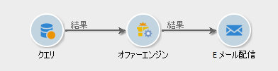
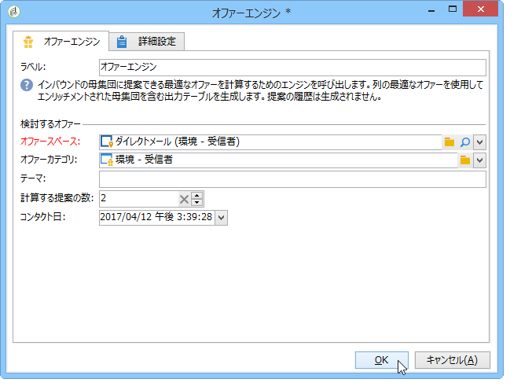

# オファーエンジン{#offer-engine}

The **[!UICONTROL Offer engine]** activity lets you define a call to the offer engine prior to a delivery.

このアクティビティは、エンリッチメントアクティビティと同じ原則でエンジン呼び出しによって作動します。つまり、配信の前に、インバウンド母集団のデータを、エンジンによって自動生成されたオファーでエンリッチメントします。

クエリを設定した後におこなう作業（この[節](../../workflow/using/query.md)を参照）：

1. Add and open an **[!UICONTROL Offer engine]** activity.
1. 使用可能な各種フィールドに入力して、オファーエンジンパラメーター（オファースペース、カテゴリまたはテーマ、コンタクト日、保持するオファー数）への呼び出しを指定します。エンジンは、これらのパラメーターに基づいて、追加するオファーを自動的に計算します。

   >[!CAUTION]
   >
   >このアクティビティを使用する場合、配信に使用されたオファーの提案のみが格納されます。

   

1. 次に、選択したチャネルに対応する配信アクティビティを設定します。Refer to [Cross-channel deliveries](../../workflow/using/cross-channel-deliveries.md).

