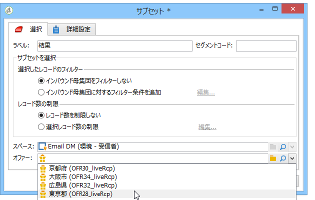

# オファー（セル別）{#offers-by-cell}

The **[!UICONTROL Offers by cell]** activity lets you distribute the inbound population (from a query for example) into several segments and to specify an offer to present for each of these segments.

このアクティビティは、「**インタラクション**」と一緒の場合のみ使用できます。詳しくは、この[節](../../interaction/using/about-outbound-channels.md)を参照してください。

手順は次のとおりです。

1. Add the **[!UICONTROL Offers by cell]** activity once you have specified the target population, then open it.
1. In the **[!UICONTROL General]** tab, select the offer space on which you want to present the offers.
1. In the **[!UICONTROL Cells]** tab, specify the different sub-sets using the **[!UICONTROL Add]** button:

   * 適用可能なフィルタリングおよび制限ルールを使用して、サブセットの母集団を指定します。
   * 次に、サブセットに提案するオファーを選択します。選択できるオファーは、前の手順で選択したオファースペースに適合するオファーです。

      

1. 次に、選択したチャネルに対応する配信アクティビティを設定します。Refer to [Cross-channel deliveries](../../workflow/using/cross-channel-deliveries.md).

